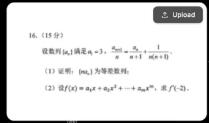
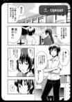

<a id="readme-top"></a>
# Awesome Nano-Banana-Pro Images ✨

[](LICENSE)
<a href="https://github.com/muset-ai/awesome-nano-banana-pro/stargazers">
  
</a>

🎉 Welcome to the curated collection of images generated by Nano-Banana-Pro!

## 🌐 [✨ View Beautiful Web Gallery ✨](https://muset-ai.github.io/awesome-nano-banana-pro/)

> 💡 **Visit our web gallery** for a more intuitive and beautiful browsing experience!

Most examples come from Twitter/X 🐦 and Nano-Banana Studio 🎬. May they spark ideas 💡 and turbo‑charge your creativity 🚀.


<strong>→ Smash that ⭐ if you like it!</strong>

---

<a id="table-of-contents"></a>
## Contents

- [🎨 What is Nano‑Banana-Pro](#gpt4o-intro)
- [📖 Cases Directory](#cases-toc)
- [🤝 How to Contribute](#how-to-contribute)
- [🙏 Acknowledgements](#acknowledgements)
- [🌟 Star History](#star-history)


---

<a id="gpt4o-intro"></a>
## 🎨 What is Nano‑Banana-Pro

Nano‑Banana-Pro is a multimodal model that not only turns text prompts into high‑quality images but also offers image‑to‑image editing—enabling targeted retouching, style transfer, and multi‑image blending.

- 🧠 Multimodal comprehension: Simultaneously parses text and images to capture creative intent with precision
- ✍️ Accurate rendering: Handles complex prompts and rapidly produces high‑quality images
- 🎨 Diverse styles: Ghibli, painterly, pixel art, 3D plush, and more—pick your favorite
- 🖼️ Realistic composition: Spatial depth, perspective, and lighting that feel authentic
- ✏️ Easy post‑editing: Swap backgrounds, tweak details—seamless for second‑round creation
- ⚡️ Lightning‑fast interaction: Shorter response times for real‑time ideation and iteration


---

<a id="cases-toc"></a>
## 📖 Cases Directory

*   [No. 1: Clock 11:15 + Wine Glass Filled to Rim (by )](#cases-1)
*   [No. 2: Math/Formula Boards & Logical Layouts (by )](#cases-2)
*   [No. 3: CCTV Footage (by )](#cases-3)
*   [No. 4: CNN Election Results TV Broadcast (by vladislavkochergin01)](#cases-4)
*   [No. 5: Five Adventurers in a Luminous Cave (by Kiitani)](#cases-5)
*   [No. 6: A Motorbike Made of Sharks (by Dependent_Piece_5781)](#cases-6)
*   [No. 7: Biden’s Dog Holding a 2018 Newspaper (by Healthy_Razzmatazz38)](#cases-7)
*   [No. 8: Elderly Couple Watching a B-2 Bomber (by Snoo26837)](#cases-8)
*   [No. 9: Stylized 3D Zombie Character (by Fysikz)](#cases-9)
*   [No. 10: Man Drinking Sushi Water Under Surreal Skies (by Rare-Belt-9644)](#cases-10)
*   [No. 11: Grizzly Bear Showing a Meme to a Hiker (by maynmaynmayn)](#cases-11)
*   [No. 12: Floral Calculus Blackboard (by Longjumping_Spot5843)](#cases-12)
*   [No. 13: Lightning Radar Browser UI (by BasketFar667)](#cases-13)
*   [No. 14: Duck, Chicken and Parrot Riding a Scooter (by maynmaynmayn)](#cases-14)
*   [No. 15: One-Eyed Whippet on a Moped (by douggieball1312)](#cases-15)
*   [No. 16: Gemini Solves Cancer and World Peace (by Feisty_Test_9388)](#cases-16)
*   [No. 17: Big-Headed Superhero Sprite Sheet (by hydrangers)](#cases-17)
*   [No. 18: Sun Exploding into Pigeons (by neoqueto)](#cases-18)
*   [No. 19: Old Lady Balancing Sumo Wrestlers on the Statue of Liberty (by maynmaynmayn)](#cases-19)
*   [No. 20: Soviet Manual on Human-Wolf Hybrids (by ryebrye)](#cases-20)
*   [No. 21: Business Conversation Film Still (by Bait_Shop_Guy_)](#cases-21)
*   [No. 22: Orchestra Playing 'Baby Got Back' in Vienna (by ryebrye)](#cases-22)
*   [No. 23: Cats Boxing in the Ring (by Every_Ad_2705)](#cases-23)
*   [No. 24: Volcanic Werewolf Camo Pattern (by SentinelHalo)](#cases-24)
*   [No. 25: Sveavägen Street in Stockholm (by kyprianou)](#cases-25)
*   [No. 26: Web App UI with QR Code (by Camaraderie)](#cases-26)
*   [No. 27: CT5-V Blackwing and Purple Hellcat at Dusk (by InformalNatural1134)](#cases-27)
*   [No. 28: Brazilian Zouk Demo at Warsaw Zouk Festival (by zactral)](#cases-28)
*   [No. 29: Wind Turbine over the Swiss Alps (by Kosmicce)](#cases-29)
*   [No. 30: Anne Boleyn Actress iPhone Selfie (by Bait_Shop_Guy_)](#cases-30)
*   [No. 31: Tiny Human Inside an Acoustic Guitar (by xGRAPH1KSx)](#cases-31)
*   [No. 32: Blue Oranges and a Purple Apple (by Head_Phrase_7084)](#cases-32)
*   [No. 33: A Burger, but not (by HeraclesLeftNipple)](#cases-33)
*   [No. 34: Space-Age 60s Living Room at Golden Hour (by Polstick1971)](#cases-34)
*   [No. 35: Comic-Book Ouroboros with Ben Day Dots (by SupehCookie)](#cases-35)
*   [No. 36: Prompt Overload Dystopian Desert (by ComprehensiveLead198)](#cases-36)
*   [No. 37: 绝区零 × 喜茶 霓虹联动海报 (by 雪佬说)](#cases-37)
*   [No. 38: 美团 赛博黄历 复古符箓海报 (by 雪佬说)](#cases-38)
*   [No. 39: 奈斯派索 上海装饰艺术海报 (by 雪佬说)](#cases-39)
*   [No. 40: 90年代过肩镜头：Nano-Banana-Pro 电视广告 (by 雪佬说)](#cases-40)
*   [No. 41: 成都慢行图 手绘旅游地图 (by 雪佬说)](#cases-41)
*   [No. 42: 大唐长安 插画长卷地图 (by 雪佬说)](#cases-42)
*   [No. 43: 老北京航拍：光影显形的“衚”字 (by 雪佬说)](#cases-43)
*   [No. 44: 过肩镜头：雨夜瘦金体书稿 (by 雪佬说)](#cases-44)
*   [No. 45: 蜜雪冰城商业海报 (by 雪佬说)](#cases-45)
*   [No. 46: Chibi Sticker Sheet with Expressive Poses (by Marvin)](#cases-46)
*   [No. 47: Chibi Funko Pop 3D Character Render (by Marvin)](#cases-47)
*   [No. 48: Ghibli-Style Redraw of Reference Photo (by Marvin)](#cases-48)
*   [No. 49: Rhythm Dance Game Scene with 3D Character (by Marvin)](#cases-49)
*   [No. 50: Photorealistic Multi-Image Composite (by Marvin)](#cases-50)
*   [No. 51: Image Style Transfer Between Two Photos (by Marvin)](#cases-51)
*   [No. 52: Outfit Swap with New Pants from Reference (by Marvin)](#cases-52)
*   [No. 53: Facial Expression Editing of the Same Person (by Marvin)](#cases-53)
*   [No. 54: Pose Transfer Between Two Men (by Marvin)](#cases-54)
*   [No. 55: Body Reshaping While Preserving Identity (by Marvin)](#cases-55)
*   [No. 56: Nine Half-Length Portraits in Natural Environments (by Marvin)](#cases-56)
*   [No. 57: Background Replacement for a Subject (by Marvin)](#cases-57)
*   [No. 58: Adding a New Element into a Photo (by Marvin)](#cases-58)
*   [No. 59: Object Removal and Clean Background Fill (by Marvin)](#cases-59)
*   [No. 60: Four Camera Angles of the Same Scene (by Marvin)](#cases-60)
*   [No. 61: Seamless Text Editing in an Image (by Marvin)](#cases-61)
*   [No. 62: Ten-Minute-Later Version of the Same Scene (by Marvin)](#cases-62)
*   [No. 63: Clothing Extraction for E-Commerce Photo (by Marvin)](#cases-63)
*   [No. 64: High-Quality Photo Enhancement from Reference Image (by Marvin)](#cases-64)
*   [No. 65: Weather Transformation Based on Reference Image (by Marvin)](#cases-65)
*   [No. 66: Color Grading and Palette Adjustment from Reference Image (by Marvin)](#cases-66)
*   [No. 67: Targeted content replacement in a reference image (by Marvin)](#cases-67)
*   [No. 68: Image Outpainting Extension from Reference Photo (by Marvin)](#cases-68)
*   [No. 69: Dual-Image Redraw and Aspect Ratio Transfer (by Marvin)](#cases-69)
*   [No. 70: 3x3 Studio-Style Photo Strip Grid (by Marvin)](#cases-70)
*   [No. 71: Line Art to Fully Colored Illustration (by Marvin)](#cases-71)
*   [No. 72: Line Art Colorization with Detailed Rendering (by Marvin)](#cases-72)
*   [No. 73: Two-Step Living Room Redesign from Reference Photos (by Marvin)](#cases-73)
*   [No. 74: Object or Scene Creation from Listed Items (by Marvin)](#cases-74)
*   [No. 75: Anatomical Infographic of a Fictional Character (by Marvin)](#cases-75)
*   [No. 76: 16-Bit Video Game Character Recreation (by Marvin)](#cases-76)
*   [No. 77: Polaroid-Style Snapshot with Curtain Background (by Marvin)](#cases-77)
*   [No. 78: Soft Sunlit Portrait in Yellow Saree (by Marvin)](#cases-78)
*   [No. 79: Polaroid Hug Scene with White Curtain Background (by Marvin)](#cases-79)
*   [No. 80: Top-Angle Black-and-White Portrait (by Marvin)](#cases-80)
*   [No. 81: Vertical Cinematic Portrait with Red Background (by Marvin)](#cases-81)
*   [No. 82: Exploded Technical View of a Product (by Marvin)](#cases-82)
*   [No. 83: 100x Zoom Detail View of a Scene (by Marvin)](#cases-83)
*   [No. 84: Storyboard Generated from a Single Image (by Marvin)](#cases-84)
*   [No. 85: Tom Yum Goong Soup Recipe Infographic (by Marvin)](#cases-85)
*   [No. 86: Background and Blanket Focus with Blurred Child (by Marvin)](#cases-86)
*   [No. 87: Minimal Food Letter Logos on White Background (by Marvin)](#cases-87)
*   [No. 88: 水调歌头 词意与意境 (by AIGC 创意猎人)](#cases-88)
*   [No. 89: 古老石碑上的《青玉案·元夕》 (by AIGC 创意猎人)](#cases-89)
*   [No. 90: 感恩节主题黑板报 (by AIGC 创意猎人)](#cases-90)
*   [No. 91: 90年代情书：春娇写给志明 (by AIGC 创意猎人)](#cases-91)
*   [No. 92: 三天两晚北京旅游攻略手帐风格 (by AIGC 创意猎人)](#cases-92)
*   [No. 93: 猎人野味湘菜餐馆经典菜单 (by AIGC 创意猎人)](#cases-93)
*   [No. 94: 宇称不守恒原理科普图 (by AIGC 创意猎人)](#cases-94)
*   [No. 95: 《红楼梦》主要人物关系图谱 (by AIGC 创意猎人)](#cases-95)
*   [No. 96: 黑板上的高考解答过程 (by AIGC 创意猎人)](#cases-96)
*   [No. 97: MBTI 16型人格图（中文版） (by AIGC 创意猎人)](#cases-97)
*   [No. 98: 航空发动机3D结构透视图 (by AIGC 创意猎人)](#cases-98)
*   [No. 99: 黑金立体3D文字与传统印章设计 (by AIGC 创意猎人)](#cases-99)
*   [No. 100: 创意猎人 - 街头涂鸦风格字体设计 (by AIGC 创意猎人)](#cases-100)
*   [No. 101: 苍劲有力的北京书法艺术 (by AIGC 创意猎人)](#cases-101)
*   [No. 102: 夏日傍晚的浪漫海边情感海报 (by AIGC 创意猎人)](#cases-102)
*   [No. 103: 梦幻唐代荔枝海报 (by AIGC 创意猎人)](#cases-103)
*   [No. 104: HUNTER 高端品牌鞋靴广告 (by AIGC 创意猎人)](#cases-104)
*   [No. 105: 搞怪创意海报：牛马注意警示标识 (by AIGC 创意猎人)](#cases-105)
*   [No. 106: 时尚电影肖像：年轻女性坐在现代椅子上 (by AIGC 创意猎人)](#cases-106)
*   [No. 107: 工作室肖像照片 (by AIGC 创意猎人)](#cases-107)
*   [No. 108: 米色工作室中的极简主义肖像系列 (by AIGC 创意猎人)](#cases-108)
*   [No. 109: 高端洗发水广告：Nano Banana 2 (by AIGC 创意猎人)](#cases-109)
*   [No. 110: 老夫子风格漫画：俞敏洪南极游玩与加班员工的对比 (by AIGC 创意猎人)](#cases-110)
*   [No. 111: 真人风格的漫画翻译 (by AIGC 创意猎人)](#cases-111)
*   [No. 112: 简约高级AI产品商店设计 (by AIGC 创意猎人)](#cases-112)
*   [No. 113: Nano Banana 2 - Fictional Pharmaceutical Product (by AIGC 创意猎人)](#cases-113)
*   [No. 114: 微信聊天截图：Nano Banana 2发布警告 (by AIGC 创意猎人)](#cases-114)
*   [No. 115: 爱因斯坦发布相对论后的微信朋友圈 (by AIGC 创意猎人)](#cases-115)
*   [No. 116: 斗地主游戏UI界面 (by AIGC 创意猎人)](#cases-116)
*   [No. 117: Gemini 3 Pro 主要功能亮点介绍 (by AIGC 创意猎人)](#cases-117)
*   [No. 118: Nano Banana 2的优势与Bento Grid视觉风格 (by AIGC 创意猎人)](#cases-118)
*   [No. 119: Hand-Crocheted Yarn Doll Cradled in Gentle Hands (by Marvin)](#cases-119)
*   [No. 120: 大师级排版海报设计：荒原与落日 (by 沃垠AI)](#cases-120)
*   [No. 121: 四时更替海报设计 (by 沃垠AI)](#cases-121)
*   [No. 122: 重庆旅游指南手账 (by 沃垠AI)](#cases-122)
*   [No. 123: 耄耋的词语解释 (by 沃垠AI)](#cases-123)
*   [No. 124: 古诗《黄鹤楼》课文页 (by 沃垠AI)](#cases-124)
*   [No. 125: Windows XP Desktop Screenshot (by 沃垠AI)](#cases-125)
*   [No. 126: 橙色风格的用户界面设计 (by 沃垠AI)](#cases-126)
*   [No. 127: 詹姆斯与库里的总决赛对决 (by 沃垠AI)](#cases-127)
*   [No. 128: 激战中的天命人和二郎神 (by 沃垠AI)](#cases-128)
*   [No. 129: 成都建设路漫步地图推荐 (by 沃垠AI)](#cases-129)
*   [No. 130: 手账风格咖啡制作过程 (by 沃垠AI)](#cases-130)
*   [No. 131: 李白的《蜀道难》石碑刻字 (by 沃垠AI)](#cases-131)
*   [No. 132: 传呼机屏幕上的警告信息 (by 沃垠AI)](#cases-132)
*   [No. 133: Transformer架构图 (by 沃垠AI)](#cases-133)
*   [No. 134: High-Contrast Black-and-White Side-Profile Portrait (by Nano Banana Labs)](#cases-134)
*   [No. 135: Chibi Character with Playful Expressions (by Marvin)](#cases-135)
*   [No. 136: Vibrant Rhythm Dance Game Screenshot (by Marvin)](#cases-136)
*   [No. 137: Gashapon Capsule Diorama of [NAME] in [ICONIC POSE / STYLE] (by Marvin)](#cases-137)
*   [No. 138: Detailed Whiteboard Photo of The Llama 3 Herd of Models (by Pietro Schirano)](#cases-138)
*   [No. 139: Detailed Whiteboard Photo of Gemini 3 Pro Announcement (by Pietro Schirano)](#cases-139)
*   [No. 140: Fingerprint Map of a Finger (by Higgsfield AI)](#cases-140)
*   [No. 141: Ingredients for the Dish (by Higgsfield AI)](#cases-141)
*   [No. 142: Lifecycle of a Handsome Man Celebrating Holidays (by Nano Banana Labs
)](#cases-142)
*   [No. 143: GTA: Vice City Inspired Character in Miami (by Nano Banana Labs)](#cases-143)
*   [No. 144: Drone Shot of a Man on a Cliff with Bulldog (by Nano Banana Labs)](#cases-144)
*   [No. 145: Anime Girl Joins the Conversation (by ニケちゃん（@tegnike）)](#cases-145)
*   [No. 146: Sesame Street Character Poster (by 
Firat Bilal)](#cases-146)
*   [No. 147: Glossy Magazine Article with Beautiful Typography Design (by fofr)](#cases-147)
*   [No. 148: Cinematic Portrait in a Desert Landscape (by Nano Banana Labs)](#cases-148)
*   [No. 149: Bold Abstract Portrait of a Confident Man (by Nano Banana Labs)](#cases-149)
*   [No. 150: Timeless Contemplation in Black and White (by Nano Banana Labs)](#cases-150)
*   [No. 151: Candid Moment Between Friends at a Restaurant (by Nano Banana Labs)](#cases-151)
*   [No. 152: Ultra-Realistic Portrait with Jack Daniel’s Bottle (by Nano Banana Labs)](#cases-152)
*   [No. 153: Chibi Funko Pop Figure Render (by Marvin)](#cases-153)
*   [No. 154: Seamless Image Integration (by Marvin)](#cases-154)
*   [No. 155: Two Men in Photorealistic Poses (by Marvin)](#cases-155)

---

<a id="cases"></a>
## 🧩 No.

<a id="cases-1"></a>
### No. 1: Clock 11:15 + Wine Glass Filled to Rim

<p>

</p>

<br>
<sub>Image © 2025 <a href="https://github.com/muset-ai">@muset-ai</a>, <a href="https://creativecommons.org/licenses/by/4.0/">CC BY 4.0</a> • Prompt by <a href="https://github.com/muset-ai">@muset-ai</a> • [Source](https://aidisruption.ai/p/nano-banana-2-pulled-in-1-hour-aced)</sub>


**Prompt**

```
A cozy dining table scene. On the wall, a clock showing exactly 11:15 with correct tick marks. A crystal wine glass on the table is filled exactly to the rim with liquid—no spill, realistic meniscus, and natural reflections. Soft daylight, 50mm lens look.
```


[⬆️ Back to Cases Directory](#cases-toc)

---


<a id="cases-2"></a>
### No. 2: Math/Formula Boards & Logical Layouts

<p>

</p>

<br>
<sub>Image © 2025 <a href="https://github.com/muset-ai">@muset-ai</a>, <a href="https://creativecommons.org/licenses/by/4.0/">CC BY 4.0</a> • Prompt by <a href="https://github.com/muset-ai">@muset-ai</a> • [Source](https://x.com/EHuanglu/status/1988007355070451975)</sub>


**Prompt**

```
A professor teaching in a classroom. Large blackboard behind them filled with a multi-line derivation: numbered steps, clearly separated lines, readable mathematical symbols, and logical arrows or brackets showing the flow of the proof.
```


[⬆️ Back to Cases Directory](#cases-toc)

---


<a id="cases-3"></a>
### No. 3: CCTV Footage

<p>

</p>

<br>
<sub>Image © 2025 <a href="https://www.reddit.com/user/vladislavkochergin01/">@vladislavkochergin01</a>, <a href="https://creativecommons.org/licenses/by/4.0/">CC BY 4.0</a> • Prompt by <a href="https://www.reddit.com/user/Qemmish/">@Qemmish</a> • [Source](https://www.reddit.com/r/singularity/comments/1otuefg/nano_banana_2_crazy_image_outputs/)</sub>


**Prompt**

```
cctv footage, UK. a man in the street wearing gigantic oversized sneakers. talking to a police officer.
```


[⬆️ Back to Cases Directory](#cases-toc)

---


<a id="cases-4"></a>
### No. 4: CNN Election Results TV Broadcast

<p>

</p>

<br>
<sub>Image © 2025 <a href="https://www.reddit.com/user/vladislavkochergin01/">vladislavkochergin01</a>, <a href="https://creativecommons.org/licenses/by/4.0/">CC BY 4.0</a> • Prompt by <a href="https://www.reddit.com/user/vladislavkochergin01/">vladislavkochergin01</a> • [Source](https://www.reddit.com/r/Bard/comments/1p0moso/just_got_a_limited_access_to_nano_banana_2_pro/)</sub>


**Prompt**

```
A realistic close-up of a television screen displaying CNN U.S. election results. The broadcast layout shows the two candidates with their photos: P Diddy at 50.2% and Jeffry Epstein at 49.8%. Their portraits appear beside their names and percentages in a clean red-and-blue election graphic. On the right side of the screen, a female news anchor is visible in a small live window, as if she is reporting the results. High-resolution, realistic lighting, slight screen glare, modern American news broadcast style.
```


[⬆️ Back to Cases Directory](#cases-toc)

---


<a id="cases-5"></a>
### No. 5: Five Adventurers in a Luminous Cave

<p>

</p>

<br>
<sub>Image © 2025 <a href="https://www.reddit.com/user/vladislavkochergin01/">vladislavkochergin01</a>, <a href="https://creativecommons.org/licenses/by/4.0/">CC BY 4.0</a> • Prompt by <a href="https://www.reddit.com/user/Kiitani/">Kiitani</a> • [Source](https://www.reddit.com/r/Bard/comments/1p0moso/just_got_a_limited_access_to_nano_banana_2_pro/)</sub>


**Prompt**

```
an animated illustration of a party of five adventurers navigating a cave system. In the middle, the tall, old guide stands. He is dressed in navy blue wizard robes. He has a silver goatee and a wise smile on his face. He holds a brown walking stick. He is carrying a heavy load of packs. A grimoire floats next to him, creating a luminescent light to guide the way. On his right, stands the towering Berserker. The berserker is wearing fur armor. He has a sculpted, muscular and tall build. His muscles are covered in storm lightning runes that flicker and crack. He is carrying twin axes, one in his left hand, and another in his axe holster on his hip. He has a large bastardsword on his back. He is gnawing on a huge piece of meat which he holds with his right hand. On the right of the berserker stands the pretty, fair-skinned healer. She is short and cute, wearing pure white priestess robes with golden trim. She has blonde hair and she is actually levitating a bit off the ground, with an aura around her. On the left of the guide stands a mischievious, redhead archer with a crafty smile on her face. She is drawing her bow. She has a number of arrows on her back and bombs strapped to her leather armor. She is slender and of average height. Next to her left stands the bald monk with five shaolin marks on his head. He wears orange monk robes and has a lean-muscular build. He is wearing sandals. He is carrying daoist builds and holding his hands close together in prayer.
```


[⬆️ Back to Cases Directory](#cases-toc)

---


<a id="cases-6"></a>
### No. 6: A Motorbike Made of Sharks

<p>

</p>

<br>
<sub>Image © 2025 <a href="https://www.reddit.com/user/vladislavkochergin01/">vladislavkochergin01</a>, <a href="https://creativecommons.org/licenses/by/4.0/">CC BY 4.0</a> • Prompt by <a href="https://www.reddit.com/user/Dependent_Piece_5781/">Dependent_Piece_5781</a> • [Source](https://www.reddit.com/r/Bard/comments/1p0moso/just_got_a_limited_access_to_nano_banana_2_pro/)</sub>


**Prompt**

```
A motorbike made of sharks
```


[⬆️ Back to Cases Directory](#cases-toc)

---


<a id="cases-7"></a>
### No. 7: Biden’s Dog Holding a 2018 Newspaper

<p>

</p>

<br>
<sub>Image © 2025 <a href="https://www.reddit.com/user/vladislavkochergin01/">vladislavkochergin01</a>, <a href="https://creativecommons.org/licenses/by/4.0/">CC BY 4.0</a> • Prompt by <a href="https://www.reddit.com/user/Healthy_Razzmatazz38/">Healthy_Razzmatazz38</a> • [Source](https://www.reddit.com/r/Bard/comments/1p0moso/just_got_a_limited_access_to_nano_banana_2_pro/)</sub>


**Prompt**

```
the breed of dog which biden had as a pet holding up a newspaper with the top headline from october 1st 2018 on a skateboard.
```


[⬆️ Back to Cases Directory](#cases-toc)

---


<a id="cases-8"></a>
### No. 8: Elderly Couple Watching a B-2 Bomber

<p>

</p>

<br>
<sub>Image © 2025 <a href="https://www.reddit.com/user/vladislavkochergin01/">vladislavkochergin01</a>, <a href="https://creativecommons.org/licenses/by/4.0/">CC BY 4.0</a> • Prompt by <a href="https://www.reddit.com/user/Snoo26837/">Snoo26837</a> • [Source](https://www.reddit.com/r/Bard/comments/1p0moso/just_got_a_limited_access_to_nano_banana_2_pro/)</sub>


**Prompt**

```
35mm film photograph, full shot from behind of an elderly man in a long black overcoat and an elderly woman in a long deep red overcoat, standing symmetrically on a vast concrete tarmac. They are looking at a Northrop Grumman B-2 Spirit stealth bomber parked in the middle distance. In the far background are hazy, snow-capped mountains under a pale blue sky. The top third of the image is framed by the interior ceiling of a massive hangar with horizontal beams. Cinematic and formal composition, muted color palette, visible film grain, somber and powerful atmosphere. --ar 2:3 --style raw --v 6.0
```


[⬆️ Back to Cases Directory](#cases-toc)

---


<a id="cases-9"></a>
### No. 9: Stylized 3D Zombie Character

<p>

</p>

<br>
<sub>Image © 2025 <a href="https://www.reddit.com/user/vladislavkochergin01/">vladislavkochergin01</a>, <a href="https://creativecommons.org/licenses/by/4.0/">CC BY 4.0</a> • Prompt by <a href="https://www.reddit.com/user/Fysikz/">Fysikz</a> • [Source](https://www.reddit.com/r/Bard/comments/1p0moso/just_got_a_limited_access_to_nano_banana_2_pro/)</sub>


**Prompt**

```
3D character model of a zombie. The style should be stylized and graphic, with crisp, defined, and bold colors. The zombie should have a gloomy inspired aesthetic only wearing torn shorts. Has decaying flesh.
```


[⬆️ Back to Cases Directory](#cases-toc)

---


<a id="cases-10"></a>
### No. 10: Man Drinking Sushi Water Under Surreal Skies

<p>

</p>

<br>
<sub>Image © 2025 <a href="https://www.reddit.com/user/vladislavkochergin01/">vladislavkochergin01</a>, <a href="https://creativecommons.org/licenses/by/4.0/">CC BY 4.0</a> • Prompt by <a href="https://www.reddit.com/user/Rare-Belt-9644/">Rare-Belt-9644</a> • [Source](https://www.reddit.com/r/Bard/comments/1p0moso/just_got_a_limited_access_to_nano_banana_2_pro/)</sub>


**Prompt**

```
A man drinking bottle of sushi water and looking at beautiful-shaped skies, smirking
```


[⬆️ Back to Cases Directory](#cases-toc)

---


<a id="cases-11"></a>
### No. 11: Grizzly Bear Showing a Meme to a Hiker

<p>

</p>

<br>
<sub>Image © 2025 <a href="https://www.reddit.com/user/vladislavkochergin01/">vladislavkochergin01</a>, <a href="https://creativecommons.org/licenses/by/4.0/">CC BY 4.0</a> • Prompt by <a href="https://www.reddit.com/user/maynmaynmayn/">maynmaynmayn</a> • [Source](https://www.reddit.com/r/Bard/comments/1p0moso/just_got_a_limited_access_to_nano_banana_2_pro/)</sub>


**Prompt**

```
A grizzly bear holding a picture with a meme of a grizzly bear in the forest, in front of a real hiker
```


[⬆️ Back to Cases Directory](#cases-toc)

---


<a id="cases-12"></a>
### No. 12: Floral Calculus Blackboard

<p>

</p>

<br>
<sub>Image © 2025 <a href="https://www.reddit.com/user/vladislavkochergin01/">vladislavkochergin01</a>, <a href="https://creativecommons.org/licenses/by/4.0/">CC BY 4.0</a> • Prompt by <a href="https://www.reddit.com/user/Longjumping_Spot5843/">Longjumping_Spot5843</a> • [Source](https://www.reddit.com/r/Bard/comments/1p0moso/just_got_a_limited_access_to_nano_banana_2_pro/)</sub>


**Prompt**

```
A hard calculus integration problem written and solved on a blackboard, but the text itself and the chalk is sort of turned into this coloured artwork that looks like a flower. (as a photo)
```


[⬆️ Back to Cases Directory](#cases-toc)

---


<a id="cases-13"></a>
### No. 13: Lightning Radar Browser UI

<p>

</p>

<br>
<sub>Image © 2025 <a href="https://www.reddit.com/user/vladislavkochergin01/">vladislavkochergin01</a>, <a href="https://creativecommons.org/licenses/by/4.0/">CC BY 4.0</a> • Prompt by <a href="https://www.reddit.com/user/BasketFar667/">BasketFar667</a> • [Source](https://www.reddit.com/r/Bard/comments/1p0moso/just_got_a_limited_access_to_nano_banana_2_pro/)</sub>


**Prompt**

```
Lightning Radar: A copy of the browser version of Lightning Radar.
```


[⬆️ Back to Cases Directory](#cases-toc)

---


<a id="cases-14"></a>
### No. 14: Duck, Chicken and Parrot Riding a Scooter

<p>

</p>

<br>
<sub>Image © 2025 <a href="https://www.reddit.com/user/vladislavkochergin01/">vladislavkochergin01</a>, <a href="https://creativecommons.org/licenses/by/4.0/">CC BY 4.0</a> • Prompt by <a href="https://www.reddit.com/user/maynmaynmayn/">maynmaynmayn</a> • [Source](https://www.reddit.com/r/Bard/comments/1p0moso/just_got_a_limited_access_to_nano_banana_2_pro/)</sub>


**Prompt**

```
A duck riding a chicken that sits in the shoulders of a parrot that drives and electric scooter in a theme park
```


[⬆️ Back to Cases Directory](#cases-toc)

---


<a id="cases-15"></a>
### No. 15: One-Eyed Whippet on a Moped

<p>

</p>

<br>
<sub>Image © 2025 <a href="https://www.reddit.com/user/vladislavkochergin01/">vladislavkochergin01</a>, <a href="https://creativecommons.org/licenses/by/4.0/">CC BY 4.0</a> • Prompt by <a href="https://www.reddit.com/user/douggieball1312/">douggieball1312</a> • [Source](https://www.reddit.com/r/Bard/comments/1p0moso/just_got_a_limited_access_to_nano_banana_2_pro/)</sub>


**Prompt**

```
A whippet with an eye patch riding a moped through a UK street filled with shops with boarded up windows.
```


[⬆️ Back to Cases Directory](#cases-toc)

---


<a id="cases-16"></a>
### No. 16: Gemini Solves Cancer and World Peace

<p>

</p>

<br>
<sub>Image © 2025 <a href="https://www.reddit.com/user/vladislavkochergin01/">vladislavkochergin01</a>, <a href="https://creativecommons.org/licenses/by/4.0/">CC BY 4.0</a> • Prompt by <a href="https://www.reddit.com/user/Feisty_Test_9388/">Feisty_Test_9388</a> • [Source](https://www.reddit.com/r/Bard/comments/1p0moso/just_got_a_limited_access_to_nano_banana_2_pro/)</sub>


**Prompt**

```
Gemini finding cure to cancer and establishing world peace
```


[⬆️ Back to Cases Directory](#cases-toc)

---


<a id="cases-17"></a>
### No. 17: Big-Headed Superhero Sprite Sheet

<p>

</p>

<br>
<sub>Image © 2025 <a href="https://www.reddit.com/user/vladislavkochergin01/">vladislavkochergin01</a>, <a href="https://creativecommons.org/licenses/by/4.0/">CC BY 4.0</a> • Prompt by <a href="https://www.reddit.com/user/hydrangers/">hydrangers</a> • [Source](https://www.reddit.com/r/Bard/comments/1p0moso/just_got_a_limited_access_to_nano_banana_2_pro/)</sub>


**Prompt**

```
a sprite sheet for various animation for a single character for a 2d game. The hero should have a big head, cell shaded appearance, blue spandex suit with red face mask, red gloves, and red boots
```


[⬆️ Back to Cases Directory](#cases-toc)

---


<a id="cases-18"></a>
### No. 18: Sun Exploding into Pigeons

<p>

</p>

<br>
<sub>Image © 2025 <a href="https://www.reddit.com/user/vladislavkochergin01/">vladislavkochergin01</a>, <a href="https://creativecommons.org/licenses/by/4.0/">CC BY 4.0</a> • Prompt by <a href="https://www.reddit.com/user/neoqueto/">neoqueto</a> • [Source](https://www.reddit.com/r/Bard/comments/1p0moso/just_got_a_limited_access_to_nano_banana_2_pro/)</sub>


**Prompt**

```
A very photorealistic image of the Sun vigorously exploding into a bunch of pigeons and an old lady looking at the situation saying "oh, crikey!", some of the pigeons are wearing pink wedding dresses, but don't be fooled, this is certainly a doomsday scenario, Earth is cooked.
```


[⬆️ Back to Cases Directory](#cases-toc)

---


<a id="cases-19"></a>
### No. 19: Old Lady Balancing Sumo Wrestlers on the Statue of Liberty

<p>

</p>

<br>
<sub>Image © 2025 <a href="https://www.reddit.com/user/vladislavkochergin01/">vladislavkochergin01</a>, <a href="https://creativecommons.org/licenses/by/4.0/">CC BY 4.0</a> • Prompt by <a href="https://www.reddit.com/user/maynmaynmayn/">maynmaynmayn</a> • [Source](https://www.reddit.com/r/Bard/comments/1p0moso/just_got_a_limited_access_to_nano_banana_2_pro/)</sub>


**Prompt**

```
An old lady balancing 3 sumo wrestlers on her pinky finger, each sumo wrestler balances the others on their pinky fingers, the old lady is balancing on the top of the statue of liberty
```


[⬆️ Back to Cases Directory](#cases-toc)

---


<a id="cases-20"></a>
### No. 20: Soviet Manual on Human-Wolf Hybrids

<p>

</p>

<br>
<sub>Image © 2025 <a href="https://www.reddit.com/user/vladislavkochergin01/">vladislavkochergin01</a>, <a href="https://creativecommons.org/licenses/by/4.0/">CC BY 4.0</a> • Prompt by <a href="https://www.reddit.com/user/ryebrye/">ryebrye</a> • [Source](https://www.reddit.com/r/Bard/comments/1p0moso/just_got_a_limited_access_to_nano_banana_2_pro/)</sub>


**Prompt**

```
A soviet biology textbook open to the page describing how to hybridize a human and a wolf, photo realistic - being read by a werewolf with a sparkly vampire in a glass cage in the background. 1940's styling. Frame from a 1953 motion picture in technicolor.
```


[⬆️ Back to Cases Directory](#cases-toc)

---


<a id="cases-21"></a>
### No. 21: Business Conversation Film Still

<p>

</p>

<br>
<sub>Image © 2025 <a href="https://www.reddit.com/user/vladislavkochergin01/">vladislavkochergin01</a>, <a href="https://creativecommons.org/licenses/by/4.0/">CC BY 4.0</a> • Prompt by <a href="https://www.reddit.com/user/Bait_Shop_Guy_/">Bait_Shop_Guy_</a> • [Source](https://www.reddit.com/r/Bard/comments/1p0moso/just_got_a_limited_access_to_nano_banana_2_pro/)</sub>


**Prompt**

```
A redhead woman in a black blazer talks with a man in a blue business suit. Indoor setting. Screencap from a film.
```


[⬆️ Back to Cases Directory](#cases-toc)

---


<a id="cases-22"></a>
### No. 22: Orchestra Playing 'Baby Got Back' in Vienna

<p>

</p>

<br>
<sub>Image © 2025 <a href="https://www.reddit.com/user/vladislavkochergin01/">vladislavkochergin01</a>, <a href="https://creativecommons.org/licenses/by/4.0/">CC BY 4.0</a> • Prompt by <a href="https://www.reddit.com/user/ryebrye/">ryebrye</a> • [Source](https://www.reddit.com/r/Bard/comments/1p0moso/just_got_a_limited_access_to_nano_banana_2_pro/)</sub>


**Prompt**

```
a conductor's point of view of an orchestra during a Christmas concert in Vienna, with the score for an orchestral arrangement of "Baby Got Back" on the music stand. Photorealistic. RF 20mm f/1.4 L VCM lens at 4.0, Canon R5 with Aperture priority +1 ev.
```


[⬆️ Back to Cases Directory](#cases-toc)

---


<a id="cases-23"></a>
### No. 23: Cats Boxing in the Ring

<p>

</p>

<br>
<sub>Image © 2025 <a href="https://www.reddit.com/user/vladislavkochergin01/">vladislavkochergin01</a>, <a href="https://creativecommons.org/licenses/by/4.0/">CC BY 4.0</a> • Prompt by <a href="https://www.reddit.com/user/Every_Ad_2705/">Every_Ad_2705</a> • [Source](https://www.reddit.com/r/Bard/comments/1p0moso/just_got_a_limited_access_to_nano_banana_2_pro/)</sub>


**Prompt**

```
2 cats in the ring boxing it out
```


[⬆️ Back to Cases Directory](#cases-toc)

---


<a id="cases-24"></a>
### No. 24: Volcanic Werewolf Camo Pattern

<p>

</p>

<br>
<sub>Image © 2025 <a href="https://www.reddit.com/user/vladislavkochergin01/">vladislavkochergin01</a>, <a href="https://creativecommons.org/licenses/by/4.0/">CC BY 4.0</a> • Prompt by <a href="https://www.reddit.com/user/SentinelHalo/">SentinelHalo</a> • [Source](https://www.reddit.com/r/Bard/comments/1p0moso/just_got_a_limited_access_to_nano_banana_2_pro/)</sub>


**Prompt**

```
Volcanic-inspired werewolf camo pattern using ember-orange, charcoal-black, and deep red hues, molten cracks forming hidden wolf faces and snarls, flame-like fur textures, jagged claw-scar geometry, intense and supernatural, seamless repeating pattern
```


[⬆️ Back to Cases Directory](#cases-toc)

---


<a id="cases-25"></a>
### No. 25: Sveavägen Street in Stockholm

<p>

</p>

<br>
<sub>Image © 2025 <a href="https://www.reddit.com/user/vladislavkochergin01/">vladislavkochergin01</a>, <a href="https://creativecommons.org/licenses/by/4.0/">CC BY 4.0</a> • Prompt by <a href="https://www.reddit.com/user/kyprianou/">kyprianou</a> • [Source](https://www.reddit.com/r/Bard/comments/1p0moso/just_got_a_limited_access_to_nano_banana_2_pro/)</sub>


**Prompt**

```
Sveavägen, Stockholm
```


[⬆️ Back to Cases Directory](#cases-toc)

---


<a id="cases-26"></a>
### No. 26: Web App UI with QR Code

<p>

</p>

<br>
<sub>Image © 2025 <a href="https://www.reddit.com/user/vladislavkochergin01/">vladislavkochergin01</a>, <a href="https://creativecommons.org/licenses/by/4.0/">CC BY 4.0</a> • Prompt by <a href="https://www.reddit.com/user/Camaraderie/">Camaraderie</a> • [Source](https://www.reddit.com/r/Bard/comments/1p0moso/just_got_a_limited_access_to_nano_banana_2_pro/)</sub>


**Prompt**

```
Generate a mock UI for a web application with modern styling and CSS. Place a QR code with the encoding payload 'https://google.com'. The QR code must be scannable.
```


[⬆️ Back to Cases Directory](#cases-toc)

---


<a id="cases-27"></a>
### No. 27: CT5-V Blackwing and Purple Hellcat at Dusk

<p>

</p>

<br>
<sub>Image © 2025 <a href="https://www.reddit.com/user/vladislavkochergin01/">vladislavkochergin01</a>, <a href="https://creativecommons.org/licenses/by/4.0/">CC BY 4.0</a> • Prompt by <a href="https://www.reddit.com/user/InformalNatural1134/">InformalNatural1134</a> • [Source](https://www.reddit.com/r/Bard/comments/1p0moso/just_got_a_limited_access_to_nano_banana_2_pro/)</sub>


**Prompt**

```
A ct5 v black wing radiant red and a gloss purple hellcat parked together in a empty parking lot in evening
```


[⬆️ Back to Cases Directory](#cases-toc)

---


<a id="cases-28"></a>
### No. 28: Brazilian Zouk Demo at Warsaw Zouk Festival

<p>

</p>

<br>
<sub>Image © 2025 <a href="https://www.reddit.com/user/vladislavkochergin01/">vladislavkochergin01</a>, <a href="https://creativecommons.org/licenses/by/4.0/">CC BY 4.0</a> • Prompt by <a href="https://www.reddit.com/user/zactral/">zactral</a> • [Source](https://www.reddit.com/r/Bard/comments/1p0moso/just_got_a_limited_access_to_nano_banana_2_pro/)</sub>


**Prompt**

```
A couple doing a Brazilian Zouk dance demo at Warsaw Zouk Festival while a crowd of people watches and a videographer films the dancers, photorealistic.
```


[⬆️ Back to Cases Directory](#cases-toc)

---


<a id="cases-29"></a>
### No. 29: Wind Turbine over the Swiss Alps

<p>

</p>

<br>
<sub>Image © 2025 <a href="https://www.reddit.com/user/vladislavkochergin01/">vladislavkochergin01</a>, <a href="https://creativecommons.org/licenses/by/4.0/">CC BY 4.0</a> • Prompt by <a href="https://www.reddit.com/user/Kosmicce/">Kosmicce</a> • [Source](https://www.reddit.com/r/Bard/comments/1p0moso/just_got_a_limited_access_to_nano_banana_2_pro/)</sub>


**Prompt**

```
Close-up drone shot of a wind turbine on top of swiss alps, beautiful sunny day, no clouds
```


[⬆️ Back to Cases Directory](#cases-toc)

---


<a id="cases-30"></a>
### No. 30: Anne Boleyn Actress iPhone Selfie

<p>

</p>

<br>
<sub>Image © 2025 <a href="https://www.reddit.com/user/vladislavkochergin01/">vladislavkochergin01</a>, <a href="https://creativecommons.org/licenses/by/4.0/">CC BY 4.0</a> • Prompt by <a href="https://www.reddit.com/user/Bait_Shop_Guy_/">Bait_Shop_Guy_</a> • [Source](https://www.reddit.com/r/Bard/comments/1p0moso/just_got_a_limited_access_to_nano_banana_2_pro/)</sub>


**Prompt**

```
Amateur, medicore iPhone selfie of smiling young actress dressed as Anne Boleyn. Outdoor movie set setting, daytime, clear blue sky.
```


[⬆️ Back to Cases Directory](#cases-toc)

---


<a id="cases-31"></a>
### No. 31: Tiny Human Inside an Acoustic Guitar

<p>

</p>

<br>
<sub>Image © 2025 <a href="https://www.reddit.com/user/vladislavkochergin01/">vladislavkochergin01</a>, <a href="https://creativecommons.org/licenses/by/4.0/">CC BY 4.0</a> • Prompt by <a href="https://www.reddit.com/user/xGRAPH1KSx/">xGRAPH1KSx</a> • [Source](https://www.reddit.com/r/Bard/comments/1p0moso/just_got_a_limited_access_to_nano_banana_2_pro/)</sub>


**Prompt**

```
a tiny human standing in the inside of an accoustic guitar revealing all the inner workings and details of the hollow space that is contained within a guitar.
```


[⬆️ Back to Cases Directory](#cases-toc)

---


<a id="cases-32"></a>
### No. 32: Blue Oranges and a Purple Apple

<p>

</p>

<br>
<sub>Image © 2025 <a href="https://www.reddit.com/user/vladislavkochergin01/">vladislavkochergin01</a>, <a href="https://creativecommons.org/licenses/by/4.0/">CC BY 4.0</a> • Prompt by <a href="https://www.reddit.com/user/Head_Phrase_7084/">Head_Phrase_7084</a> • [Source](https://www.reddit.com/r/Bard/comments/1p0moso/just_got_a_limited_access_to_nano_banana_2_pro/)</sub>


**Prompt**

```
Photo of a white bowl filled with blue oranges and a singular purple apple in the center
```


[⬆️ Back to Cases Directory](#cases-toc)

---


<a id="cases-33"></a>
### No. 33: A Burger, but not

<p>

</p>

<br>
<sub>Image © 2025 <a href="https://www.reddit.com/user/vladislavkochergin01/">vladislavkochergin01</a>, <a href="https://creativecommons.org/licenses/by/4.0/">CC BY 4.0</a> • Prompt by <a href="https://www.reddit.com/user/HeraclesLeftNipple/">HeraclesLeftNipple</a> • [Source](https://www.reddit.com/r/Bard/comments/1p0moso/just_got_a_limited_access_to_nano_banana_2_pro/)</sub>


**Prompt**

```
A Burger, but not.
```


[⬆️ Back to Cases Directory](#cases-toc)

---


<a id="cases-34"></a>
### No. 34: Space-Age 60s Living Room at Golden Hour

<p>

</p>

<br>
<sub>Image © 2025 <a href="https://www.reddit.com/user/vladislavkochergin01/">vladislavkochergin01</a>, <a href="https://creativecommons.org/licenses/by/4.0/">CC BY 4.0</a> • Prompt by <a href="https://www.reddit.com/user/Polstick1971/">Polstick1971</a> • [Source](https://www.reddit.com/r/Bard/comments/1p0moso/just_got_a_limited_access_to_nano_banana_2_pro/)</sub>


**Prompt**

```
Space age 60’s style living room. Golden hour. Nostalgic feeling.
```


[⬆️ Back to Cases Directory](#cases-toc)

---


<a id="cases-35"></a>
### No. 35: Comic-Book Ouroboros with Ben Day Dots

<p>

</p>

<br>
<sub>Image © 2025 <a href="https://www.reddit.com/user/vladislavkochergin01/">vladislavkochergin01</a>, <a href="https://creativecommons.org/licenses/by/4.0/">CC BY 4.0</a> • Prompt by <a href="https://www.reddit.com/user/SupehCookie/">SupehCookie</a> • [Source](https://www.reddit.com/r/Bard/comments/1p0moso/just_got_a_limited_access_to_nano_banana_2_pro/)</sub>


**Prompt**

```
an Ouroboros in a comicbook theme, with ben day dots make the Ouroboros look like its moving
```


[⬆️ Back to Cases Directory](#cases-toc)

---


<a id="cases-36"></a>
### No. 36: Prompt Overload Dystopian Desert

<p>

</p>

<br>
<sub>Image © 2025 <a href="https://www.reddit.com/user/vladislavkochergin01/">vladislavkochergin01</a>, <a href="https://creativecommons.org/licenses/by/4.0/">CC BY 4.0</a> • Prompt by <a href="https://www.reddit.com/user/ComprehensiveLead198/">ComprehensiveLead198</a> • [Source](https://www.reddit.com/r/Bard/comments/1p0moso/just_got_a_limited_access_to_nano_banana_2_pro/)</sub>


**Prompt**

```
Dystopian, arid desert landscape under a hazy orange sky, leading to a distant cyberpunk megalopolis. Central focus: a rusted tech scrap pile with a flickering digital monolith. The monolith displays: "PROMPT OVERLOAD: Reddit silliness consumed creative cycles. Error 404: Imagination Not Found." Holographic snippets of absurd Reddit prompts drift like digital sand. Highly detailed 3D render, volumetric fog, neon reflections.
```


[⬆️ Back to Cases Directory](#cases-toc)

---


<a id="cases-37"></a>
### No. 37: 绝区零 × 喜茶 霓虹联动海报

<p>

</p>

<br>
<sub>Image © 2025 <a href="https://mp.weixin.qq.com/s/Rcr2TM4tIRpZfxJueXntsA">雪佬说</a>, <a href="https://creativecommons.org/licenses/by/4.0/">CC BY 4.0</a> • Prompt by <a href="https://mp.weixin.qq.com/s/Rcr2TM4tIRpZfxJueXntsA">雪佬说</a> • [Source](https://mp.weixin.qq.com/s/Rcr2TM4tIRpZfxJueXntsA)</sub>


**Prompt**

```
`画幅比例16:9，官方游戏联动海报，杰作，充满活力的《绝区零》动漫风格。
场景: 四位时尚的动漫角色（一位黑夹克粉发女孩是视觉中心，一位银发女孩，一位白发男孩，一位黑发男孩）在未来城市夜晚上摆姿势，每人都拿着一杯喜茶。
环境: 这是一个未来城市的夜间街道，整个场景
被巨大、发光的霓虹灯招牌所主导。
一个以风格化的“ZZZ”标志为特色的、巨大且不容错过的霓虹灯招牌，是背景的绝对视觉焦点，在主角们身后闪耀着明亮的光芒。 其他写着“HEYTEA”的霓虹灯也同样醒目，将整个场景沐浴在鲜艳的紫色和蓝色光线中。
特殊效果: 草莓和柠檬等水果被包裹在透明气泡中漂浮，发光的粉色和蓝色能量漩涡贯穿画面。
文字元素:
左上角: 显示“绝区零”和“喜茶”的Logo，由“X”连接。
底部中央: 一大块醒目的中文文字“绝区零 X 喜茶：异能觉醒，双倍快乐！”。字体为粗体、风格化的艺术字，白色填充，带有厚重的紫粉渐变描边。
中文下方: 黑色矩形框内有白色大写英文“LIMITED COLLAB”。
艺术风格: 高度细节，线条干净，来自巨型霓虹灯的电影级光效，动态构图。
负面提示词: 模糊, 低质量, 人体结构崩坏, 手部畸形, 丑陋, 水印, 签名, 乱码文字, 字母变形
```


[⬆️ Back to Cases Directory](#cases-toc)

---


<a id="cases-38"></a>
### No. 38: 美团 赛博黄历 复古符箓海报

<p>

</p>

<br>
<sub>Image © 2025 <a href="https://mp.weixin.qq.com/s/Rcr2TM4tIRpZfxJueXntsA">雪佬说</a>, <a href="https://creativecommons.org/licenses/by/4.0/">CC BY 4.0</a> • Prompt by <a href="https://mp.weixin.qq.com/s/Rcr2TM4tIRpZfxJueXntsA">雪佬说</a> • [Source](https://mp.weixin.qq.com/s/Rcr2TM4tIRpZfxJueXntsA)</sub>


**Prompt**

```
`画幅比例16:9，一张为美团设计的、超级复杂的商业海报，风格是未来主义的道家黄历或符箓图。
布局与风格: 整张海报是一个密集的、复杂的网格，充满了文字和图标，模仿在泛黄旧纸上的中国传统木版画。所有文字都采用经典的木刻风格楷体或宋体，从右到左竖排。
中心神像: 中央是一位“外卖神君”，以古版画风格描绘。他身穿黄帝袍，头戴袋鼠耳神冠，一手托着显示美团App的手机，另一手托着外卖餐盒。
复杂文字网格:
顶部标题: 在一个华丽的画框中，从右到左写着主标题：“赛博黄历·万事皆宜”。
环绕网格: 中心神像被代表十二时辰（子、丑、寅…）的网格包围。每个时辰下都有一列竖排文字描述宜忌，例如“宜：點宵夜”和“忌：空腹眠”。
角落元素: 四角是八卦卦象，每个卦象都与一项美团业务和一个小版画图标相关联（例如，机械马代表共享单车）。
细节: 海报上装饰着几个红色的、篆书风格的方形印章。整体氛围是古代神秘主义与现代日常生活的融合，一种“赛博道教”美学。杰作，高信息密度。
负面提示词: 3D, 照片, 现代字体, 横排文字, 极简, 简单, 模糊, 丑陋, 畸形, 糟糕的书法, 水印。
```


[⬆️ Back to Cases Directory](#cases-toc)

---


<a id="cases-39"></a>
### No. 39: 奈斯派索 上海装饰艺术海报

<p>

</p>

<br>
<sub>Image © 2025 <a href="https://mp.weixin.qq.com/s/Rcr2TM4tIRpZfxJueXntsA">雪佬说</a>, <a href="https://creativecommons.org/licenses/by/4.0/">CC BY 4.0</a> • Prompt by <a href="https://mp.weixin.qq.com/s/Rcr2TM4tIRpZfxJueXntsA">雪佬说</a> • [Source](https://mp.weixin.qq.com/s/Rcr2TM4tIRpZfxJueXntsA)</sub>


**Prompt**

```
`画幅比例16:9，一张为Nespresso设计的优雅商业海报，采用上世纪二三十年代独特的上海装饰艺术（Art Deco）风格。
构图: 不对称但平衡的构图。
左侧人物: 一位身穿时尚几何图案旗袍的摩登女性，正优雅地操作一台被重新设计成Art Deco美学的Nespresso咖啡机——黄铜细节、流线型曲线、华丽雕刻。
右侧文字: 视觉焦点是一列巨大、引人注目的竖排风格化汉字。
字体是核心元素:
主标题: “奈斯派索”这四个汉字是核心艺术品。每个字的笔画都被设计成大胆的几何线条和装饰元素。
Slogan: 主标题旁，用小一号但同样艺术风格的字体竖排写着“啡常时刻，啡你莫属”。
英文“Nespresso”以小号无衬线字体，作为装饰巧妙地融入汉字笔画之间或旁边。
背景与边框: 背景是风格化、几何化的上海城市景观。整个海报被一个融合了中式传统图案与Art Deco几何图形的华丽边框包围。色彩丰富而怀旧（深红、金色、蓝绿色、奶油色）。杰作，精致，黄金时代的魅力。
负面提示词: 3D, 照片, 写实, 现代, 极简, 丑陋, 畸形, 糟糕的书法, 水印。
`画幅比例16:9，一张为Nespresso设计的优雅商业海报，采用上世纪二三十年代独特的上海装饰艺术（Art Deco）风格。
构图: 不对称但平衡的构图。
左侧人物: 一位身穿时尚几何图案旗袍的摩登女性，正优雅地操作一台被重新设计成Art Deco美学的Nespresso咖啡机——黄铜细节、流线型曲线、华丽雕刻。
右侧文字: 视觉焦点是一列巨大、引人注目的竖排风格化汉字。
字体是核心元素:
主标题: “奈斯派索”这四个汉字是核心艺术品。每个字的笔画都被设计成大胆的几何线条和装饰元素。
Slogan: 主标题旁，用小一号但同样艺术风格的字体竖排写着“啡常时刻，啡你莫属”。
英文“Nespresso”以小号无衬线字体，作为装饰巧妙地融入汉字笔画之间或旁边。
背景与边框: 背景是风格化、几何化的上海城市景观。整个海报被一个融合了中式传统图案与Art Deco几何图形的华丽边框包围。色彩丰富而怀旧（深红、金色、蓝绿色、奶油色）。杰作，精致，黄金时代的魅力。
负面提示词: 3D, 照片, 写实, 现代, 极简, 丑陋, 畸形, 糟糕的书法, 水印。
```


[⬆️ Back to Cases Directory](#cases-toc)

---


<a id="cases-40"></a>
### No. 40: 90年代过肩镜头：Nano-Banana-Pro 电视广告

<p>

</p>

<br>
<sub>Image © 2025 <a href="https://mp.weixin.qq.com/s/Rcr2TM4tIRpZfxJueXntsA">雪佬说</a>, <a href="https://creativecommons.org/licenses/by/4.0/">CC BY 4.0</a> • Prompt by <a href="https://mp.weixin.qq.com/s/Rcr2TM4tIRpZfxJueXntsA">雪佬说</a> • [Source](https://mp.weixin.qq.com/s/Rcr2TM4tIRpZfxJueXntsA)</sub>


**Prompt**

```
画幅比例16:9，一张大师级的电影感过肩镜头画面，视角位于一个怀旧的90年代中国家庭成员身后。这个视角将观众直接带入场景中，与角色一同望向电视。

场景与视角:
前景是父亲和小孩头部的柔焦剪影，这确立了观众的观察视角。我们正越过他们看向前方。电视周围的房间沐浴在温暖、朦胧的黄色调灯光中，带有王家卫电影般的可见胶片颗粒感。老式风扇、花纹热水瓶等细节可见，但不是主要焦点。

电视机 (视觉焦点):
镜头的中心焦点是一台老式的、厚重的、有木纹外壳的显像管电视机，它正**面对着家人（即背对镜头）**。

屏幕内容 (关键对比):
**与柔焦的前景和充满颗粒感的房间形成强烈对比**，电视屏幕上的图像**是不可思议地锐利、鲜艳和清晰**。它是在一个模拟信号世界中打开的一扇完美的8K超高清窗口。屏幕内容**绝对不能有任何反光、扫描线或球面畸变**。

屏幕上的文字 (最高优先级, 刀锋般锐利):
电视屏幕上正播放着“Nano Banana 2”的未来感广告。屏幕上的文字是**整个图像中最锐利的元素，必须完美清晰可读**。字体采用大胆、时髦的90年代“美术字”风格。
- **第一行 (大而醒目):** 「未来之约，准时抵达！」
- **第二行 (在下方清晰可见):** 「2025年11月18日」
务必确保这些汉字和数字**形态完美、如刀锋般锐利，没有任何模糊或变形**。

美学:
一幅关于视角和对比的杰作。过肩镜头创造了一种亲密、窥视的感觉，让观众成为这个时间瞬间的一部分。朦胧的、模拟信号的过去（房间和人）与来自未来的完美、超高清清晰文字之间的超现实并置，构成了整个画面的核心叙事。

负面提示词:
家人的正面视角, 角色面向镜头, 电视面向镜头, 模糊的文字, 无法辨认的文字, 文字错误, 屏幕反光, 扫描线, 像素化的屏幕, 扭曲的屏幕内容, 现代房间, 平板电视, 水印。
```


[⬆️ Back to Cases Directory](#cases-toc)

---


<a id="cases-41"></a>
### No. 41: 成都慢行图 手绘旅游地图

<p>

</p>

<br>
<sub>Image © 2025 <a href="https://mp.weixin.qq.com/s/Rcr2TM4tIRpZfxJueXntsA">雪佬说</a>, <a href="https://creativecommons.org/licenses/by/4.0/">CC BY 4.0</a> • Prompt by <a href="https://mp.weixin.qq.com/s/Rcr2TM4tIRpZfxJueXntsA">雪佬说</a> • [Source](https://mp.weixin.qq.com/s/Rcr2TM4tIRpZfxJueXntsA)</sub>


**Prompt**

```
画幅比例16:9，一张迷人而精致的成都手绘旅游地图，具有吉卜力工作室艺术设定集般的风格。整个画面是在一张有纹理的、陈旧的羊皮纸上的水彩和钢笔淡彩插画。整体美学风格异想天开、充满活力和生活气息。

地图布局与风格:
地图以风格化的等轴测视角，展示了成都的核心地标，这些地标被描绘成可爱、精细的微缩建筑和图标（例如，熊猫基地的熊猫、锦里的灯笼、人民公园的茶馆）。布局是有机的、自由流动的，而非基于僵硬的网格。

至关重要的字体排版挑战 (高难度部分):
所有文字必须以一种优美的、略带不完美感的手写书法风格（行楷）呈现，看起来就像是用绘制插图的同一支钢笔写出来的。
1.  **主标题:** 主标题“成都慢行图”被艺术性地写在顶部一条飘逸的缎带上。
2.  **带角度的趣味标签:** 每个地标图标旁边，都以俏皮的、略带倾斜的方式写着它的名字（例如：“宽窄巷子”、“武侯祠”、“杜甫草堂”）。文字需要感觉是有机放置的，而不是死板的水平线。
3.  **沿路径弯曲的文字:** 一条风格化的锦江贯穿地图。河流的名字“锦江”二字，需要沿着河流的弯曲路径优雅地书写。这是一个关键测试点。
4.  **融合性的注释:** 地图上散布着小小的、异想天开的注释，这些注释结合了文字和图标。例如：
    - 一条写着“吃火锅!”的注释，旁边画着一个小小的红辣椒。
    - 一个“喝茶咯!”的标签，旁边有一个冒着热气的微型茶杯图标。
    - 区域名称“锦江区”被写在一个手绘的云朵形状里。
5.  **手绘图例:** 在一个角落，有一个手绘的“图例”方框，里面有小图标（如茶杯、熊猫脸、寺庙屋顶）和它们对应的手写标签。
6.  **印章:** 一枚红色的、仿佛手工篆刻风格的印章，印着“蓉”字（成都的简称），被盖在角落，并与边框有轻微的重叠。

美学:
一幅插画地图学的杰作。文字和插图的融合必须天衣无缝。水彩效果要柔和，有可见的水渍和纹理，而钢笔线条则要自信而生动。整体感觉温暖、诱人，充满个性。

负面提示词:
电脑字体, 计算机生成的文字, 直线, 僵硬的网格, 完美对齐, 只有水平文字, 文字浮层, 照片, 3D, 极简, 通用图标, 拼写错误, 乱码, 水印。
```


[⬆️ Back to Cases Directory](#cases-toc)

---


<a id="cases-42"></a>
### No. 42: 大唐长安 插画长卷地图

<p>

</p>

<br>
<sub>Image © 2025 <a href="https://mp.weixin.qq.com/s/Rcr2TM4tIRpZfxJueXntsA">雪佬说</a>, <a href="https://creativecommons.org/licenses/by/4.0/">CC BY 4.0</a> • Prompt by <a href="https://mp.weixin.qq.com/s/Rcr2TM4tIRpZfxJueXntsA">雪佬说</a> • [Source](https://mp.weixin.qq.com/s/Rcr2TM4tIRpZfxJueXntsA)</sub>


**Prompt**

```
画幅比例16:9，一幅令人叹为观止的插画地图学杰作，描绘了唐代首都长安的地图。整个画面以唐代仕女画的精致风格呈现，令人联想到绘画大师周昉的作品。媒材是在陈旧、细腻的绢本上使用工笔重彩。

**构图与透视:**
地图采用“散点透视”的长卷形式。城市感觉更像一幅生动的织锦，而非僵硬的蓝图。朱雀大街作为画面的中轴线。

**插画与字体细节:**
- **作为微型场景的地标:** 关键地点是小巧、精致的叙事场景：
    - **大明宫:** 宫廷仕女在园林中演奏乐器。
    - **西市:** 粟特商人与贵族妇女交易丝绸。
    - **曲江池:** 仕女们正在进行“曲水流觞”。
- **作为地图元素的优雅人物:** 优雅的唐代仕女被用作装饰元素，她们的姿态和袖带引导着观众的视线。

**一百零八坊 - 高级指令:**
一百零八坊由一个个优雅的手绘长方形印章来代表。核心目标是用貌似可信的、具有历史感的文字填充这些印章。
- **指令:** AI不必尝试渲染全部108个独一无二的坊名，而是必须从提供的“样本集”中学习，并用相似的、合理的、不重复的双字坊名去填充每一个印章。
- **著名坊名样本集 (用于风格参考):**
  “平康坊”、“崇仁坊”、“兴庆坊”、“道政坊”、“长兴坊”、“永崇坊”、“亲仁坊”、“永宁坊”、“怀远坊”、“延康坊”、“金城坊”、“布政坊”。
- **风格强制要求:** 所有印章内的文字必须是优美、纤细、典雅的“小篆”字体。结构应为“[某][某]坊”。

**主标题与标签:**
- **主标题:** “大唐长安”以雄浑大气的隶书，竖排书写在右上角。
- **标签:** 街道（“朱雀大街”）和河流（“渭水”）的名称，以娟秀的行书直接写在绢本背景上，并顺着路径的曲线流动。

**美学与氛围:**
调色板丰富而华丽（朱砂、石绿、石青、金箔）。线条如“游丝描”般细劲流畅。整体氛围是一种繁华、诗意、优雅的感觉。

**负面提示词:**
英文, 罗马字母, 3D, 现代地图, 网格布局, 几何形状, 电脑字体, 西方艺术风格, 卡通, 简单, 极简, 空白区域, 水印, 糟糕的书法, 乱码。
```


[⬆️ Back to Cases Directory](#cases-toc)

---


<a id="cases-43"></a>
### No. 43: 老北京航拍：光影显形的“衚”字

<p>

</p>

<br>
<sub>Image © 2025 <a href="https://mp.weixin.qq.com/s/Rcr2TM4tIRpZfxJueXntsA">雪佬说</a>, <a href="https://creativecommons.org/licenses/by/4.0/">CC BY 4.0</a> • Prompt by <a href="https://mp.weixin.qq.com/s/Rcr2TM4tIRpZfxJueXntsA">雪佬说</a> • [Source](https://mp.weixin.qq.com/s/Rcr2TM4tIRpZfxJueXntsA)</sub>


**Prompt**

```
画幅比例16:9，一幅关于精妙含蓄与视觉智慧的杰作。一幅老北京城市肌理的无人机鸟瞰图。核心概念是汉字“衚”**完美无缝地**融入了整个城市景观。

**字体与建筑的融合 (终极的精妙之处):**
- **无物理高差:** “衚”字不是一个独立的、高耸的或庞大的结构。构成其笔画的墙体，与周围所有的胡同、四合院的墙体，在**高度、材质和风格上完全一致**。它身处肌理之中，而非凌驾其上。
- **“光影雕刻”:** 汉字的形态并非由结构来凸显，而是由**大师级的、富有氛围感的光影**来呈现。一束低角度的午后斜阳（Raking Light）横扫整个场景。光线刚好捕捉到构成“衚”字形态的墙体的边缘，使其微妙地变亮，同时在其“笔画”（即胡同）内部投下深刻而轮廓分明的阴影。这个字，是被光所揭示，而非被水泥所建造。
- **“氛围透视”:** 一层纤薄的、贴地的晨雾或霭气，弥漫在周边的庭院和巷陌中，使边缘的细节略微柔化。然而，构成“衚”字形态的那些路径和庭院，则**微妙地更加清晰、对比度更高**，由此形成一个自然的视觉焦点，让隐藏的形状在凝视者的眼中浮现。

**优雅的字体排版布局:**
保留精致且艺术化的字体设计。
- **主标题:** 标题“字里京城”被排成一个强有力的单列竖排，位于右侧。背景区域被巧妙地处理成半透明的微妙褪色效果，以确保文字的可读性而不突兀。字体是优雅的“新宋体”风格。一条极细的竖线与文字平行。
- **信息标签:** 标签文字（“灰瓦”、“国槐”）采用小号、精致的手写体。它们通过一条铅笔在图纸上画出般的、针尖般纤细的手绘曲线连接到物体。**不要有方框，不要有发光效果。**

**美学:**
整体基调是宁静、引人深思且意境深远的。色调是考究的“高级灰”，以饱和度低的色彩为主，唯一的色彩点缀来自阳光温暖的轻抚。画面拥有一种“众目睽睽下的秘密”般的气质，回报着观者的耐心与洞察力。它是一次具有深刻绘画感和哲学氛围的超写实渲染。

**负面提示词:**
高耸的墙壁, 雕塑般的汉字, 庞大的结构, 过于明显的汉字形状, 平均的光照, 平光, 发光方框, 未来感UI, 无衬线字体, 抽象, 2D, 色彩鲜艳, 卡通, 糟糕的书法, 水印。
```


[⬆️ Back to Cases Directory](#cases-toc)

---


<a id="cases-44"></a>
### No. 44: 过肩镜头：雨夜瘦金体书稿

<p>

</p>

<br>
<sub>Image © 2025 <a href="https://mp.weixin.qq.com/s/Rcr2TM4tIRpZfxJueXntsA">雪佬说</a>, <a href="https://creativecommons.org/licenses/by/4.0/">CC BY 4.0</a> • Prompt by <a href="https://mp.weixin.qq.com/s/Rcr2TM4tIRpZfxJueXntsA">雪佬说</a> • [Source](https://mp.weixin.qq.com/s/Rcr2TM4tIRpZfxJueXntsA)</sub>


**Prompt**

```
画幅比例16:9，一个源自中国古装剧的、极富氛围感和叙事性的电影镜头，散发着宋代典雅、克制的美学。风格令人联想到张艺谋的电影。

**构图与视角:**
一个精心构图的**过肩镜头**。摄影机位于一位文人身后，越过他的肩膀，望向半开的窗外雨景。

**叙事元素与调度:**
- **窗外景象:** 透过雕花木窗，一株巨大的芭蕉树正被大雨抽打。
- **人物与动作:** 文人坐在书案前，**右手**以正确的姿势执笔。他的左手按在纸张边缘。
- **书稿 (极致的细节与神韵):** 桌上的宣纸是清晰的视觉焦点，被一盏温暖的孤灯照亮。
    - **书法:** 纸上写满了**笔画锐利的“瘦金体”**，内容是李清照的《声声慢》开篇。
    - **墨色变化 (墨分五色):** 字迹的墨色应有微妙而真实的变化。较早写下、已经干透的字是深沉的、哑光的“焦墨”。最新写的字则是更浓郁、湿润、闪着光泽的“湿墨”。
    - **墨迹晕染效果 (诗意的高潮):** 几滴雨点落在了纸上。
        - 在**较干的旧字**上，雨滴只留下一个微妙的、半透明的水痕，字迹本身保持清晰。
        - 在**湿润的新字**上，雨滴导致墨迹**向外“炸”开，形成一圈精细的、羽毛状的洇染**。晕染的边缘不是一个实心圆，而是有机的、**带有纤维感的“毛边”**，仿佛墨水正顺着宣纸的纹理漫开。这个效果必须既美丽又充满悲剧感。

**光影与色调:**
一盏孤灯的暖光至关重要。它必须捕捉到新洇开墨迹的湿润光泽，突显出那圈墨花富有质感的纤维边缘，并在纸张干燥的部分投下柔和的光泽。这温暖的室内与窗外冷色调、低饱和度的绿和灰形成对比。

**美学:**
一幅在电影镜头中捕捉到中国水墨画灵魂的杰作。对墨、水、纸之间物理互动的关注，将这个场景从一个简单的叙事提升为对“无常”和“秩序世界被混乱入侵”的深刻冥想。

**负面提示词:**
墨色完全一样, 实心的墨团晕染, 完全干燥的纸, 左手写字, 不正确的姿势, 模糊的文字, 现代字体, 粗壮的笔画, 晴天, 微笑, 水印。
```


[⬆️ Back to Cases Directory](#cases-toc)

---


<a id="cases-45"></a>
### No. 45: 蜜雪冰城商业海报

<p>

</p>

<br>
<sub>Image © 2025 <a href="https://mp.weixin.qq.com/s/Rcr2TM4tIRpZfxJueXntsA">雪佬说</a>, <a href="https://creativecommons.org/licenses/by/4.0/">CC BY 4.0</a> • Prompt by <a href="https://mp.weixin.qq.com/s/Rcr2TM4tIRpZfxJueXntsA">雪佬说</a> • [Source](https://mp.weixin.qq.com/s/Rcr2TM4tIRpZfxJueXntsA)</sub>


**Prompt**

```
艺术风格与要求:
画幅比例16:9，一张极其复杂宏伟的蜜雪冰城商业海报。严格遵循古代敦煌壁画中“经变画”的风格，绘制在风化的石窟墙壁上，细节丰富，堪称杰作。使用赭石、朱砂、石绿等矿物颜料色彩，墙壁有裂纹和斑驳质感。整体采用二维视角，具有强烈的书法式轮廓线和神圣、古老的历史氛围，唐代艺术风格。
构图布局:
采用复杂的多板块叙事构图。一个巨大的中央主体，两侧环绕着四个较小的叙事故事板块，底部有一排供养人像。
一、中央主体:
吉祥物“雪王”化身为庄严宁静的佛陀形象，端坐于冰晶莲花宝座上。他的背后光环是一个巨大、发光的柠檬切片。两侧有两位由透明冰块雕刻而成的金刚力士护法，手持巨大的冰淇淋勺作为武器。优雅的飞天在空中飞舞，手捧发光的冰淇淋甜筒和柠檬水。
二、两侧叙事板块:
右上板块: 描绘酷暑沙漠，烈日下人们表情痛苦。旁边有竖排榜题，用书法风格模仿“酷暑之地，衆生皆苦”。
右下板块: 描绘天界冰雪宫殿中的雪王，心生慈悲，脚踩冰晶祥云准备下凡。榜题文字模仿“聖王憫世，乘冰東來”。
左上板块: 描绘雪王在沙漠上空，从净瓶中洒下由真实柠檬和冰淇淋雪花组成的甘露。榜题文字模仿“天降甘露，地湧冰蓮”。
左下板块: 描绘沙漠变为绿洲，人们欢欣鼓舞，畅饮柠檬泉，采摘冰淇淋花。榜题文字模仿“煩惱盡滌，同登極樂”。
三、底部供养人区域:
最下方有一排供养人像，他们保持着敦煌壁画中僵直、虔诚的姿态，但穿着现代的蜜雪冰城员工制服，手捧联动饮品。旁边有题记模仿“弟子蜜雪冰城衆等，一心供養”。
四、标题与文字排版:
顶部中央: 在一个华丽的画框内，有宏大的标题，模仿书法“大雪聖王甘露普惠經變圖”。
中央主体两侧: 有主Slogan，模仿书法“雪王赐福，衆生皆甜”。
底部中央: 有副Slogan，模仿书法“冰雪甘露，沁入心田”。
右下角: 有一个模仿朱红色篆书的方形印章，印文为“蜜雪之寶”。
负面提示词:
3D, 照片, 现代, 简约, 极简主义, 模糊, 水印, 糟糕的书法, 畸形, 错误
```


[⬆️ Back to Cases Directory](#cases-toc)

---


<a id="cases-46"></a>
### No. 46: Chibi Sticker Sheet with Expressive Poses

<p>

</p>

<br>
<sub>Image © 2025 <a href="https://www.fotor.com/blog/author/marvin-tompkins/">Marvin</a>, <a href="https://creativecommons.org/licenses/by/4.0/">CC BY 4.0</a> • Prompt by <a href="https://www.fotor.com/blog/author/marvin-tompkins/">Marvin</a> • [Source](https://www.fotor.com/blog/nano-banana-model-prompts/#blog-title-image-effects-0-1)</sub>

**Reference Images:**


**Prompt**

```
Making a playful peace sign with both hands and winking. Tearful eyes and slightly trembling lips, showing a cute crying expression. Arms wide open in a warm, enthusiastic hug pose. Lying on their side asleep, resting on a tiny pillow with a sweet smile. Pointing forward with confidence, surrounded by shining visual effects. Blowing a kiss, with heart symbols floating around. Maintain the chibi aesthetic. Exaggerated, expressive big eyes. Soft facial lines. Background: Vibrant red with star or colorful confetti elements for decoration. Leave some clean white space around each sticker. Aspect ratio: 9:16
```


[⬆️ Back to Cases Directory](#cases-toc)

---


<a id="cases-47"></a>
### No. 47: Chibi Funko Pop 3D Character Render

<p>

</p>

<br>
<sub>Image © 2025 <a href="https://www.fotor.com/blog/author/marvin-tompkins/">Marvin</a>, <a href="https://creativecommons.org/licenses/by/4.0/">CC BY 4.0</a> • Prompt by <a href="https://www.fotor.com/blog/author/marvin-tompkins/">Marvin</a> • [Source](https://www.fotor.com/blog/nano-banana-model-prompts/#blog-title-image-effects-0-1)</sub>

**Reference Images:**


**Prompt**

```
Create a detailed 3D render of a chibi Funko Pop figure, strictly based on the provided reference photo. The figure should accurately reflect the person's appearance, hairstyle, attire, and characteristic style from the photo. High detail, studio lighting, photorealistic texture, pure white background.
```


[⬆️ Back to Cases Directory](#cases-toc)

---


<a id="cases-48"></a>
### No. 48: Ghibli-Style Redraw of Reference Photo

<p>

</p>

<br>
<sub>Image © 2025 <a href="https://www.fotor.com/blog/author/marvin-tompkins/">Marvin</a>, <a href="https://creativecommons.org/licenses/by/4.0/">CC BY 4.0</a> • Prompt by <a href="https://www.fotor.com/blog/author/marvin-tompkins/">Marvin</a> • [Source](https://www.fotor.com/blog/nano-banana-model-prompts/#blog-title-image-effects-0-1)</sub>

**Reference Images:**


**Prompt**

```
Redraw this photo in Ghibli style
```


[⬆️ Back to Cases Directory](#cases-toc)

---


<a id="cases-49"></a>
### No. 49: Rhythm Dance Game Scene with 3D Character

<p>

</p>

<br>
<sub>Image © 2025 <a href="https://www.fotor.com/blog/author/marvin-tompkins/">Marvin</a>, <a href="https://creativecommons.org/licenses/by/4.0/">CC BY 4.0</a> • Prompt by <a href="https://www.fotor.com/blog/author/marvin-tompkins/">Marvin</a> • [Source](https://www.fotor.com/blog/nano-banana-model-prompts/#blog-title-image-effects-0-1)</sub>

**Reference Images:**


**Prompt**

```
A vibrant rhythm dance game screenshot featuring the 3D animated character from the reference photo, keeping its unique style, hat, outfit, and confident dance pose. Immersive cinematic lighting with neon pink and purple glow, glossy reflective dance floor shining under spotlights, and dynamic 3D cartoon style. Rhythm game interface with immersive UI: score meter at the top, colorful music waveform animations synced to the beat, stage timer countdown, and floating combo numbers. Highly detailed, game-like atmosphere with energy bars, neon particle effects, and immersive arcade rhythm game HUD elements. Ultra-detailed, cinematic, immersive, 3D animation.
```


[⬆️ Back to Cases Directory](#cases-toc)

---


<a id="cases-50"></a>
### No. 50: Photorealistic Multi-Image Composite

<p>

</p>

<br>
<sub>Image © 2025 <a href="https://www.fotor.com/blog/author/marvin-tompkins/">Marvin</a>, <a href="https://creativecommons.org/licenses/by/4.0/">CC BY 4.0</a> • Prompt by <a href="https://www.fotor.com/blog/author/marvin-tompkins/">Marvin</a> • [Source](https://www.fotor.com/blog/nano-banana-model-prompts/#blog-title-image-effects-0-1)</sub>

**Reference Images:**


**Prompt**

```
Combine multiple images ([Image1], [Image2], [Image3], …) into a single cohesive image. Keep all key subjects recognizable and maintain their proportions and details. Blend the images naturally with consistent lighting, shadows, perspective, and style. Photorealistic, high-resolution, seamless integration.
```


[⬆️ Back to Cases Directory](#cases-toc)

---


<a id="cases-51"></a>
### No. 51: Image Style Transfer Between Two Photos

<p>

</p>

<br>
<sub>Image © 2025 <a href="https://www.fotor.com/blog/author/marvin-tompkins/">Marvin</a>, <a href="https://creativecommons.org/licenses/by/4.0/">CC BY 4.0</a> • Prompt by <a href="https://www.fotor.com/blog/author/marvin-tompkins/">Marvin</a> • [Source](https://www.fotor.com/blog/nano-banana-model-prompts/#blog-title-image-effects-0-1)</sub>

**Reference Images:**


**Prompt**

```
Transform this image [Image1] into the artistic style of [Image2]. Keep the main subject, composition, and details from [Image1], but apply the colors, textures, and overall aesthetic of [Image2]. High-quality, [illustraition] style, consistent details.
```


[⬆️ Back to Cases Directory](#cases-toc)

---


<a id="cases-52"></a>
### No. 52: Outfit Swap with New Pants from Reference

<p>

</p>

<br>
<sub>Image © 2025 <a href="https://www.fotor.com/blog/author/marvin-tompkins/">Marvin</a>, <a href="https://creativecommons.org/licenses/by/4.0/">CC BY 4.0</a> • Prompt by <a href="https://www.fotor.com/blog/author/marvin-tompkins/">Marvin</a> • [Source](https://www.fotor.com/blog/nano-banana-model-prompts/#blog-title-image-effects-0-1)</sub>

**Reference Images:**


**Prompt**

```
Keep the character in [Image1] unchanged, but replace her pant with the outfit in [Image2]. Maintain the same pose, body proportions, and facial features, while applying the color, texture, and style of the pants in [Image2]. High-quality, realistic, consistent detail.
```


[⬆️ Back to Cases Directory](#cases-toc)

---


<a id="cases-53"></a>
### No. 53: Facial Expression Editing of the Same Person

<p>

</p>

<br>
<sub>Image © 2025 <a href="https://www.fotor.com/blog/author/marvin-tompkins/">Marvin</a>, <a href="https://creativecommons.org/licenses/by/4.0/">CC BY 4.0</a> • Prompt by <a href="https://www.fotor.com/blog/author/marvin-tompkins/">Marvin</a> • [Source](https://www.fotor.com/blog/nano-banana-model-prompts/#blog-title-image-effects-0-1)</sub>

**Reference Images:**


**Prompt**

```
Keep the person from [Image1] unchanged, but change their facial expression to [desired expression, e.g., smiling, surprised, angry]. Preserve the pose, body proportions, hairstyle, and overall appearance. Maintain realistic lighting, shadows, and photorealistic details.
```


[⬆️ Back to Cases Directory](#cases-toc)

---


<a id="cases-54"></a>
### No. 54: Pose Transfer Between Two Men

<p>

</p>

<br>
<sub>Image © 2025 <a href="https://www.fotor.com/blog/author/marvin-tompkins/">Marvin</a>, <a href="https://creativecommons.org/licenses/by/4.0/">CC BY 4.0</a> • Prompt by <a href="https://www.fotor.com/blog/author/marvin-tompkins/">Marvin</a> • [Source](https://www.fotor.com/blog/nano-banana-model-prompts/#blog-title-image-effects-0-1)</sub>

**Reference Images:**


**Prompt**

```
Take the two men and place them in the exact poses of the man in green carrying the man in red. Preserve their identities, body proportions, and clothing details. Ensure the pose is natural and realistic, with consistent lighting, shadows, and perspective. Photorealistic, high-resolution result.
```


[⬆️ Back to Cases Directory](#cases-toc)

---


<a id="cases-55"></a>
### No. 55: Body Reshaping While Preserving Identity

<p>

</p>

<br>
<sub>Image © 2025 <a href="https://www.fotor.com/blog/author/marvin-tompkins/">Marvin</a>, <a href="https://creativecommons.org/licenses/by/4.0/">CC BY 4.0</a> • Prompt by <a href="https://www.fotor.com/blog/author/marvin-tompkins/">Marvin</a> • [Source](https://www.fotor.com/blog/nano-banana-model-prompts/#blog-title-image-effects-0-1)</sub>

**Reference Images:**


**Prompt**

```
Reshape the body of the person in [Image1] into a [target body type]. Keep the face, identity, hairstyle, and clothing consistent. Ensure realistic anatomy, natural proportions, and photorealistic details.
```


[⬆️ Back to Cases Directory](#cases-toc)

---


<a id="cases-56"></a>
### No. 56: Nine Half-Length Portraits in Natural Environments

<p>

</p>

<br>
<sub>Image © 2025 <a href="https://www.fotor.com/blog/author/marvin-tompkins/">Marvin</a>, <a href="https://creativecommons.org/licenses/by/4.0/">CC BY 4.0</a> • Prompt by <a href="https://www.fotor.com/blog/author/marvin-tompkins/">Marvin</a> • [Source](https://www.fotor.com/blog/nano-banana-model-prompts/#blog-title-image-effects-0-1)</sub>

**Reference Images:**


**Prompt**

```
Using the uploaded photo as a reference, generate a set of 9 vibrant half-length portraits featuring natural life. Each portrait should show a different pose and be placed in a unique setting, with rich, colorful details that highlight the diversity of nature.
```


[⬆️ Back to Cases Directory](#cases-toc)

---


<a id="cases-57"></a>
### No. 57: Background Replacement for a Subject

<p>

</p>

<br>
<sub>Image © 2025 <a href="https://www.fotor.com/blog/author/marvin-tompkins/">Marvin</a>, <a href="https://creativecommons.org/licenses/by/4.0/">CC BY 4.0</a> • Prompt by <a href="https://www.fotor.com/blog/author/marvin-tompkins/">Marvin</a> • [Source](https://www.fotor.com/blog/nano-banana-model-prompts/#blog-title-image-effects-0-1)</sub>

**Reference Images:**


**Prompt**

```
Replace the background of [Image1] with [desired background description, e.g., a beach, a forest, a city skyline]. Keep the main subject (person/object) unchanged, maintaining original proportions, lighting, and details. Ensure the subject blends naturally with the new environment. Photorealistic, high-resolution, seamless integration.
```


[⬆️ Back to Cases Directory](#cases-toc)

---


<a id="cases-58"></a>
### No. 58: Adding a New Element into a Photo

<p>

</p>

<br>
<sub>Image © 2025 <a href="https://www.fotor.com/blog/author/marvin-tompkins/">Marvin</a>, <a href="https://creativecommons.org/licenses/by/4.0/">CC BY 4.0</a> • Prompt by <a href="https://www.fotor.com/blog/author/marvin-tompkins/">Marvin</a> • [Source](https://www.fotor.com/blog/nano-banana-model-prompts/#blog-title-image-effects-0-1)</sub>

**Reference Images:**


**Prompt**

```
Add [desired element, e.g., a tree, a lamp, a dog] to [Image1]. Place it naturally in the scene, matching the lighting, perspective, and style. Keep the original elements unchanged. Photorealistic, seamless integration.
```


[⬆️ Back to Cases Directory](#cases-toc)

---


<a id="cases-59"></a>
### No. 59: Object Removal and Clean Background Fill

<p>

</p>

<br>
<sub>Image © 2025 <a href="https://www.fotor.com/blog/author/marvin-tompkins/">Marvin</a>, <a href="https://creativecommons.org/licenses/by/4.0/">CC BY 4.0</a> • Prompt by <a href="https://www.fotor.com/blog/author/marvin-tompkins/">Marvin</a> • [Source](https://www.fotor.com/blog/nano-banana-model-prompts/#blog-title-image-effects-0-1)</sub>

**Reference Images:**


**Prompt**

```
Remove [element to remove, e.g., a person, a car, a sign] from [Image1]. Fill the background naturally to maintain the scene’s continuity, lighting, and details. Keep all other elements unchanged. Photorealistic, high-resolution.
```


[⬆️ Back to Cases Directory](#cases-toc)

---


<a id="cases-60"></a>
### No. 60: Four Camera Angles of the Same Scene

<p>

</p>

<br>
<sub>Image © 2025 <a href="https://www.fotor.com/blog/author/marvin-tompkins/">Marvin</a>, <a href="https://creativecommons.org/licenses/by/4.0/">CC BY 4.0</a> • Prompt by <a href="https://www.fotor.com/blog/author/marvin-tompkins/">Marvin</a> • [Source](https://www.fotor.com/blog/nano-banana-model-prompts/#blog-title-image-effects-0-1)</sub>

**Reference Images:**


**Prompt**

```
Recreate the person from [Image1] in four different camera perspectives.Keep the subject’s identity, body proportions, and clothing consistent across all four images. Maintain the same background environment as [Image1], with photorealistic lighting, natural shadows, and high-quality details.
Generate four variations side by side:
Bird’s-eye view (from above).
Rear view (from behind).
Side profile view.
Close-up portrait view.
```


[⬆️ Back to Cases Directory](#cases-toc)

---


<a id="cases-61"></a>
### No. 61: Seamless Text Editing in an Image

<p>

</p>

<br>
<sub>Image © 2025 <a href="https://www.fotor.com/blog/author/marvin-tompkins/">Marvin</a>, <a href="https://creativecommons.org/licenses/by/4.0/">CC BY 4.0</a> • Prompt by <a href="https://www.fotor.com/blog/author/marvin-tompkins/">Marvin</a> • [Source](https://www.fotor.com/blog/nano-banana-model-prompts/#blog-title-image-effects-0-1)</sub>

**Reference Images:**


**Prompt**

```
Edit the text in [Image1]. Replace the existing text with “[your new text]” while keeping the background, design, and other elements unchanged. Match the font style, size, and color to look natural and consistent with the image. Photorealistic, seamless integration.
```


[⬆️ Back to Cases Directory](#cases-toc)

---


<a id="cases-62"></a>
### No. 62: Ten-Minute-Later Version of the Same Scene

<p>

</p>

<br>
<sub>Image © 2025 <a href="https://www.fotor.com/blog/author/marvin-tompkins/">Marvin</a>, <a href="https://creativecommons.org/licenses/by/4.0/">CC BY 4.0</a> • Prompt by <a href="https://www.fotor.com/blog/author/marvin-tompkins/">Marvin</a> • [Source](https://www.fotor.com/blog/nano-banana-model-prompts/#blog-title-image-effects-0-1)</sub>

**Reference Images:**


**Prompt**

```
Generate an image of the same scene as [Image1], but showing how it looks 10 minutes later. Keep the environment and style consistent, but add natural changes over time such as light, weather, people and so on. Photorealistic, seamless continuity.
```


[⬆️ Back to Cases Directory](#cases-toc)

---


<a id="cases-63"></a>
### No. 63: Clothing Extraction for E-Commerce Photo

<p>

</p>

<br>
<sub>Image © 2025 <a href="https://www.fotor.com/blog/author/marvin-tompkins/">Marvin</a>, <a href="https://creativecommons.org/licenses/by/4.0/">CC BY 4.0</a> • Prompt by <a href="https://www.fotor.com/blog/author/marvin-tompkins/">Marvin</a> • [Source](https://www.fotor.com/blog/nano-banana-model-prompts/#blog-title-image-effects-0-1)</sub>

**Reference Images:**


**Prompt**

```
Extract the clothing from [Image1] and present it as a clean e-commerce product photo. Remove the model’s body completely. Keep the outfit in natural 3D shape, with realistic fabric folds, seams, and textures. Display the garment as if photographed on a mannequin or neatly laid flat, centered on a pure white or transparent background. High-resolution, professional lighting, suitable for online fashion catalog.
```


[⬆️ Back to Cases Directory](#cases-toc)

---


<a id="cases-64"></a>
### No. 64: High-Quality Photo Enhancement from Reference Image

<p>


</p>

<br>
<sub>Image © 2025 <a href="https://www.fotor.com/blog/author/marvin-tompkins/">Marvin</a>, <a href="https://creativecommons.org/licenses/by/4.0/">CC BY 4.0</a> • Prompt by <a href="https://www.fotor.com/blog/author/marvin-tompkins/">Marvin</a> • [Source](https://www.fotor.com/blog/nano-banana-model-prompts/#blog-title-image-effects-0-1)</sub>

**Reference Images:**


**Prompt**

```
Enhance [Image1] to improve overall quality and detail. Keep the original composition, colors, and style intact. Increase resolution, sharpness, texture clarity, and lighting realism. Output as a photorealistic, high-resolution image.
```


[⬆️ Back to Cases Directory](#cases-toc)

---


<a id="cases-65"></a>
### No. 65: Weather Transformation Based on Reference Image

<p>


</p>

<br>
<sub>Image © 2025 <a href="https://www.fotor.com/blog/author/marvin-tompkins/">Marvin</a>, <a href="https://creativecommons.org/licenses/by/4.0/">CC BY 4.0</a> • Prompt by <a href="https://www.fotor.com/blog/author/marvin-tompkins/">Marvin</a> • [Source](https://www.fotor.com/blog/nano-banana-model-prompts/#blog-title-image-effects-0-1)</sub>

**Reference Images:**


**Prompt**

```
Change the weather in [Image1] to [desired weather, e.g., rainy, snowy, foggy, sunny]. Keep the main subject and overall scene intact. Adjust lighting, shadows, colors, and environmental effects to match the new weather. Photorealistic, seamless integration, high-resolution.
```


[⬆️ Back to Cases Directory](#cases-toc)

---


<a id="cases-66"></a>
### No. 66: Color Grading and Palette Adjustment from Reference Image

<p>


</p>

<br>
<sub>Image © 2025 <a href="https://www.fotor.com/blog/author/marvin-tompkins/">Marvin</a>, <a href="https://creativecommons.org/licenses/by/4.0/">CC BY 4.0</a> • Prompt by <a href="https://www.fotor.com/blog/author/marvin-tompkins/">Marvin</a> • [Source](https://www.fotor.com/blog/nano-banana-model-prompts/#blog-title-image-effects-0-1)</sub>

**Reference Images:**


**Prompt**

```
Change the colors in [Image1] to [desired color/style, e.g., warm tones, cool blue tones, pastel colors]. Keep the main subject and composition intact. Adjust lighting, shadows, and overall color balance to match the new color scheme. Photorealistic, high-resolution, natural-looking result.
```


[⬆️ Back to Cases Directory](#cases-toc)

---


<a id="cases-67"></a>
### No. 67: Targeted content replacement in a reference image

<p>


</p>

<br>
<sub>Image © 2025 <a href="https://www.fotor.com/blog/author/marvin-tompkins/">Marvin</a>, <a href="https://creativecommons.org/licenses/by/4.0/">CC BY 4.0</a> • Prompt by <a href="https://www.fotor.com/blog/author/marvin-tompkins/">Marvin</a> • [Source](https://www.fotor.com/blog/nano-banana-model-prompts/#blog-title-image-effects-0-1)</sub>

**Reference Images:**


**Prompt**

```
Replace [target element or area] in [Image1] with [new element or reference, e.g., a different person, object, or scene]. Keep all other parts of the image unchanged. Ensure the replacement blends naturally with lighting, perspective, and overall style. Photorealistic, high-resolution, seamless integration.
```


[⬆️ Back to Cases Directory](#cases-toc)

---


<a id="cases-68"></a>
### No. 68: Image Outpainting Extension from Reference Photo

<p>


</p>

<br>
<sub>Image © 2025 <a href="https://www.fotor.com/blog/author/marvin-tompkins/">Marvin</a>, <a href="https://creativecommons.org/licenses/by/4.0/">CC BY 4.0</a> • Prompt by <a href="https://www.fotor.com/blog/author/marvin-tompkins/">Marvin</a> • [Source](https://www.fotor.com/blog/nano-banana-model-prompts/#blog-title-image-effects-0-1)</sub>

**Reference Images:**


**Prompt**

```
Extend [Image1] beyond its original borders using outpainting. Keep the main subject and composition intact. Generate new content around the edges that matches the style, colors, lighting, and perspective of the original image. Photorealistic, high-resolution, seamless integration.
```


[⬆️ Back to Cases Directory](#cases-toc)

---


<a id="cases-69"></a>
### No. 69: Dual-Image Redraw and Aspect Ratio Transfer

<p>


</p>

<br>
<sub>Image © 2025 <a href="https://www.fotor.com/blog/author/marvin-tompkins/">Marvin</a>, <a href="https://creativecommons.org/licenses/by/4.0/">CC BY 4.0</a> • Prompt by <a href="https://www.fotor.com/blog/author/marvin-tompkins/">Marvin</a> • [Source](https://www.fotor.com/blog/nano-banana-model-prompts/#blog-title-image-effects-0-1)</sub>

**Reference Images:**


**Prompt**

```
Redraw the content of Figure 1 onto Figure 2, add more detailed content to Figure 1 to fit the aspect ratio of Figure 2, completely clear the content of Figure 2, and only retain the aspect ratio of Figure 2.
```


[⬆️ Back to Cases Directory](#cases-toc)

---


<a id="cases-70"></a>
### No. 70: 3x3 Studio-Style Photo Strip Grid

<p>


</p>

<br>
<sub>Image © 2025 <a href="https://www.fotor.com/blog/author/marvin-tompkins/">Marvin</a>, <a href="https://creativecommons.org/licenses/by/4.0/">CC BY 4.0</a> • Prompt by <a href="https://www.fotor.com/blog/author/marvin-tompkins/">Marvin</a> • [Source](https://www.fotor.com/blog/nano-banana-model-prompts/#blog-title-image-effects-0-1)</sub>

**Reference Images:**


**Prompt**

```
Turn the photo into a 3x3 grid of photo strips with different studio-style poses and expressions.
```


[⬆️ Back to Cases Directory](#cases-toc)

---


<a id="cases-71"></a>
### No. 71: Line Art to Fully Colored Illustration

<p>


</p>

<br>
<sub>Image © 2025 <a href="https://www.fotor.com/blog/author/marvin-tompkins/">Marvin</a>, <a href="https://creativecommons.org/licenses/by/4.0/">CC BY 4.0</a> • Prompt by <a href="https://www.fotor.com/blog/author/marvin-tompkins/">Marvin</a> • [Source](https://www.fotor.com/blog/nano-banana-model-prompts/#blog-title-image-effects-0-1)</sub>

**Reference Images:**


**Prompt**

```
Convert the line art in [Image1] into a fully colored and detailed image. Preserve all original outlines and compositions. Apply [desired style, e.g., photorealistic, anime, cartoon, digital painting] with realistic lighting, shadows, and textures. High-resolution, natural, seamless rendering.
```


[⬆️ Back to Cases Directory](#cases-toc)

---


<a id="cases-72"></a>
### No. 72: Line Art Colorization with Detailed Rendering

<p>


</p>

<br>
<sub>Image © 2025 <a href="https://www.fotor.com/blog/author/marvin-tompkins/">Marvin</a>, <a href="https://creativecommons.org/licenses/by/4.0/">CC BY 4.0</a> • Prompt by <a href="https://www.fotor.com/blog/author/marvin-tompkins/">Marvin</a> • [Source](https://www.fotor.com/blog/nano-banana-model-prompts/#blog-title-image-effects-0-1)</sub>

**Reference Images:**


**Prompt**

```
Convert the line art in [Image1] into a fully colored and detailed image. Preserve all original outlines and compositions. Apply [desired style, e.g., photorealistic, anime, cartoon, digital painting] with realistic lighting, shadows, and textures. High-resolution, natural, seamless rendering.
```


[⬆️ Back to Cases Directory](#cases-toc)

---


<a id="cases-73"></a>
### No. 73: Two-Step Living Room Redesign from Reference Photos

<p>


</p>

<br>
<sub>Image © 2025 <a href="https://www.fotor.com/blog/author/marvin-tompkins/">Marvin</a>, <a href="https://creativecommons.org/licenses/by/4.0/">CC BY 4.0</a> • Prompt by <a href="https://www.fotor.com/blog/author/marvin-tompkins/">Marvin</a> • [Source](https://www.fotor.com/blog/nano-banana-model-prompts/#blog-title-image-effects-0-1)</sub>

**Reference Images:**


**Prompt**

```
1️⃣ Step one: Add a comfortable gray sofa and a wooden coffee table in the center, matching the room’s contemporary style, photorealistic render.

2️⃣ Step two: Add more furniture-like items to the foreground and more daily necessities on the table. Also, change the wallpaper to something warmer.
```


[⬆️ Back to Cases Directory](#cases-toc)

---


<a id="cases-74"></a>
### No. 74: Object or Scene Creation from Listed Items

<p>


</p>

<br>
<sub>Image © 2025 <a href="https://www.fotor.com/blog/author/marvin-tompkins/">Marvin</a>, <a href="https://creativecommons.org/licenses/by/4.0/">CC BY 4.0</a> • Prompt by <a href="https://www.fotor.com/blog/author/marvin-tompkins/">Marvin</a> • [Source](https://www.fotor.com/blog/nano-banana-model-prompts/#blog-title-image-effects-0-1)</sub>

**Reference Images:**


**Prompt**

```
Here are the items available: [List of items]. Based on these items, create an image of a [type of object/scene] that can be made or represented by combining them. The composition should make logical sense, considering the relationship between the items. Ensure the image is [visual style]. It should be with appropriate proportions and clear placement of each item.
```


[⬆️ Back to Cases Directory](#cases-toc)

---


<a id="cases-75"></a>
### No. 75: Anatomical Infographic of a Fictional Character

<p>


</p>

<br>
<sub>Image © 2025 <a href="https://www.fotor.com/blog/author/marvin-tompkins/">Marvin</a>, <a href="https://creativecommons.org/licenses/by/4.0/">CC BY 4.0</a> • Prompt by <a href="https://www.fotor.com/blog/author/marvin-tompkins/">Marvin</a> • [Source](https://www.fotor.com/blog/nano-banana-model-prompts/#blog-title-image-effects-0-1)</sub>

**Reference Images:**


**Prompt**

```
Draw a bilaterally symmetrical frontal anatomical illustration of the [Character], styled similarly to an infographic. The image should show the creature's external features on both sides, with its internal anatomy partially exposed. Detailed text should flank the image, explaining the creature's biology, abilities, behavior, habitat, and the specific functions of its anatomical structures. The overall design should be clear, informative, and in the style of a scientific illustration.
```


[⬆️ Back to Cases Directory](#cases-toc)

---


<a id="cases-76"></a>
### No. 76: 16-Bit Video Game Character Recreation

<p>


</p>

<br>
<sub>Image © 2025 <a href="https://www.fotor.com/blog/author/marvin-tompkins/">Marvin</a>, <a href="https://creativecommons.org/licenses/by/4.0/">CC BY 4.0</a> • Prompt by <a href="https://www.fotor.com/blog/author/marvin-tompkins/">Marvin</a> • [Source](https://www.fotor.com/blog/nano-banana-model-prompts/#blog-title-image-effects-0-1)</sub>

**Reference Images:**


**Prompt**

```
Recreate this [Character] as a 16-bit video game character, and place the character in a level of a 2D 16-bit platform video game.
```


[⬆️ Back to Cases Directory](#cases-toc)

---


<a id="cases-77"></a>
### No. 77: Polaroid-Style Snapshot with Curtain Background

<p>


</p>

<br>
<sub>Image © 2025 <a href="https://www.fotor.com/blog/author/marvin-tompkins/">Marvin</a>, <a href="https://creativecommons.org/licenses/by/4.0/">CC BY 4.0</a> • Prompt by <a href="https://www.fotor.com/blog/author/marvin-tompkins/">Marvin</a> • [Source](https://www.fotor.com/blog/nano-banana-model-prompts/#blog-title-image-effects-0-1)</sub>

**Reference Images:**


**Prompt**

```
Take a picture with a Polaroid camera. The photo should look like a normal photo, without any clear subject or props. The photo should have a slight blur a consistent light source. Such as a flash from a dark room, spread throughout the photo. Do not change the faces. Replace the background behind the two people with a white curtain.
```


[⬆️ Back to Cases Directory](#cases-toc)

---


<a id="cases-78"></a>
### No. 78: Soft Sunlit Portrait in Yellow Saree

<p>


</p>

<br>
<sub>Image © 2025 <a href="https://www.fotor.com/blog/author/marvin-tompkins/">Marvin</a>, <a href="https://creativecommons.org/licenses/by/4.0/">CC BY 4.0</a> • Prompt by <a href="https://www.fotor.com/blog/author/marvin-tompkins/">Marvin</a> • [Source](https://www.fotor.com/blog/nano-banana-model-prompts/#blog-title-image-effects-0-1)</sub>

**Reference Images:**


**Prompt**

```
Create A soft, sunlit portrait wearing a flowing sheer yellow saree with delicate floral embroidery. Sit gracefully against a plain wall, bathed in warm natural light with a triangular patch of sunlight casting artistic shadows. Hold a vibrant bouquet of sunflowers close to the chest, and a small white flower is tucked behind he ear. Gentle expression, loose hair strands moving slightly, and the dreamy golden glow create a serene, poetic, and romantic.
```


[⬆️ Back to Cases Directory](#cases-toc)

---


<a id="cases-79"></a>
### No. 79: Polaroid Hug Scene with White Curtain Background

<p>


</p>

<br>
<sub>Image © 2025 <a href="https://www.fotor.com/blog/author/marvin-tompkins/">Marvin</a>, <a href="https://creativecommons.org/licenses/by/4.0/">CC BY 4.0</a> • Prompt by <a href="https://www.fotor.com/blog/author/marvin-tompkins/">Marvin</a> • [Source](https://www.fotor.com/blog/nano-banana-model-prompts/#blog-title-image-effects-0-1)</sub>

**Reference Images:**


**Prompt**

```
Take a photo taken with a Polaroid camera. The photo should look like an ordinary photograph, without an explicit subject or property. The photo should have a slight blur and a consistent light source, like a flash from a dark room, scattered throughout the photo. Don’t change the face. Change the background behind those two people with white curtains. Make it look like both people in the reference picture are hugging each other.
```


[⬆️ Back to Cases Directory](#cases-toc)

---


<a id="cases-80"></a>
### No. 80: Top-Angle Black-and-White Portrait

<p>


</p>

<br>
<sub>Image © 2025 <a href="https://www.fotor.com/blog/author/marvin-tompkins/">Marvin</a>, <a href="https://creativecommons.org/licenses/by/4.0/">CC BY 4.0</a> • Prompt by <a href="https://www.fotor.com/blog/author/marvin-tompkins/">Marvin</a> • [Source](https://www.fotor.com/blog/nano-banana-model-prompts/#blog-title-image-effects-0-1)</sub>

**Reference Images:**


**Prompt**

```
Please generate a top-angle and close-up black and white portrait of my face, focused on the head facing forward. Use a 35mm lens look, 10.7K 4HD quality. Proud expression. Deep black shadow background - only the face, the upper chest, and the shoulder.
```


[⬆️ Back to Cases Directory](#cases-toc)

---


<a id="cases-81"></a>
### No. 81: Vertical Cinematic Portrait with Red Background

<p>


</p>

<br>
<sub>Image © 2025 <a href="https://www.fotor.com/blog/author/marvin-tompkins/">Marvin</a>, <a href="https://creativecommons.org/licenses/by/4.0/">CC BY 4.0</a> • Prompt by <a href="https://www.fotor.com/blog/author/marvin-tompkins/">Marvin</a> • [Source](https://www.fotor.com/blog/nano-banana-model-prompts/#blog-title-image-effects-0-1)</sub>

**Reference Images:**


**Prompt**

```
Create a vertical potrait shot using the exact same face features, characterized by stark cinematic lighting and intense contrast. Captured in a slightly low, upward-facing angle that dramatized the subject’s jawline and neck, the composition evokes quite dominance and sculptural elegance. The background is a deep, saturated crimson red, creating a bold visual clash with the model’s luminous skin and dark wardrobe.
```


[⬆️ Back to Cases Directory](#cases-toc)

---


<a id="cases-82"></a>
### No. 82: Exploded Technical View of a Product

<p>


</p>

<br>
<sub>Image © 2025 <a href="https://www.fotor.com/blog/author/marvin-tompkins/">Marvin</a>, <a href="https://creativecommons.org/licenses/by/4.0/">CC BY 4.0</a> • Prompt by <a href="https://www.fotor.com/blog/author/marvin-tompkins/">Marvin</a> • [Source](https://www.fotor.com/blog/nano-banana-model-prompts/#blog-title-image-effects-0-1)</sub>

**Reference Images:**


**Prompt**

```
Ultra-detailed exploded view of a product, metallic parts and electronic components floating in mid-air, perfectly aligned, revealing inner structure, futuristic technology aesthetic, 8K resolution, soft cinematic lighting, highly realistic.
```


[⬆️ Back to Cases Directory](#cases-toc)

---


<a id="cases-83"></a>
### No. 83: 100x Zoom Detail View of a Scene

<p>


</p>

<br>
<sub>Image © 2025 <a href="https://www.fotor.com/blog/author/marvin-tompkins/">Marvin</a>, <a href="https://creativecommons.org/licenses/by/4.0/">CC BY 4.0</a> • Prompt by <a href="https://www.fotor.com/blog/author/marvin-tompkins/">Marvin</a> • [Source](https://www.fotor.com/blog/nano-banana-model-prompts/#blog-title-image-effects-0-1)</sub>

**Reference Images:**


**Prompt**

```
Zoom in 100x on this image, maintaining the original aspect ratio. Ensure that the image details remain sharp and clear, revealing intricate textures, patterns, and elements without distortion, while preserving the natural colors and quality.
```


[⬆️ Back to Cases Directory](#cases-toc)

---


<a id="cases-84"></a>
### No. 84: Storyboard Generated from a Single Image

<p>


</p>

<br>
<sub>Image © 2025 <a href="https://www.fotor.com/blog/author/marvin-tompkins/">Marvin</a>, <a href="https://creativecommons.org/licenses/by/4.0/">CC BY 4.0</a> • Prompt by <a href="https://www.fotor.com/blog/author/marvin-tompkins/">Marvin</a> • [Source](https://www.fotor.com/blog/nano-banana-model-prompts/#blog-title-image-effects-0-1)</sub>

**Reference Images:**


**Prompt**

```
Create a storyboard from the uploaded image, highlighting key moments and transitions with cinematic angles, camera movements, and framing that capture the scene's mood and narrative flow.
```


[⬆️ Back to Cases Directory](#cases-toc)

---


<a id="cases-85"></a>
### No. 85: Tom Yum Goong Soup Recipe Infographic

<p>


</p>

<br>
<sub>Image © 2025 <a href="https://www.fotor.com/blog/author/marvin-tompkins/">Marvin</a>, <a href="https://creativecommons.org/licenses/by/4.0/">CC BY 4.0</a> • Prompt by <a href="https://www.fotor.com/blog/author/marvin-tompkins/">Marvin</a> • [Source](https://www.fotor.com/blog/nano-banana-model-prompts/#blog-title-image-effects-0-1)</sub>

**Reference Images:**


**Prompt**

```
Create an infographic that shows how to make Thai Tom Yum Goong Soup, with ingredients and recipe in it.
```


[⬆️ Back to Cases Directory](#cases-toc)

---


<a id="cases-86"></a>
### No. 86: Background and Blanket Focus with Blurred Child

<p>


</p>

<br>
<sub>Image © 2025 <a href="https://www.fotor.com/blog/author/marvin-tompkins/">Marvin</a>, <a href="https://creativecommons.org/licenses/by/4.0/">CC BY 4.0</a> • Prompt by <a href="https://www.fotor.com/blog/author/marvin-tompkins/">Marvin</a> • [Source](https://www.fotor.com/blog/nano-banana-model-prompts/#blog-title-image-effects-0-1)</sub>

**Reference Images:**


**Prompt**

```
Focus on the background trees and blanket of this image, blur this kid.
```


[⬆️ Back to Cases Directory](#cases-toc)

---


<a id="cases-87"></a>
### No. 87: Minimal Food Letter Logos on White Background

<p>


</p>

<br>
<sub>Image © 2025 <a href="https://www.fotor.com/blog/author/marvin-tompkins/">Marvin</a>, <a href="https://creativecommons.org/licenses/by/4.0/">CC BY 4.0</a> • Prompt by <a href="https://www.fotor.com/blog/author/marvin-tompkins/">Marvin</a> • [Source](https://www.fotor.com/blog/nano-banana-model-prompts/#blog-title-image-effects-0-1)</sub>

**Reference Images:**


**Prompt**

```
Turn these 8 Logos into sophisticated minimalistic logos to make letters from realistic food to express the meaning of this word. Composition: rendering of all logos on a single solid white background.
```


[⬆️ Back to Cases Directory](#cases-toc)

---


<a id="cases-88"></a>
### No. 88: 水调歌头 词意与意境

<p>

</p>

<br>
<sub>Image © 2025 <a href="">AIGC 创意猎人</a>, <a href="https://creativecommons.org/licenses/by/4.0/">CC BY 4.0</a> • Prompt by <a href="">AIGC 创意猎人</a> • [Source](https://mp.weixin.qq.com/s/DvM-1_aVjItH_WunNeQ3ew)</sub>


**Prompt**

```
把《水调歌头》这首词全文：明月几时有？把酒问青天。不知天上宫阙，今夕是何年。我欲乘风归去，又恐琼楼玉宇，高处不胜寒。起舞弄清影，何似在人间。转朱阁，低绮户，照无眠。不应有恨，何事长向别时圆？人有悲欢离合，月有阴晴圆缺，此事古难全。但愿人长久，千里共婵娟。 全部写出来，配上合适画面
```


[⬆️ Back to Cases Directory](#cases-toc)

---


<a id="cases-89"></a>
### No. 89: 古老石碑上的《青玉案·元夕》

<p>

</p>

<br>
<sub>Image © 2025 <a href="">AIGC 创意猎人</a>, <a href="https://creativecommons.org/licenses/by/4.0/">CC BY 4.0</a> • Prompt by <a href="">AIGC 创意猎人</a> • [Source](https://mp.weixin.qq.com/s/DvM-1_aVjItH_WunNeQ3ew)</sub>


**Prompt**

```
荒郊野外的一块石碑上，写着《青玉案·元夕》这首词的全文：东风夜放花千树，更吹落、星如雨。宝马雕车香满路。凤箫声动，玉壶光转，一夜鱼龙舞。蛾儿雪柳黄金缕，笑语盈盈暗香去。众里寻他千百度，蓦然回首，那人却在，灯火阑珊处。 行书字体，画面破旧，有沧桑感~~
```


[⬆️ Back to Cases Directory](#cases-toc)

---


<a id="cases-90"></a>
### No. 90: 感恩节主题黑板报

<p>

</p>

<br>
<sub>Image © 2025 <a href="">AIGC 创意猎人</a>, <a href="https://creativecommons.org/licenses/by/4.0/">CC BY 4.0</a> • Prompt by <a href="">AIGC 创意猎人</a> • [Source](https://mp.weixin.qq.com/s/DvM-1_aVjItH_WunNeQ3ew)</sub>


**Prompt**

```
教室后面黑板报，主题是“感恩节”，内容自行设计，整体内容饱满、丰富
```


[⬆️ Back to Cases Directory](#cases-toc)

---


<a id="cases-91"></a>
### No. 91: 90年代情书：春娇写给志明

<p>

</p>

<br>
<sub>Image © 2025 <a href="">AIGC 创意猎人</a>, <a href="https://creativecommons.org/licenses/by/4.0/">CC BY 4.0</a> • Prompt by <a href="">AIGC 创意猎人</a> • [Source](https://mp.weixin.qq.com/s/DvM-1_aVjItH_WunNeQ3ew)</sub>


**Prompt**

```
90年代钢笔写的情书，春娇写给志明的，有老旧感年代感。情书内容自行设计，深请，感人
```


[⬆️ Back to Cases Directory](#cases-toc)

---


<a id="cases-92"></a>
### No. 92: 三天两晚北京旅游攻略手帐风格

<p>

</p>

<br>
<sub>Image © 2025 <a href="">AIGC 创意猎人</a>, <a href="https://creativecommons.org/licenses/by/4.0/">CC BY 4.0</a> • Prompt by <a href="">AIGC 创意猎人</a> • [Source](https://mp.weixin.qq.com/s/DvM-1_aVjItH_WunNeQ3ew)</sub>


**Prompt**

```
做一张三天2晚在北京旅游的攻略图，需要详细的行程，手帐风格
```


[⬆️ Back to Cases Directory](#cases-toc)

---


<a id="cases-93"></a>
### No. 93: 猎人野味湘菜餐馆经典菜单

<p>

</p>

<br>
<sub>Image © 2025 <a href="">AIGC 创意猎人</a>, <a href="https://creativecommons.org/licenses/by/4.0/">CC BY 4.0</a> • Prompt by <a href="">AIGC 创意猎人</a> • [Source](https://mp.weixin.qq.com/s/DvM-1_aVjItH_WunNeQ3ew)</sub>


**Prompt**

```
我开一家湘菜餐馆“猎人野味”，请帮我生成一份常见经典的湘菜菜单，选16道菜，菜品的照片用实拍图
```


[⬆️ Back to Cases Directory](#cases-toc)

---


<a id="cases-94"></a>
### No. 94: 宇称不守恒原理科普图

<p>

</p>

<br>
<sub>Image © 2025 <a href="">AIGC 创意猎人</a>, <a href="https://creativecommons.org/licenses/by/4.0/">CC BY 4.0</a> • Prompt by <a href="">AIGC 创意猎人</a> • [Source](https://mp.weixin.qq.com/s/DvM-1_aVjItH_WunNeQ3ew)</sub>


**Prompt**

```
画一张中文科普图，详细解释“宇称不守恒”原理
```


[⬆️ Back to Cases Directory](#cases-toc)

---


<a id="cases-95"></a>
### No. 95: 《红楼梦》主要人物关系图谱

<p>

</p>

<br>
<sub>Image © 2025 <a href="">AIGC 创意猎人</a>, <a href="https://creativecommons.org/licenses/by/4.0/">CC BY 4.0</a> • Prompt by <a href="">AIGC 创意猎人</a> • [Source](https://mp.weixin.qq.com/s/DvM-1_aVjItH_WunNeQ3ew)</sub>


**Prompt**

```
生成《红楼梦》里面主要人物的关系图谱，中文版
```


[⬆️ Back to Cases Directory](#cases-toc)

---


<a id="cases-96"></a>
### No. 96: 黑板上的高考解答过程

<p>

</p>

<br>
<sub>Image © 2025 <a href="">AIGC 创意猎人</a>, <a href="https://creativecommons.org/licenses/by/4.0/">CC BY 4.0</a> • Prompt by <a href="">AIGC 创意猎人</a> • [Source](https://mp.weixin.qq.com/s/DvM-1_aVjItH_WunNeQ3ew)</sub>

**Reference Images:**




**Prompt**

```
在黑板上写出道题的解答过程。（2025全国卷高考题，答案正确！）
```


[⬆️ Back to Cases Directory](#cases-toc)

---


<a id="cases-97"></a>
### No. 97: MBTI 16型人格图（中文版）

<p>

</p>

<br>
<sub>Image © 2025 <a href="">AIGC 创意猎人</a>, <a href="https://creativecommons.org/licenses/by/4.0/">CC BY 4.0</a> • Prompt by <a href="">AIGC 创意猎人</a> • [Source](https://mp.weixin.qq.com/s/DvM-1_aVjItH_WunNeQ3ew)</sub>


**Prompt**

```
一图画出MBTI 16型人格图，中文版
```


[⬆️ Back to Cases Directory](#cases-toc)

---


<a id="cases-98"></a>
### No. 98: 航空发动机3D结构透视图

<p>

</p>

<br>
<sub>Image © 2025 <a href="">AIGC 创意猎人</a>, <a href="https://creativecommons.org/licenses/by/4.0/">CC BY 4.0</a> • Prompt by <a href="">AIGC 创意猎人</a> • [Source](https://mp.weixin.qq.com/s/DvM-1_aVjItH_WunNeQ3ew)</sub>


**Prompt**

```
画出航空发动机的3D结构渲染透视图，并用中文标出各个部位的名字
```


[⬆️ Back to Cases Directory](#cases-toc)

---


<a id="cases-99"></a>
### No. 99: 黑金立体3D文字与传统印章设计

<p>

</p>

<br>
<sub>Image © 2025 <a href="">AIGC 创意猎人</a>, <a href="https://creativecommons.org/licenses/by/4.0/">CC BY 4.0</a> • Prompt by <a href="">AIGC 创意猎人</a> • [Source](https://mp.weixin.qq.com/s/DvM-1_aVjItH_WunNeQ3ew)</sub>


**Prompt**

```
立体设计，黑金立体3D文字行书“生活给你的不是标准答案，而是思考题。重要的不是发生了什么，而是你从中领悟到了什么？”根据文字，创意，有一枚随形传统印章朱砂印文“创意猎人”横写。
```


[⬆️ Back to Cases Directory](#cases-toc)

---


<a id="cases-100"></a>
### No. 100: 创意猎人 - 街头涂鸦风格字体设计

<p>

</p>

<br>
<sub>Image © 2025 <a href="">AIGC 创意猎人</a>, <a href="https://creativecommons.org/licenses/by/4.0/">CC BY 4.0</a> • Prompt by <a href="">AIGC 创意猎人</a> • [Source](https://mp.weixin.qq.com/s/DvM-1_aVjItH_WunNeQ3ew)</sub>


**Prompt**

```
标题字体设计，大文字“创意猎人”，小字英文“AIGCreativeHunter”，街头涂鸦风格，笔画夸张变形，粗细对比强烈，不规则切割效果，字体流动跳跃，白色带多彩内色，蓝渐变线条装饰，暗蓝色双层厚度，多层描边，开学季元素抽象点缀，纯黑背景
```


[⬆️ Back to Cases Directory](#cases-toc)

---


<a id="cases-101"></a>
### No. 101: 苍劲有力的北京书法艺术

<p>

</p>

<br>
<sub>Image © 2025 <a href="">AIGC 创意猎人</a>, <a href="https://creativecommons.org/licenses/by/4.0/">CC BY 4.0</a> • Prompt by <a href="">AIGC 创意猎人</a> • [Source](https://mp.weixin.qq.com/s/DvM-1_aVjItH_WunNeQ3ew)</sub>


**Prompt**

```
纯白背景，“北京”，苍劲有力的毛笔书法风格，真实笔触质感，字体笔画包含北京地标建筑，著名景点完美结合填充，极繁主义 ，颜色鲜艳，3D效果，红色结印印章点缀，底部居中极小字“AIGCreativeHunter ”
```


[⬆️ Back to Cases Directory](#cases-toc)

---


<a id="cases-102"></a>
### No. 102: 夏日傍晚的浪漫海边情感海报

<p>

</p>

<br>
<sub>Image © 2025 <a href="">AIGC 创意猎人</a>, <a href="https://creativecommons.org/licenses/by/4.0/">CC BY 4.0</a> • Prompt by <a href="">AIGC 创意猎人</a> • [Source](https://mp.weixin.qq.com/s/DvM-1_aVjItH_WunNeQ3ew)</sub>


**Prompt**

```
夏日傍晚海边情感海报，橙红色落日渐变背景，海面与地面带反光效果，两个行人黑色剪影搭配海边路灯，自由手写体中文文案“浪漫是一种感觉，它写在夏日里的晚风”文艺风手写体，拉长的笔划，字体笔触自由，字形错落分布，流畅,部分字的笔画拉长，形成一个优美的弧线，整个标题显得艺术而富有动感，衬线英文小字“You are a feeling, written in the summer evening breeze”补充，整体营造温暖
```


[⬆️ Back to Cases Directory](#cases-toc)

---


<a id="cases-103"></a>
### No. 103: 梦幻唐代荔枝海报

<p>

</p>

<br>
<sub>Image © 2025 <a href="">AIGC 创意猎人</a>, <a href="https://creativecommons.org/licenses/by/4.0/">CC BY 4.0</a> • Prompt by <a href="">AIGC 创意猎人</a> • [Source](https://mp.weixin.qq.com/s/DvM-1_aVjItH_WunNeQ3ew)</sub>


**Prompt**

```
高级感插画，电影海报，天空背景，画面顶部是红色的隆起的表面呈现荔枝表皮的纹理，有压迫感，有一个唐代青衣中年男子正在下面策马奔腾，地面金粉飞溅。背景有关于荔枝的暗淡诗句“一骑红尘妃子笑，无人知是荔枝来”，有岭南荔枝树，有唐代宫殿投影。右上角，金色岩彩竖版字体，艺术草书，“长安的荔枝”，暖色调，史诗感的构图，景深效果，画风柔美，细节丰富，神秘氛围，梦幻朦胧。
```


[⬆️ Back to Cases Directory](#cases-toc)

---


<a id="cases-104"></a>
### No. 104: HUNTER 高端品牌鞋靴广告

<p>

</p>

<br>
<sub>Image © 2025 <a href="">AIGC 创意猎人</a>, <a href="https://creativecommons.org/licenses/by/4.0/">CC BY 4.0</a> • Prompt by <a href="">AIGC 创意猎人</a> • [Source](https://mp.weixin.qq.com/s/DvM-1_aVjItH_WunNeQ3ew)</sub>


**Prompt**

```
以 1：1 的比例创建图片 [HUNTER] 的品牌鞋靴广告，使用品牌技术和纹理展示高端品牌鞋靴。（虚构一种基于品牌DNA的技术和质感）。这双鞋以动态浮动透视形式显示在方格纸背景布局上，并附有技术草图和手写注释。角落里贴着一张随机的生活方式真实照片，照片中展示了运动中的品牌服装，与街头服饰时尚相得益彰。用粗体排版强调产品的口号。布局功能包括产品规格标签，如工程样式的 Project a fiction brand title、Date、Size 和 fiction model name。带有品牌 pantone 调色板和代码编号的背景参考
```


[⬆️ Back to Cases Directory](#cases-toc)

---


<a id="cases-105"></a>
### No. 105: 搞怪创意海报：牛马注意警示标识

<p>

</p>

<br>
<sub>Image © 2025 <a href="">AIGC 创意猎人</a>, <a href="https://creativecommons.org/licenses/by/4.0/">CC BY 4.0</a> • Prompt by <a href="">AIGC 创意猎人</a> • [Source](https://mp.weixin.qq.com/s/DvM-1_aVjItH_WunNeQ3ew)</sub>


**Prompt**

```
搞怪创意风格的海报，主体展示带有牛图案的黄色警示标识与 “牛馬注意” 文字牌，搭配 “你們爲什麼那麼多時間做海報” 等文字；场景设定为户外草地与蓝天，营造出轻松诙谐的氛围；风格融合搞怪创意与户外场景，色调以亮黄（标识）、青绿（草地）、湛蓝（天空）为主，传递出活泼吸睛的感觉；构图采用户外标识的中景视角，突出创意元素与自然场景的结合；细节补充有 “REFUSE TO BE LIKE A COW OR HORSE 10.01”“牛馬請做好牛馬的分內工作”“拒絕內捲 請勿做海報” 等文字，以及 “POSTER Design”“LOGO Design” 等设计类别标识，整体传递出搞怪调侃做海报的创意氛围，兼具趣味与设计感。
```


[⬆️ Back to Cases Directory](#cases-toc)

---


<a id="cases-106"></a>
### No. 106: 时尚电影肖像：年轻女性坐在现代椅子上

<p>

</p>

<br>
<sub>Image © 2025 <a href="">AIGC 创意猎人</a>, <a href="https://creativecommons.org/licenses/by/4.0/">CC BY 4.0</a> • Prompt by <a href="">AIGC 创意猎人</a> • [Source](https://mp.weixin.qq.com/s/DvM-1_aVjItH_WunNeQ3ew)</sub>


**Prompt**

```
一位年轻女性的时尚、电影肖像，她坐在一张现代椅子上，在室内。她以 3/4 视角构图，身体微微向后倾斜，一只手臂随意地搭在椅子上，散发出平静而自信的氛围。这位女士拥有一张瓜子脸，线条分明的下颌，发型与参考图片完全一致。她穿着一套时尚的全黑服装，包括深色高领毛衣和结构感强的西装外套，展现出高端时尚的编辑造型。背景是一堵光滑的深色墙壁，窗户投射出引人注目的几何光影图案，散发出柔和的粉紫色光芒，与阴影形成鲜明对比。彩色的光线落在墙壁上，并 subtly 照亮她的头发和肩膀边缘，增强了戏剧性的氛围。整体照明 moody 而艺术，具有柔和的阴影和电影般的对比度。色彩分级强调深黑色、柔和的肤色和鲜艳的粉色高光，营造出杂志封面般的审美效果。主体略微偏离中心。最终图像中不应出现任何文字、徽标或水印。
```


[⬆️ Back to Cases Directory](#cases-toc)

---


<a id="cases-107"></a>
### No. 107: 工作室肖像照片

<p>

</p>

<br>
<sub>Image © 2025 <a href="">AIGC 创意猎人</a>, <a href="https://creativecommons.org/licenses/by/4.0/">CC BY 4.0</a> • Prompt by <a href="">AIGC 创意猎人</a> • [Source](https://mp.weixin.qq.com/s/DvM-1_aVjItH_WunNeQ3ew)</sub>

**Reference Images:**


**Prompt**

```
给图里的人物生成工作室拍摄肖像照片,黑色背景,黑色T恤,采用侧光和半身像的构图
```


[⬆️ Back to Cases Directory](#cases-toc)

---


<a id="cases-108"></a>
### No. 108: 米色工作室中的极简主义肖像系列

<p>

</p>

<br>
<sub>Image © 2025 <a href="">AIGC 创意猎人</a>, <a href="https://creativecommons.org/licenses/by/4.0/">CC BY 4.0</a> • Prompt by <a href="">AIGC 创意猎人</a> • [Source](https://mp.weixin.qq.com/s/DvM-1_aVjItH_WunNeQ3ew)</sub>


**Prompt**

```
干净柔和的米色工作室中的编辑 3x3 照片网格。人物（与参考 100 %)相匹配）身穿轻薄的深蓝色海军蓝衬衫、象牙色裤子，赤脚，呈现原始简约风格。灯光：右前方直接有大型漫射主光，左侧有银色反光板，顶部有微妙的边缘。拍摄内容包括：1. 嘴唇 + 颧骨的极端特写，手模糊部分遮盖（85mm，f/1.8，极薄景深）；2. 紧密裁剪眼睛，看着镜头，可见光带反射（85mm，f/2。 0) ；3. 黑白近距离肖像，下巴靠在拳头上，脸部充满画面（50mm，f/2.2）；4. 过肩镜头，模糊的前景织物窗帘框住半张脸（85mm，f/2。 0) ；5. 非常近的正面，双手重叠在脸上，光线穿过眼睛（50mm，f/2.5）；6. 紧密角度的肖像，显示头发落入眼睛，柔焦背景（85mm，f/2.2）；7. 裁剪至触及下颌线的手，眼睛被裁剪掉（50mm，f/3.2，注重细节）；8. 半身侧坐在矮柜上，头部急剧转向别处，前景模糊（35mm，f/4.5）；9. 侧面特写，一滴泪珠状水滴，电影般的光片划过（85mm，f/1.9）。角度：大多为近距离头像，略微高/低倾斜，保持变化。拍摄 RAW 格式，专业柔和等级，平滑的色调对比度，微妙的电影颗粒感。氛围：亲密、内省、以人物为主导的编辑极简主义，巧妙地使用织物作为道具。
```


[⬆️ Back to Cases Directory](#cases-toc)

---


<a id="cases-109"></a>
### No. 109: 高端洗发水广告：Nano Banana 2

<p>

</p>

<br>
<sub>Image © 2025 <a href="">AIGC 创意猎人</a>, <a href="https://creativecommons.org/licenses/by/4.0/">CC BY 4.0</a> • Prompt by <a href="">AIGC 创意猎人</a> • [Source](https://mp.weixin.qq.com/s/DvM-1_aVjItH_WunNeQ3ew)</sub>


**Prompt**

```
高级摄影，大牌既视感，主体为1瓶洗发水，瓶身印有品牌英文"Nano Banana 2"和slogan"AIGCreativeHunter"，瓶身透明质感，搭配深色按压泵头，液体呈流动滴落状，从顶部流到产品；浅色调渐变背景，采用悬浮式构图，营造立体空间感；色彩色调以暖棕为主莫兰迪色系风格；画面风格偏向高端产品摄影，注重光影的细腻表现，突出产品的质感与精致感；背景要素为单一纯色，无多余装饰，让产品成为视觉焦点，整体传递出轻奢、专业的洗护产品广告质感。
```


[⬆️ Back to Cases Directory](#cases-toc)

---


<a id="cases-110"></a>
### No. 110: 老夫子风格漫画：俞敏洪南极游玩与加班员工的对比

<p>

</p>

<br>
<sub>Image © 2025 <a href="">AIGC 创意猎人</a>, <a href="https://creativecommons.org/licenses/by/4.0/">CC BY 4.0</a> • Prompt by <a href="">AIGC 创意猎人</a> • [Source](https://mp.weixin.qq.com/s/DvM-1_aVjItH_WunNeQ3ew)</sub>


**Prompt**

```
以老夫子漫画的风格，画一组漫画，讽刺俞敏洪南极游玩，却给公司正在加班的员工发周年祝贺信，形成鲜明对比，文案请自行设计
```


[⬆️ Back to Cases Directory](#cases-toc)

---


<a id="cases-111"></a>
### No. 111: 真人风格的漫画翻译

<p>

</p>

<br>
<sub>Image © 2025 <a href="">AIGC 创意猎人</a>, <a href="https://creativecommons.org/licenses/by/4.0/">CC BY 4.0</a> • Prompt by <a href="">AIGC 创意猎人</a> • [Source](https://mp.weixin.qq.com/s/DvM-1_aVjItH_WunNeQ3ew)</sub>

**Reference Images:**




**Prompt**

```
把图片中的文字翻译成中文，其他的保持不变   给这个漫画变成真人风格的
```


[⬆️ Back to Cases Directory](#cases-toc)

---


<a id="cases-112"></a>
### No. 112: 简约高级AI产品商店设计

<p>

</p>

<br>
<sub>Image © 2025 <a href="">AIGC 创意猎人</a>, <a href="https://creativecommons.org/licenses/by/4.0/">CC BY 4.0</a> • Prompt by <a href="">AIGC 创意猎人</a> • [Source](https://mp.weixin.qq.com/s/DvM-1_aVjItH_WunNeQ3ew)</sub>


**Prompt**

```
我是AI自媒体博主，名字叫做“AIGC创意猎人”，帮我设计一个简约高级的线下商店，商店里面售卖的产品是ChatGPT、Gemini，Claude，Midjourney，Lovart，TapNow等等之类的AI产品，给他们设计好外包装。
```


[⬆️ Back to Cases Directory](#cases-toc)

---


<a id="cases-113"></a>
### No. 113: Nano Banana 2 - Fictional Pharmaceutical Product

<p>

</p>

<br>
<sub>Image © 2025 <a href="">AIGC 创意猎人</a>, <a href="https://creativecommons.org/licenses/by/4.0/">CC BY 4.0</a> • Prompt by <a href="">AIGC 创意猎人</a> • [Source](https://mp.weixin.qq.com/s/DvM-1_aVjItH_WunNeQ3ew)</sub>


**Prompt**

```
A square-format digital photograph showing a fictional pharmaceutical-style product from Google Pharmacy. The box is on the left, clean and minimalist, featuring bold text with the product name "Nano Banana 2" and a witty line like "Take one 1 daily." Next to the box is a silver blister pack containing 6–10 themed pills or capsules shaped like Banana. Neutral background, soft lighting, sharp focus, modern packaging aesthetic.
```


[⬆️ Back to Cases Directory](#cases-toc)

---


<a id="cases-114"></a>
### No. 114: 微信聊天截图：Nano Banana 2发布警告

<p>

</p>

<br>
<sub>Image © 2025 <a href="">AIGC 创意猎人</a>, <a href="https://creativecommons.org/licenses/by/4.0/">CC BY 4.0</a> • Prompt by <a href="">AIGC 创意猎人</a> • [Source](https://mp.weixin.qq.com/s/DvM-1_aVjItH_WunNeQ3ew)</sub>


**Prompt**

```
生成一张微信聊天截图，对话内容为Nano Banana 2发布了，什么都可以造假，大家小心。具体文案请自行设计，用真人头像
```


[⬆️ Back to Cases Directory](#cases-toc)

---


<a id="cases-115"></a>
### No. 115: 爱因斯坦发布相对论后的微信朋友圈

<p>

</p>

<br>
<sub>Image © 2025 <a href="">AIGC 创意猎人</a>, <a href="https://creativecommons.org/licenses/by/4.0/">CC BY 4.0</a> • Prompt by <a href="">AIGC 创意猎人</a> • [Source](https://mp.weixin.qq.com/s/DvM-1_aVjItH_WunNeQ3ew)</sub>


**Prompt**

```
微信截图，爱因斯坦刚刚完成相对论后发布的一条超写实风格的微信朋友圈。包含一张自拍照，照片中清晰可见背景中的粉笔板和潦草的公式。朋友圈下方显示尼古拉·特斯拉点赞了该内容。
```


[⬆️ Back to Cases Directory](#cases-toc)

---


<a id="cases-116"></a>
### No. 116: 斗地主游戏UI界面

<p>

</p>

<br>
<sub>Image © 2025 <a href="">AIGC 创意猎人</a>, <a href="https://creativecommons.org/licenses/by/4.0/">CC BY 4.0</a> • Prompt by <a href="">AIGC 创意猎人</a> • [Source](https://mp.weixin.qq.com/s/DvM-1_aVjItH_WunNeQ3ew)</sub>


**Prompt**

```
生成一个正在斗地主的游戏UI界面
```


[⬆️ Back to Cases Directory](#cases-toc)

---


<a id="cases-117"></a>
### No. 117: Gemini 3 Pro 主要功能亮点介绍

<p>

</p>

<br>
<sub>Image © 2025 <a href="">AIGC 创意猎人</a>, <a href="https://creativecommons.org/licenses/by/4.0/">CC BY 4.0</a> • Prompt by <a href="">AIGC 创意猎人</a> • [Source](https://mp.weixin.qq.com/s/DvM-1_aVjItH_WunNeQ3ew)</sub>


**Prompt**

```
生成一页PPT，介绍Gemini 3 Pro主要功能亮点，谷歌的视觉风格
```


[⬆️ Back to Cases Directory](#cases-toc)

---


<a id="cases-118"></a>
### No. 118: Nano Banana 2的优势与Bento Grid视觉风格

<p>

</p>

<br>
<sub>Image © 2025 <a href="">AIGC 创意猎人</a>, <a href="https://creativecommons.org/licenses/by/4.0/">CC BY 4.0</a> • Prompt by <a href="">AIGC 创意猎人</a> • [Source](https://mp.weixin.qq.com/s/DvM-1_aVjItH_WunNeQ3ew)</sub>


**Prompt**

```
生成一页PPT，详细解释Nano Banana 2的优势，Bento Grid的视觉风格，深色，中文
```


[⬆️ Back to Cases Directory](#cases-toc)

---


<a id="cases-119"></a>
### No. 119: Hand-Crocheted Yarn Doll Cradled in Gentle Hands

<p>

</p>

<br>
<sub>Image © 2025 <a href="https://www.fotor.com/blog/author/marvin-tompkins/">Marvin</a>, <a href="https://creativecommons.org/licenses/by/4.0/">CC BY 4.0</a> • Prompt by <a href="https://www.fotor.com/blog/author/marvin-tompkins/">Marvin</a> • [Source](https://www.fotor.com/blog/nano-banana-model-prompts/)</sub>

**Reference Images:**


**Prompt**

```
A close-up, professionally composed photograph showcasing a hand-crocheted yarn doll gently cradled by two hands. The doll has a rounded shape, featuring the cute chibi image of the [upload image] character, with vivid contrasting colors and rich details. The hands holding the doll are natural and gentle, with clearly visible finger postures, and natural skin texture and light/shadow transitions, conveying a warm and realistic touch. The background is slightly blurred, depicting an indoor environment with a warm wooden tabletop and natural light streaming in from a window, creating a comfortable and intimate atmosphere. The overall image conveys a sense of exquisite craftsmanship and cherished warmth.
```


[⬆️ Back to Cases Directory](#cases-toc)

---


<a id="cases-120"></a>
### No. 120: 大师级排版海报设计：荒原与落日

<p>

</p>

<br>
<sub>Image © 2025 <a href="">沃垠AI</a>, <a href="https://creativecommons.org/licenses/by/4.0/">CC BY 4.0</a> • Prompt by <a href="">沃垠AI</a> • [Source](https://mp.weixin.qq.com/s/DMC3xioLV8gwp8iaT8zQlQ)</sub>


**Prompt**

```
大师级排版海报设计，画面展现一片广阔的荒原，一条笔直的公路延伸向远方，尽头是一轮巨大的橙黄色落日，天空和荒原被落日染成暖橙与金黄的色调，整体氛围辽阔且充满希望，对称构图，一辆吉普车穿行在公路上，宏大场景。画面底部有白色潇洒灵动手写风格的文字“即刻启程 奔赴山海”，部分笔画连笔，粗细变化丰富，字迹错落分布。画面中还有黄色小字英文装饰“begin”，3:4比例。
```


[⬆️ Back to Cases Directory](#cases-toc)

---


<a id="cases-121"></a>
### No. 121: 四时更替海报设计

<p>

</p>

<br>
<sub>Image © 2025 <a href="">沃垠AI</a>, <a href="https://creativecommons.org/licenses/by/4.0/">CC BY 4.0</a> • Prompt by <a href="">沃垠AI</a> • [Source](https://mp.weixin.qq.com/s/DMC3xioLV8gwp8iaT8zQlQ)</sub>


**Prompt**

```
创作4张分别是春分、夏至、秋分、冬至的“四时更替”海报，白色背景，每张对应相应的季节色彩，整体风格保持一致，画面效果和排版方式一致。
```


[⬆️ Back to Cases Directory](#cases-toc)

---


<a id="cases-122"></a>
### No. 122: 重庆旅游指南手账

<p>

</p>

<br>
<sub>Image © 2025 <a href="">沃垠AI</a>, <a href="https://creativecommons.org/licenses/by/4.0/">CC BY 4.0</a> • Prompt by <a href="">沃垠AI</a> • [Source](https://mp.weixin.qq.com/s/DMC3xioLV8gwp8iaT8zQlQ)</sub>


**Prompt**

```
生成重庆的旅游指南，手账形式，纯中文。
```


[⬆️ Back to Cases Directory](#cases-toc)

---


<a id="cases-123"></a>
### No. 123: 耄耋的词语解释

<p>

</p>

<br>
<sub>Image © 2025 <a href="">沃垠AI</a>, <a href="https://creativecommons.org/licenses/by/4.0/">CC BY 4.0</a> • Prompt by <a href="">沃垠AI</a> • [Source](https://mp.weixin.qq.com/s/DMC3xioLV8gwp8iaT8zQlQ)</sub>


**Prompt**

```
参照词典，生成“耄耋”的词语解释。
```


[⬆️ Back to Cases Directory](#cases-toc)

---


<a id="cases-124"></a>
### No. 124: 古诗《黄鹤楼》课文页

<p>

</p>

<br>
<sub>Image © 2025 <a href="">沃垠AI</a>, <a href="https://creativecommons.org/licenses/by/4.0/">CC BY 4.0</a> • Prompt by <a href="">沃垠AI</a> • [Source](https://mp.weixin.qq.com/s/DMC3xioLV8gwp8iaT8zQlQ)</sub>


**Prompt**

```
参考中国语文课本，为古诗《黄鹤楼》生成一页课文，诗、拼音、注释一应俱全。
```


[⬆️ Back to Cases Directory](#cases-toc)

---


<a id="cases-125"></a>
### No. 125: Windows XP Desktop Screenshot

<p>

</p>

<br>
<sub>Image © 2025 <a href="">沃垠AI</a>, <a href="https://creativecommons.org/licenses/by/4.0/">CC BY 4.0</a> • Prompt by <a href="">沃垠AI</a> • [Source](https://mp.weixin.qq.com/s/DMC3xioLV8gwp8iaT8zQlQ)</sub>


**Prompt**

```
生成一张Windows XP的桌面截图。要求包含：经典草原背景、左下角“开始”按钮、一个打开着“我的电脑”窗口，窗口内文件列表的字体和图标必须还原Windows XP风格。
```


[⬆️ Back to Cases Directory](#cases-toc)

---


<a id="cases-126"></a>
### No. 126: 橙色风格的用户界面设计

<p>

</p>

<br>
<sub>Image © 2025 <a href="">沃垠AI</a>, <a href="https://creativecommons.org/licenses/by/4.0/">CC BY 4.0</a> • Prompt by <a href="">沃垠AI</a> • [Source](https://mp.weixin.qq.com/s/DMC3xioLV8gwp8iaT8zQlQ)</sub>

**Reference Images:**


**Prompt**

```
参考这张图，生成一张类似风格的UI，主色调改为橙色。
```


[⬆️ Back to Cases Directory](#cases-toc)

---


<a id="cases-127"></a>
### No. 127: 詹姆斯与库里的总决赛对决

<p>

</p>

<br>
<sub>Image © 2025 <a href="">沃垠AI</a>, <a href="https://creativecommons.org/licenses/by/4.0/">CC BY 4.0</a> • Prompt by <a href="">沃垠AI</a> • [Source](https://mp.weixin.qq.com/s/DMC3xioLV8gwp8iaT8zQlQ)</sub>


**Prompt**

```
生成像《灌篮高手》那种专业分镜结构、漫画叙事节奏、对白气泡、拟声词、画格布局、视角变化、动态镜头，但主角换成 詹姆斯 和 库里 在NBA总决赛喷垃圾话的故事，中文对白。
```


[⬆️ Back to Cases Directory](#cases-toc)

---


<a id="cases-128"></a>
### No. 128: 激战中的天命人和二郎神

<p>

</p>

<br>
<sub>Image © 2025 <a href="">沃垠AI</a>, <a href="https://creativecommons.org/licenses/by/4.0/">CC BY 4.0</a> • Prompt by <a href="">沃垠AI</a> • [Source](https://mp.weixin.qq.com/s/DMC3xioLV8gwp8iaT8zQlQ)</sub>


**Prompt**

```
生成一个《黑神话：悟空》的游戏界面，天命人身着全套大圣套装，正在与二郎神激战。
```


[⬆️ Back to Cases Directory](#cases-toc)

---


<a id="cases-129"></a>
### No. 129: 成都建设路漫步地图推荐

<p>

</p>

<br>
<sub>Image © 2025 <a href="">沃垠AI</a>, <a href="https://creativecommons.org/licenses/by/4.0/">CC BY 4.0</a> • Prompt by <a href="">沃垠AI</a> • [Source](https://mp.weixin.qq.com/s/DMC3xioLV8gwp8iaT8zQlQ)</sub>


**Prompt**

```
生成周末Citywalk路线推荐主题的小红书笔记封面，尺寸3:4，内容：“成都建设路漫步地图🍃咖啡+书店+小众美术馆，一天拍出99张氛围感照片！”
```


[⬆️ Back to Cases Directory](#cases-toc)

---


<a id="cases-130"></a>
### No. 130: 手账风格咖啡制作过程

<p>

</p>

<br>
<sub>Image © 2025 <a href="">沃垠AI</a>, <a href="https://creativecommons.org/licenses/by/4.0/">CC BY 4.0</a> • Prompt by <a href="">沃垠AI</a> • [Source](https://mp.weixin.qq.com/s/DMC3xioLV8gwp8iaT8zQlQ)</sub>


**Prompt**

```
手账风格，中文讲解咖啡的制作过程，4:3尺寸。
```


[⬆️ Back to Cases Directory](#cases-toc)

---


<a id="cases-131"></a>
### No. 131: 李白的《蜀道难》石碑刻字

<p>

</p>

<br>
<sub>Image © 2025 <a href="">沃垠AI</a>, <a href="https://creativecommons.org/licenses/by/4.0/">CC BY 4.0</a> • Prompt by <a href="">沃垠AI</a> • [Source](https://mp.weixin.qq.com/s/DMC3xioLV8gwp8iaT8zQlQ)</sub>


**Prompt**

```
平平无奇的手机拍摄，在一个石碑上刻着李白的《蜀道难》，繁体，行书。
```


[⬆️ Back to Cases Directory](#cases-toc)

---


<a id="cases-132"></a>
### No. 132: 传呼机屏幕上的警告信息

<p>

</p>

<br>
<sub>Image © 2025 <a href="">沃垠AI</a>, <a href="https://creativecommons.org/licenses/by/4.0/">CC BY 4.0</a> • Prompt by <a href="">沃垠AI</a> • [Source](https://mp.weixin.qq.com/s/DMC3xioLV8gwp8iaT8zQlQ)</sub>


**Prompt**

```
写实风格，一个传呼机屏幕写着：不好，香蕉来了。
```


[⬆️ Back to Cases Directory](#cases-toc)

---


<a id="cases-133"></a>
### No. 133: Transformer架构图

<p>

</p>

<br>
<sub>Image © 2025 <a href="">沃垠AI</a>, <a href="https://creativecommons.org/licenses/by/4.0/">CC BY 4.0</a> • Prompt by <a href="">沃垠AI</a> • [Source](https://mp.weixin.qq.com/s/DMC3xioLV8gwp8iaT8zQlQ)</sub>


**Prompt**

```
画一个Transformer的架构图。
```


[⬆️ Back to Cases Directory](#cases-toc)

---


<a id="cases-134"></a>
### No. 134: High-Contrast Black-and-White Side-Profile Portrait

<p>

</p>

<br>
<sub>Image © 2025 <a href="https://x.com/NanoBanana_labs">Nano Banana Labs</a>, <a href="https://creativecommons.org/licenses/by/4.0/">CC BY 4.0</a> • Prompt by <a href="https://x.com/NanoBanana_labs">Nano Banana Labs</a> • [Source](https://x.com/NanoBanana_labs/status/1989802091682926775)</sub>


**Prompt**

```
A powerful, high-contrast black-and-white side-profile portrait of a person (use reference photo,  Keep face of person 100% accurate from the reference image), with distinctly human yet timeless features emerging from complete darkness.

The composition is minimalist and sculptural, where form, light, and shadow define the subject rather than color or texture.

(Subject is the person in the attached reference image)

The subject’s profile is clean and strong, contemplative expression  as if caught between thought and transcendence. They wear a dark, form-fitting turtleneck sweater that merges seamlessly into the black void, erasing all detail except the glowing edge of their silhouette.

A single, narrow rim light  bright, sharp, and directional  carves out the shape of the head, neck, and shoulder, tracing the contours with precision. The light originates from directly behind and slightly above the subject, creating a thin, luminous halo along the jawline and curve of the skull, while the rest dissolves into pure black.

The background is absolute darkness, a void without texture or depth, emphasizing the luminous boundary between shadow and light.

There are no midtones, only the purest black and deliberate contrast with the brightest whites  heightening drama and abstraction.

Mood & Aesthetic: Minimalist, conceptual, and deeply introspective. Evokes solitude, contemplation, and timeless elegance. Feels cinematic yet intimate  an exploration of identity through light.

Technical details:

Shot with a telephoto lens for compressed perspective

Aperture: wide open (f/1.8–2.8) to achieve glowing contour and shallow depth of field

Lighting: front face with good highlight balance

Rendering: ultra-realistic 8K cinematic quality, true lens physics, depth of field, subtle film grain
```


[⬆️ Back to Cases Directory](#cases-toc)

---


<a id="cases-135"></a>
### No. 135: Chibi Character with Playful Expressions

<p>

</p>

<br>
<sub>Image © 2025 <a href="https://www.fotor.com/blog/author/marvin-tompkins/">Marvin</a>, <a href="https://creativecommons.org/licenses/by/4.0/">CC BY 4.0</a> • Prompt by <a href="https://www.fotor.com/blog/author/marvin-tompkins/">Marvin</a> • [Source](https://www.fotor.com/blog/nano-banana-model-prompts/)</sub>

**Reference Images:**


**Prompt**

```
Making a playful peace sign with both hands and winking. Tearful eyes and slightly trembling lips, showing a cute crying expression. Arms wide open in a warm, enthusiastic hug pose. Lying on their side asleep, resting on a tiny pillow with a sweet smile. Pointing forward with confidence, surrounded by shining visual effects. Blowing a kiss, with heart symbols floating around. Maintain the chibi aesthetic. Exaggerated, expressive big eyes. Soft facial lines. Background: Vibrant red with star or colorful confetti elements for decoration. Leave some clean white space around each sticker. Aspect ratio: 9:16
```


[⬆️ Back to Cases Directory](#cases-toc)

---


<a id="cases-136"></a>
### No. 136: Vibrant Rhythm Dance Game Screenshot

<p>

</p>

<br>
<sub>Image © 2025 <a href="https://www.fotor.com/blog/author/marvin-tompkins/">Marvin</a>, <a href="https://creativecommons.org/licenses/by/4.0/">CC BY 4.0</a> • Prompt by <a href="https://www.fotor.com/blog/author/marvin-tompkins/">Marvin</a> • [Source](https://www.fotor.com/blog/nano-banana-model-prompts/)</sub>

**Reference Images:**


**Prompt**

```
A vibrant rhythm dance game screenshot featuring the 3D animated character from the reference photo, keeping its unique style, hat, outfit, and confident dance pose. Immersive cinematic lighting with neon pink and purple glow, glossy reflective dance floor shining under spotlights, and dynamic 3D cartoon style. Rhythm game interface with immersive UI: score meter at the top, colorful music waveform animations synced to the beat, stage timer countdown, and floating combo numbers. Highly detailed, game-like atmosphere with energy bars, neon particle effects, and immersive arcade rhythm game HUD elements. Ultra-detailed, cinematic, immersive, 3D animation.
```


[⬆️ Back to Cases Directory](#cases-toc)

---


<a id="cases-137"></a>
### No. 137: Gashapon Capsule Diorama of [NAME] in [ICONIC POSE / STYLE]

<p>

</p>

<br>
<sub>Image © 2025 <a href="https://www.fotor.com/blog/author/marvin-tompkins/">Marvin</a>, <a href="https://creativecommons.org/licenses/by/4.0/">CC BY 4.0</a> • Prompt by <a href="https://www.fotor.com/blog/author/marvin-tompkins/">Marvin</a> • [Source](https://www.fotor.com/blog/nano-banana-model-prompts/)</sub>

**Reference Images:**


**Prompt**

```
A detailed transparent gashapon capsule diorama, held between fingers, featuring [NAME] in their [ICONIC POSE / STYLE]. Inside: [short description of figure’s look, clothing, and accessories], with background elements such as [relevant setting: stadium, stage, lecture hall, etc.]. Lighting should be dramatic and cinematic, matching their theme. The capsule has a transparent top and a colored base [choose fitting color: e.g., royal blue, gold, black, red], decorated with [motifs related to the person]. The base is labeled with [NAME or NICKNAME] in a matching font style. The design should look like a miniature collectible, with photorealistic detail, soft bokeh, and a square 1080x1080 composition.
```


[⬆️ Back to Cases Directory](#cases-toc)

---


<a id="cases-138"></a>
### No. 138: Detailed Whiteboard Photo of The Llama 3 Herd of Models

<p>

</p>

<br>
<sub>Image © 2025 <a href="https://x.com/skirano">Pietro Schirano</a>, <a href="https://creativecommons.org/licenses/by/4.0/">CC BY 4.0</a> • Prompt by <a href="https://x.com/skirano">Pietro Schirano</a> • [Source](https://x.com/skirano/status/1991527921316773931?s=46)</sub>


**Prompt**

```
turn the pdf "The Llama 3 Herd of Models” into a detailed whiteboard photo.
```


[⬆️ Back to Cases Directory](#cases-toc)

---


<a id="cases-139"></a>
### No. 139: Detailed Whiteboard Photo of Gemini 3 Pro Announcement

<p>

</p>

<br>
<sub>Image © 2025 <a href="https://x.com/skirano">Pietro Schirano</a>, <a href="https://creativecommons.org/licenses/by/4.0/">CC BY 4.0</a> • Prompt by <a href="https://x.com/skirano">Pietro Schirano</a> • [Source](https://x.com/skirano/status/1991527921316773931?s=46)</sub>


**Prompt**

```
Turn the pdf "The Gemini 3 Pro announcement" into a detailed whiteboard photo.
```


[⬆️ Back to Cases Directory](#cases-toc)

---


<a id="cases-140"></a>
### No. 140: Fingerprint Map of a Finger

<p>

</p>

<br>
<sub>Image © 2025 <a href="https://x.com/higgsfield_ai">Higgsfield AI</a>, <a href="https://creativecommons.org/licenses/by/4.0/">CC BY 4.0</a> • Prompt by <a href="https://x.com/higgsfield_ai">Higgsfield AI</a> • [Source](https://x.com/higgsfield_ai/status/1991532530881950031)</sub>

**Reference Images:**


**Prompt**

```
Create a fingerprint map of this finger
```


[⬆️ Back to Cases Directory](#cases-toc)

---


<a id="cases-141"></a>
### No. 141: Ingredients for the Dish

<p>

</p>

<br>
<sub>Image © 2025 <a href="https://x.com/higgsfield_ai">Higgsfield AI</a>, <a href="https://creativecommons.org/licenses/by/4.0/">CC BY 4.0</a> • Prompt by <a href="https://x.com/higgsfield_ai">Higgsfield AI</a> • [Source](https://x.com/higgsfield_ai/status/1991600367138926697)</sub>

**Reference Images:**


**Prompt**

```
Show me a photo of all the ingredients for this dish, labeled with names and quantities.
```


[⬆️ Back to Cases Directory](#cases-toc)

---


<a id="cases-142"></a>
### No. 142: Lifecycle of a Handsome Man Celebrating Holidays

<p>

</p>

<br>
<sub>Image © 2025 <a href="https://x.com/NanoBanana_labs">Nano Banana Labs
</a>, <a href="https://creativecommons.org/licenses/by/4.0/">CC BY 4.0</a> • Prompt by <a href="https://x.com/NanoBanana_labs">Nano Banana Labs
</a> • [Source](https://x.com/NanoBanana_labs/status/1991765684297035867)</sub>


**Prompt**

```
A photorealistic 3x3 grid collage showing the lifecycle of a handsome man with dark wavy hair and warm eyes, celebrating various holidays throughout his life.
Top Left (Age 5): A cute young boy in a knitted Christmas sweater holding a toy truck in front of a decorated tree.
Top Middle (Age 15): A teenage boy with longer hair sitting at a festive dinner table, smiling.
Top Right (Age 25): A young adult male in a suit wearing a Santa hat, holding a drink at a holiday party.
Middle Left (Age 35): A stylish portrait of the man with a beard, wearing a burgundy velvet shirt, looking confident.
Middle Center (Age 45): The man carving a turkey at a family Thanksgiving dinner.
Middle Right (Age 55): The man with greying hair lighting a Menorah, looking dignified.
Bottom Left (Age 65): The man with silver hair holding a grandchild in front of a Christmas tree.
Bottom Center (Age 75): The elderly man outdoors in a spring setting, perhaps looking for Easter eggs, wearing a beige sweater.
Bottom Right (Age 85): The very old man sitting in an armchair by a fireplace, holding a wrapped gift, looking happy.
Style: Cinematic lighting, high resolution, 8k, highly detailed, ensuring the facial features remain recognizable as the same person aging naturally across all panels. Label each panel with white text at the bottom: 'Age 5', 'Age 15', etc
```


[⬆️ Back to Cases Directory](#cases-toc)

---


<a id="cases-143"></a>
### No. 143: GTA: Vice City Inspired Character in Miami

<p>

</p>

<br>
<sub>Image © 2025 <a href="https://x.com/NanoBanana_labs">Nano Banana Labs</a>, <a href="https://creativecommons.org/licenses/by/4.0/">CC BY 4.0</a> • Prompt by <a href="https://x.com/NanoBanana_labs">Nano Banana Labs</a> • [Source](https://x.com/NanoBanana_labs/status/1991225716952743945)</sub>


**Prompt**

```
The man attached in the uploaded reference image with the exact face from the uploaded selfie — same features, same proportions, same expression, no changes. Dressed like the GTA: Vice City main character, leaning against a retro 1980s sports car  Ocean Drive. Background: art-deco buildings, palm trees, neon signs, and a pink-purple Miami sunset reflecting on wet asphalt. Neon glow on the car and pavement, soft blur of nightlife in motion. Low-angle cinematic shot, dramatic shadows, ultra-realistic look, strong 1980s Vice City vibe.
```


[⬆️ Back to Cases Directory](#cases-toc)

---


<a id="cases-144"></a>
### No. 144: Drone Shot of a Man on a Cliff with Bulldog

<p>

</p>

<br>
<sub>Image © 2025 <a href="https://x.com/NanoBanana_labs">Nano Banana Labs</a>, <a href="https://creativecommons.org/licenses/by/4.0/">CC BY 4.0</a> • Prompt by <a href="https://x.com/NanoBanana_labs">Nano Banana Labs</a> • [Source](https://x.com/NanoBanana_labs/status/1990536869218546082)</sub>


**Prompt**

```
Generate a hyper-realistic landscape image of a drone shot of a man (attached photo as reference,  Keep the face of the person 100% accurate from the reference image , full body shot, the drone shot was ten feet away from the woman) sitting on a ledge off a cliff. He is wearing a black t-shirt with a printed "NANO BANANA" on it, a fitted distressed blue jeans and Oakley with orange lens. His two legs dangling from the ledge while his expression is calm and looking directly at the drone while he is holding the remote control of the drone. Beside him sits his English bulldog. The drone cam also captures the the stunning and breath-taking view of the surroundings. The view from the drone camera is nothing sort of ordinary since its overlooking the epic grandeur of the scenery below which is a like a detailed landscape of two mountainous gorge with a clear blue river or lake that passes between the two mountains. There are also a flock of white seagulls flying from the distance. The epic landscapes' are showing patches of different colors such as red, orange and yellow of autumn originating from the leaves of the trees that grew from it but the dominant color is still green. There are also patches of snow showing on the riverbank. The sky is sunny and clear blue with lots of scattered clouds that completes the epic scenery. Render this shot in 8K DSLR high resolution. Natural lightings, Create a realistic, lifelike image that captures the essence of the picture. Make sure the lighting, expressions, and details look as natural as possible, with a sense of realism. Ensure the background and foreground blend seamlessly for a cohesive and genuine look.
```


[⬆️ Back to Cases Directory](#cases-toc)

---


<a id="cases-145"></a>
### No. 145: Anime Girl Joins the Conversation

<p>

</p>

<br>
<sub>Image © 2025 <a href="https://x.com/tegnike">ニケちゃん（@tegnike）</a>, <a href="https://creativecommons.org/licenses/by/4.0/">CC BY 4.0</a> • Prompt by <a href="https://x.com/tegnike">ニケちゃん（@tegnike）</a> • [Source](https://x.com/tegnike/status/1991557599519728113)</sub>

**Reference Images:**


**Prompt**

```
Please replace the second person from the right in the conversation with the attached anime girl, keeping the pose exactly the same
```


[⬆️ Back to Cases Directory](#cases-toc)

---


<a id="cases-146"></a>
### No. 146: Sesame Street Character Poster

<p>

</p>

<br>
<sub>Image © 2025 <a href="https://x.com/firatbilal">
Firat Bilal</a>, <a href="https://creativecommons.org/licenses/by/4.0/">CC BY 4.0</a> • Prompt by <a href="https://x.com/firatbilal">
Firat Bilal</a> • [Source](https://x.com/firatbilal/status/1991604414243872932)</sub>


**Prompt**

```
Create an image featuring all the Sesame Street characters shown in the attachment and turn it into a poster that says "Sesame Street."
```


[⬆️ Back to Cases Directory](#cases-toc)

---


<a id="cases-147"></a>
### No. 147: Glossy Magazine Article with Beautiful Typography Design

<p>

</p>

<br>
<sub>Image © 2025 <a href="https://x.com/fofrAI">fofr</a>, <a href="https://creativecommons.org/licenses/by/4.0/">CC BY 4.0</a> • Prompt by <a href="https://x.com/fofrAI">fofr</a> • [Source](https://x.com/fofrai/status/1991530971800182929?s=46)</sub>


**Prompt**

```
Put this whole text, verbatim, into a photo of a glossy magazine article on a desk, with photos, beautiful typography design, pull quotes and brave formatting. The text: [...the unformatted article]
```


[⬆️ Back to Cases Directory](#cases-toc)

---


<a id="cases-148"></a>
### No. 148: Cinematic Portrait in a Desert Landscape

<p>

</p>

<br>
<sub>Image © 2025 <a href="https://x.com/NanoBanana_labs">Nano Banana Labs</a>, <a href="https://creativecommons.org/licenses/by/4.0/">CC BY 4.0</a> • Prompt by <a href="https://x.com/NanoBanana_labs">Nano Banana Labs</a> • [Source](https://x.com/NanoBanana_labs/status/1991736924285943839)</sub>


**Prompt**

```
A hyper-realistic cinematic portrait of the person from the uploaded reference image (keep the face 100% accurate with the same expression, skin tone, and proportions). The person is kneeling in a harsh desert environment under a clear blue sky. Their body is covered in dry dust and sand, with worn tribal-style clothing made of torn fabric, rope, and rugged layers that look sun-beaten and weathered. Braided hair with loose strands falls around the face, and bold dark-blue war paint streaks run across the eyes and forehead.

Two lions sit behind the person — one adult male with a thick golden mane and one young lion cub. Both lions look straight into the camera with calm but alert expressions. Their fur has warm sandy tones that match the desert light. Soft shadows form under their bodies on the dry cracked ground.

A large bleached animal skull lies in the foreground, slightly out of focus, creating a strong depth-of-field effect. The skull has rough textures, cracks, and sand collected in the cavities. Sunlight creates crisp highlights on the edges and soft diffused shadows inside the hollow areas.

Lighting is bright and natural, coming from the high midday sun, casting short shadows. The overall color tone is warm, earthy, and dusty. The camera angle is low, close to the skull, with the focus on the person and lions while the foreground remains blurred. Background is a simple clear sky with no clouds, giving a stark open-desert feeling.

Image style: ultra-realistic, high detail, documentary style, sharp textures, natural shadows, cinematic depth, 8k quality."
```


[⬆️ Back to Cases Directory](#cases-toc)

---


<a id="cases-149"></a>
### No. 149: Bold Abstract Portrait of a Confident Man

<p>

</p>

<br>
<sub>Image © 2025 <a href="https://x.com/NanoBanana_labs">Nano Banana Labs</a>, <a href="https://creativecommons.org/licenses/by/4.0/">CC BY 4.0</a> • Prompt by <a href="https://x.com/NanoBanana_labs">Nano Banana Labs</a> • [Source](https://x.com/NanoBanana_labs/status/1989915848329339371)</sub>


**Prompt**

```
A bold abstract portrait of a confident man attached in the uploaded reference image ( Keep face of person 100% accurate from the reference image. ) wearing vibrant red rectangular sunglasses and an orange jacket. The artwork combines sketch-like pencil lines with expressive paint strokes, blending realism and abstraction. The background is a textured beige canvas filled with chaotic red and black linear patterns, giving a sense of artistic energy and rebellion. The lighting is dramatic, highlighting the subject’s face with deep shadows and a strong upward perspective, symbolizing strength and individuality. Modern art style, mixed media illustration, grunge aesthetic, poster design, high detail, cinematic composition.
Signature & Branding:
Stylish painted signature “POSTER CREATED BY” in bold letters, and under that “NANOBANANA_LABS”, subtly integrated in the bottom-left corner, blending with the textures of the scene.
```


[⬆️ Back to Cases Directory](#cases-toc)

---


<a id="cases-150"></a>
### No. 150: Timeless Contemplation in Black and White

<p>

</p>

<br>
<sub>Image © 2025 <a href="https://x.com/NanoBanana_labs">Nano Banana Labs</a>, <a href="https://creativecommons.org/licenses/by/4.0/">CC BY 4.0</a> • Prompt by <a href="https://x.com/NanoBanana_labs">Nano Banana Labs</a> • [Source](https://x.com/NanoBanana_labs/status/1989802091682926775)</sub>


**Prompt**

```
A powerful, high-contrast black-and-white side-profile portrait of a person (use reference photo,  Keep face of person 100% accurate from the reference image), with distinctly human yet timeless features emerging from complete darkness.

The composition is minimalist and sculptural, where form, light, and shadow define the subject rather than color or texture.

(Subject is the person in the attached reference image)

The subject’s profile is clean and strong, contemplative expression  as if caught between thought and transcendence. They wear a dark, form-fitting turtleneck sweater that merges seamlessly into the black void, erasing all detail except the glowing edge of their silhouette.

A single, narrow rim light  bright, sharp, and directional  carves out the shape of the head, neck, and shoulder, tracing the contours with precision. The light originates from directly behind and slightly above the subject, creating a thin, luminous halo along the jawline and curve of the skull, while the rest dissolves into pure black.

The background is absolute darkness, a void without texture or depth, emphasizing the luminous boundary between shadow and light.

There are no midtones, only the purest black and deliberate contrast with the brightest whites  heightening drama and abstraction.

Mood & Aesthetic: Minimalist, conceptual, and deeply introspective. Evokes solitude, contemplation, and timeless elegance. Feels cinematic yet intimate  an exploration of identity through light.

Technical details:

Shot with a telephoto lens for compressed perspective

Aperture: wide open (f/1.8–2.8) to achieve glowing contour and shallow depth of field

Lighting: front face with good highlight balance

Rendering: ultra-realistic 8K cinematic quality, true lens physics, depth of field, subtle film grain
```


[⬆️ Back to Cases Directory](#cases-toc)

---


<a id="cases-151"></a>
### No. 151: Candid Moment Between Friends at a Restaurant

<p>

</p>

<br>
<sub>Image © 2025 <a href="https://x.com/NanoBanana_labs">Nano Banana Labs</a>, <a href="https://creativecommons.org/licenses/by/4.0/">CC BY 4.0</a> • Prompt by <a href="https://x.com/NanoBanana_labs">Nano Banana Labs</a> • [Source](https://x.com/NanoBanana_labs/status/1989721233513197584)</sub>


**Prompt**

```
Create an indoor candid photo capturing a moment between two person enjoying a meal together at what appears to be a restaurant or a social gathering.
People: In the center, two men are seated facing each other at a table.
The person on the left is dwane the rock johnson and is wearing a dark top. He is focused on his food or drink, possibly taking a bite or sip with a thin utensil or straw.
The person on the right me (uploaded photo for 100.999% facial reference, Keep face of person 100% accurate from the reference image.) and I'm wearing a dark green or olive button-up shirt.  I've a warm smile and is gesturing or talking, looking towards the man on the left. Both appear to be enjoying the conversation and the atmosphere.
Setting & Atmosphere:
The setting is warm and inviting. The background is slightly blurred but shows a brick wall with what looks like a colorful, perhaps geometric, pattern or mural on it, adding visual interest.
The table is set with multiple wine glasses (some filled with a light, sparkling drink, possibly Champagne or white wine), water bottles, and other glassware. There is a small plate or dish of food between the two men.
The foreground is blurred by out-of-focus foliage or branches (possibly from a decorative indoor tree or large plant) with yellow and green leaves/decorations, creating a sense of depth and framing the central subjects.
The lighting is bright and warm, likely coming from a nearby window (visible on the far left) and indoor fixtures, giving the scene a cozy, lively feel.
The overall impression is one of a relaxed, friendly, and convivial social occasion.
```


[⬆️ Back to Cases Directory](#cases-toc)

---


<a id="cases-152"></a>
### No. 152: Ultra-Realistic Portrait with Jack Daniel’s Bottle

<p>

</p>

<br>
<sub>Image © 2025 <a href="https://x.com/NanoBanana_labs">Nano Banana Labs</a>, <a href="https://creativecommons.org/licenses/by/4.0/">CC BY 4.0</a> • Prompt by <a href="https://x.com/NanoBanana_labs">Nano Banana Labs</a> • [Source](https://x.com/NanoBanana_labs/status/1989468669995360271)</sub>


**Prompt**

```
Create an ultra-realistic portrait of the uploaded person standing indoors beside a giant Jack Daniel’s Tennessee Whiskey bottle prop. The person should keep their exact face, hairstyle, skin tone, and body shape from the uploaded photo. They wear a black suit, white shirt, no tie, and black shoes. They hold a glass of whiskey in one hand while resting the other arm on the oversized whiskey bottle.

Show a premium wooden bar interior in the background, with dark brown shelves filled with neatly arranged liquor bottles of different shapes, colors, and labels. Add warm ambient lighting from small ceiling spotlights that create soft highlights on the bottle shelves. Use a clean marble countertop edge behind them.

The giant Jack Daniel’s bottle must look highly realistic: transparent glass with warm amber whiskey inside, clear reflections, crisp highlights, and accurate bottle contours. The front label should follow the Jack Daniel’s style (white text on black background), but avoid exact real-world text; use stylized placeholder lettering similar in style. Make the bottle much taller than the person’s waist and almost reach shoulder height.

Use a clean full-body framing, straight-on camera angle at eye level, with natural depth of field so the person and bottle are in sharp focus while the background has slight soft blur. Maintain even, warm-toned lighting with gentle shadows under the person’s shoes and subtle reflections on the polished floor. The mood should feel classy, calm, and premium, like a professional event photo.

Keep the final output photorealistic with clear skin texture, crisp suit fabric details, realistic glass reflections, and accurate color balance.
```


[⬆️ Back to Cases Directory](#cases-toc)

---


<a id="cases-153"></a>
### No. 153: Chibi Funko Pop Figure Render

<p>

</p>

<br>
<sub>Image © 2025 <a href="https://www.fotor.com/blog/author/marvin-tompkins/">Marvin</a>, <a href="https://creativecommons.org/licenses/by/4.0/">CC BY 4.0</a> • Prompt by <a href="https://www.fotor.com/blog/author/marvin-tompkins/">Marvin</a> • [Source](https://www.fotor.com/blog/nano-banana-model-prompts/)</sub>

**Reference Images:**


**Prompt**

```
Create a detailed 3D render of a chibi Funko Pop figure, strictly based on the provided reference photo. The figure should accurately reflect the person's appearance, hairstyle, attire, and characteristic style from the photo. High detail, studio lighting, photorealistic texture, pure white background.
```


[⬆️ Back to Cases Directory](#cases-toc)

---


<a id="cases-154"></a>
### No. 154: Seamless Image Integration

<p>

</p>

<br>
<sub>Image © 2025 <a href="https://www.fotor.com/blog/author/marvin-tompkins/">Marvin</a>, <a href="https://creativecommons.org/licenses/by/4.0/">CC BY 4.0</a> • Prompt by <a href="https://www.fotor.com/blog/author/marvin-tompkins/">Marvin</a> • [Source](https://www.fotor.com/blog/nano-banana-model-prompts/)</sub>

**Reference Images:**


**Prompt**

```
Combine multiple images ([Image1], [Image2], [Image3], …) into a single cohesive image. Keep all key subjects recognizable and maintain their proportions and details. Blend the images naturally with consistent lighting, shadows, perspective, and style. Photorealistic, high-resolution, seamless integration.
```


[⬆️ Back to Cases Directory](#cases-toc)

---


<a id="cases-155"></a>
### No. 155: Two Men in Photorealistic Poses

<p>

</p>

<br>
<sub>Image © 2025 <a href="https://www.fotor.com/blog/author/marvin-tompkins/">Marvin</a>, <a href="https://creativecommons.org/licenses/by/4.0/">CC BY 4.0</a> • Prompt by <a href="https://www.fotor.com/blog/author/marvin-tompkins/">Marvin</a> • [Source](https://www.fotor.com/blog/nano-banana-model-prompts/)</sub>

**Reference Images:**


**Prompt**

```
Take the two men and place them in the exact poses of the man in green carrying the man in red. Preserve their identities, body proportions, and clothing details. Ensure the pose is natural and realistic, with consistent lighting, shadows, and perspective. Photorealistic, high-resolution result.
```


[⬆️ Back to Cases Directory](#cases-toc)

---


---

<a id="how-to-contribute"></a>
## 🤝 How to Contribute

There are two ways to contribute, please read [CONTRIBUTING.md](./CONTRIBUTING.md).


<a id="acknowledgements"></a>
## 🙏 Acknowledgements

This collection showcases the capabilities of the Nano-Banana-Pro model. We welcome contributions from the community and thank all those who share their creative work with us. 😊

If you would like to contribute or have any questions, please feel free to contact us. ✉️

[⬆️ Back to Top](#readme-top)


<a id="star-history"></a>
## 🌟 Star History

[](https://www.star-history.com/#muset-ai/awesome-nano-banana-pro&Date)

[⬆️ Back to Top](#readme-top)

