<a id="readme-top"></a>
# Awesome Nano-Banana-Pro Images ✨

[](LICENSE)
<a href="https://github.com/muset-ai/awesome-nano-banana-pro/stargazers">
  
</a>

🎉 Welcome to the curated collection of images generated by Nano-Banana-Pro!

## 🌐 [✨ View Beautiful Web Gallery ✨](https://muset-ai.github.io/awesome-nano-banana-pro/)

> 💡 **Visit our web gallery** for a more intuitive and beautiful browsing experience!

Most examples come from Twitter/X 🐦 and Nano-Banana Studio 🎬. May they spark ideas 💡 and turbo‑charge your creativity 🚀.


<strong>→ Smash that ⭐ if you like it!</strong>

---

<a id="table-of-contents"></a>
## Contents

- [🎨 What is Nano‑Banana-Pro](#gpt4o-intro)
- [📖 Cases Directory](#cases-toc)
- [🛠️ Tools Introduction](#tools-intro)
- [💡 Prompting Tips](#prompting-tips)
- [🤝 How to Contribute](#how-to-contribute)
- [🙏 Acknowledgements](#acknowledgements)
- [🌟 Star History](#star-history)


---

<a id="gpt4o-intro"></a>
## 🎨 What is Nano‑Banana-Pro

Nano‑Banana-Pro is a multimodal model that not only turns text prompts into high‑quality images but also offers image‑to‑image editing—enabling targeted retouching, style transfer, and multi‑image blending.

- 🧠 Multimodal comprehension: Simultaneously parses text and images to capture creative intent with precision
- ✍️ Accurate rendering: Handles complex prompts and rapidly produces high‑quality images
- 🎨 Diverse styles: Ghibli, painterly, pixel art, 3D plush, and more—pick your favorite
- 🖼️ Realistic composition: Spatial depth, perspective, and lighting that feel authentic
- ✏️ Easy post‑editing: Swap backgrounds, tweak details—seamless for second‑round creation
- ⚡️ Lightning‑fast interaction: Shorter response times for real‑time ideation and iteration


---

<a id="cases-toc"></a>
## 📖 Cases Directory

*   [Case 1: Clock 11:15 + Wine Glass Filled to Rim (by )](#cases-1)
*   [Case 2: Math/Formula Boards & Logical Layouts (by )](#cases-2)
*   [Case 3: CCTV Footage (by )](#cases-3)
*   [Case 4: CNN Election Results TV Broadcast (by vladislavkochergin01)](#cases-4)
*   [Case 5: Five Adventurers in a Luminous Cave (by Kiitani)](#cases-5)
*   [Case 6: A Motorbike Made of Sharks (by Dependent_Piece_5781)](#cases-6)
*   [Case 7: Biden’s Dog Holding a 2018 Newspaper (by Healthy_Razzmatazz38)](#cases-7)
*   [Case 8: Elderly Couple Watching a B-2 Bomber (by Snoo26837)](#cases-8)
*   [Case 9: Stylized 3D Zombie Character (by Fysikz)](#cases-9)
*   [Case 10: Man Drinking Sushi Water Under Surreal Skies (by Rare-Belt-9644)](#cases-10)
*   [Case 11: Grizzly Bear Showing a Meme to a Hiker (by maynmaynmayn)](#cases-11)
*   [Case 12: Floral Calculus Blackboard (by Longjumping_Spot5843)](#cases-12)
*   [Case 13: Lightning Radar Browser UI (by BasketFar667)](#cases-13)
*   [Case 14: Duck, Chicken and Parrot Riding a Scooter (by maynmaynmayn)](#cases-14)
*   [Case 15: One-Eyed Whippet on a Moped (by douggieball1312)](#cases-15)
*   [Case 16: Gemini Solves Cancer and World Peace (by Feisty_Test_9388)](#cases-16)
*   [Case 17: Big-Headed Superhero Sprite Sheet (by hydrangers)](#cases-17)
*   [Case 18: Sun Exploding into Pigeons (by neoqueto)](#cases-18)
*   [Case 19: Old Lady Balancing Sumo Wrestlers on the Statue of Liberty (by maynmaynmayn)](#cases-19)
*   [Case 20: Soviet Manual on Human-Wolf Hybrids (by ryebrye)](#cases-20)
*   [Case 21: Business Conversation Film Still (by Bait_Shop_Guy_)](#cases-21)
*   [Case 22: Orchestra Playing 'Baby Got Back' in Vienna (by ryebrye)](#cases-22)
*   [Case 23: Cats Boxing in the Ring (by Every_Ad_2705)](#cases-23)
*   [Case 24: Volcanic Werewolf Camo Pattern (by SentinelHalo)](#cases-24)
*   [Case 25: Sveavägen Street in Stockholm (by kyprianou)](#cases-25)
*   [Case 26: Web App UI with QR Code (by Camaraderie)](#cases-26)
*   [Case 27: CT5-V Blackwing and Purple Hellcat at Dusk (by InformalNatural1134)](#cases-27)
*   [Case 28: Brazilian Zouk Demo at Warsaw Zouk Festival (by zactral)](#cases-28)
*   [Case 29: Wind Turbine over the Swiss Alps (by Kosmicce)](#cases-29)
*   [Case 30: Anne Boleyn Actress iPhone Selfie (by Bait_Shop_Guy_)](#cases-30)
*   [Case 31: Tiny Human Inside an Acoustic Guitar (by xGRAPH1KSx)](#cases-31)
*   [Case 32: Blue Oranges and a Purple Apple (by Head_Phrase_7084)](#cases-32)
*   [Case 33: A Burger, but not (by HeraclesLeftNipple)](#cases-33)
*   [Case 34: Space-Age 60s Living Room at Golden Hour (by Polstick1971)](#cases-34)
*   [Case 35: Comic-Book Ouroboros with Ben Day Dots (by SupehCookie)](#cases-35)
*   [Case 36: Prompt Overload Dystopian Desert (by ComprehensiveLead198)](#cases-36)
*   [Case 37: 绝区零 × 喜茶 霓虹联动海报 (by 雪佬说)](#cases-37)
*   [Case 38: 美团 赛博黄历 复古符箓海报 (by 雪佬说)](#cases-38)
*   [Case 39: 奈斯派索 上海装饰艺术海报 (by 雪佬说)](#cases-39)
*   [Case 40: 90年代过肩镜头：Nano-Banana-Pro 电视广告 (by 雪佬说)](#cases-40)
*   [Case 41: 成都慢行图 手绘旅游地图 (by 雪佬说)](#cases-41)
*   [Case 42: 大唐长安 插画长卷地图 (by 雪佬说)](#cases-42)
*   [Case 43: 老北京航拍：光影显形的“衚”字 (by 雪佬说)](#cases-43)
*   [Case 44: 过肩镜头：雨夜瘦金体书稿 (by 雪佬说)](#cases-44)
*   [Case 45: 蜜雪冰城商业海报 (by 雪佬说)](#cases-45)
*   [Case 46: Chibi Sticker Sheet with Expressive Poses (by Marvin)](#cases-46)
*   [Case 47: Chibi Funko Pop 3D Character Render (by Marvin)](#cases-47)
*   [Case 48: Ghibli-Style Redraw of Reference Photo (by Marvin)](#cases-48)
*   [Case 49: Rhythm Dance Game Scene with 3D Character (by Marvin)](#cases-49)
*   [Case 50: Photorealistic Multi-Image Composite (by Marvin)](#cases-50)
*   [Case 51: Image Style Transfer Between Two Photos (by Marvin)](#cases-51)
*   [Case 52: Outfit Swap with New Pants from Reference (by Marvin)](#cases-52)
*   [Case 53: Facial Expression Editing of the Same Person (by Marvin)](#cases-53)
*   [Case 54: Pose Transfer Between Two Men (by Marvin)](#cases-54)
*   [Case 55: Body Reshaping While Preserving Identity (by Marvin)](#cases-55)
*   [Case 56: Nine Half-Length Portraits in Natural Environments (by Marvin)](#cases-56)
*   [Case 57: Background Replacement for a Subject (by Marvin)](#cases-57)
*   [Case 58: Adding a New Element into a Photo (by Marvin)](#cases-58)
*   [Case 59: Object Removal and Clean Background Fill (by Marvin)](#cases-59)
*   [Case 60: Four Camera Angles of the Same Scene (by Marvin)](#cases-60)
*   [Case 61: Seamless Text Editing in an Image (by Marvin)](#cases-61)
*   [Case 62: Ten-Minute-Later Version of the Same Scene (by Marvin)](#cases-62)
*   [Case 63: Clothing Extraction for E-Commerce Photo (by Marvin)](#cases-63)
*   [Case 64: High-Quality Photo Enhancement from Reference Image (by Marvin)](#cases-64)
*   [Case 65: Weather Transformation Based on Reference Image (by Marvin)](#cases-65)
*   [Case 66: Color Grading and Palette Adjustment from Reference Image (by Marvin)](#cases-66)
*   [Case 67: Targeted content replacement in a reference image (by Marvin)](#cases-67)
*   [Case 68: Image Outpainting Extension from Reference Photo (by Marvin)](#cases-68)
*   [Case 69: Dual-Image Redraw and Aspect Ratio Transfer (by Marvin)](#cases-69)
*   [Case 70: 3x3 Studio-Style Photo Strip Grid (by Marvin)](#cases-70)
*   [Case 71: Line Art to Fully Colored Illustration (by Marvin)](#cases-71)
*   [Case 72: Line Art Colorization with Detailed Rendering (by Marvin)](#cases-72)
*   [Case 73: Two-Step Living Room Redesign from Reference Photos (by Marvin)](#cases-73)
*   [Case 74: Object or Scene Creation from Listed Items (by Marvin)](#cases-74)
*   [Case 75: Anatomical Infographic of a Fictional Character (by Marvin)](#cases-75)
*   [Case 76: 16-Bit Video Game Character Recreation (by Marvin)](#cases-76)
*   [Case 77: Polaroid-Style Snapshot with Curtain Background (by Marvin)](#cases-77)
*   [Case 78: Soft Sunlit Portrait in Yellow Saree (by Marvin)](#cases-78)
*   [Case 79: Polaroid Hug Scene with White Curtain Background (by Marvin)](#cases-79)
*   [Case 80: Top-Angle Black-and-White Portrait (by Marvin)](#cases-80)
*   [Case 81: Vertical Cinematic Portrait with Red Background (by Marvin)](#cases-81)
*   [Case 82: Exploded Technical View of a Product (by Marvin)](#cases-82)
*   [Case 83: 100x Zoom Detail View of a Scene (by Marvin)](#cases-83)
*   [Case 84: Storyboard Generated from a Single Image (by Marvin)](#cases-84)
*   [Case 85: Tom Yum Goong Soup Recipe Infographic (by Marvin)](#cases-85)
*   [Case 86: Background and Blanket Focus with Blurred Child (by Marvin)](#cases-86)
*   [Case 87: Minimal Food Letter Logos on White Background (by Marvin)](#cases-87)

---

<a id="cases"></a>
## 🧩 Case

<a id="cases-1"></a>
### Case 1: Clock 11:15 + Wine Glass Filled to Rim (by []())

<p>


</p>

[Source Link](https://aidisruption.ai/p/nano-banana-2-pulled-in-1-hour-aced)

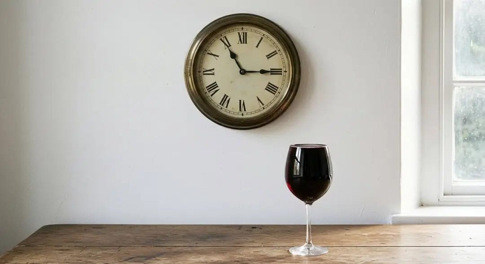<br>
<sub>Image © 2025 <a href="https://github.com/muset-ai">@muset-ai</a>, <a href="https://creativecommons.org/licenses/by/4.0/">CC BY 4.0</a> • Prompt by <a href="https://github.com/muset-ai">@muset-ai</a></sub>


**Prompt**

```
A cozy dining table scene. On the wall, a clock showing exactly 11:15 with correct tick marks. A crystal wine glass on the table is filled exactly to the rim with liquid—no spill, realistic meniscus, and natural reflections. Soft daylight, 50mm lens look.
```


---

[⬆️ Back to Cases Directory](#cases-toc)

<a id="cases-2"></a>
### Case 2: Math/Formula Boards & Logical Layouts (by []())

<p>


</p>

[Source Link](https://x.com/EHuanglu/status/1988007355070451975)

<br>
<sub>Image © 2025 <a href="https://github.com/muset-ai">@muset-ai</a>, <a href="https://creativecommons.org/licenses/by/4.0/">CC BY 4.0</a> • Prompt by <a href="https://github.com/muset-ai">@muset-ai</a></sub>


**Prompt**

```
A professor teaching in a classroom. Large blackboard behind them filled with a multi-line derivation: numbered steps, clearly separated lines, readable mathematical symbols, and logical arrows or brackets showing the flow of the proof.
```


---

[⬆️ Back to Cases Directory](#cases-toc)

<a id="cases-3"></a>
### Case 3: CCTV Footage (by []())

<p>


</p>

[Source Link](https://www.reddit.com/r/singularity/comments/1otuefg/nano_banana_2_crazy_image_outputs/)

<br>
<sub>Image © 2025 <a href="https://www.reddit.com/user/vladislavkochergin01/">@vladislavkochergin01</a>, <a href="https://creativecommons.org/licenses/by/4.0/">CC BY 4.0</a> • Prompt by <a href="https://www.reddit.com/user/Qemmish/">@Qemmish</a></sub>


**Prompt**

```
cctv footage, UK. a man in the street wearing gigantic oversized sneakers. talking to a police officer.
```


---

[⬆️ Back to Cases Directory](#cases-toc)

<a id="cases-4"></a>
### Case 4: CNN Election Results TV Broadcast (by [vladislavkochergin01](https://www.reddit.com/user/vladislavkochergin01/))

<p>


</p>

[Source Link](https://www.reddit.com/r/Bard/comments/1p0moso/just_got_a_limited_access_to_nano_banana_2_pro/)

<br>
<sub>Image © 2025 <a href="https://www.reddit.com/user/vladislavkochergin01/">vladislavkochergin01</a>, <a href="https://creativecommons.org/licenses/by/4.0/">CC BY 4.0</a> • Prompt by <a href="https://www.reddit.com/user/vladislavkochergin01/">vladislavkochergin01</a></sub>


**Prompt**

```
A realistic close-up of a television screen displaying CNN U.S. election results. The broadcast layout shows the two candidates with their photos: P Diddy at 50.2% and Jeffry Epstein at 49.8%. Their portraits appear beside their names and percentages in a clean red-and-blue election graphic. On the right side of the screen, a female news anchor is visible in a small live window, as if she is reporting the results. High-resolution, realistic lighting, slight screen glare, modern American news broadcast style.
```


---

[⬆️ Back to Cases Directory](#cases-toc)

<a id="cases-5"></a>
### Case 5: Five Adventurers in a Luminous Cave (by [Kiitani](https://www.reddit.com/user/Kiitani/))

<p>


</p>

[Source Link](https://www.reddit.com/r/Bard/comments/1p0moso/just_got_a_limited_access_to_nano_banana_2_pro/)

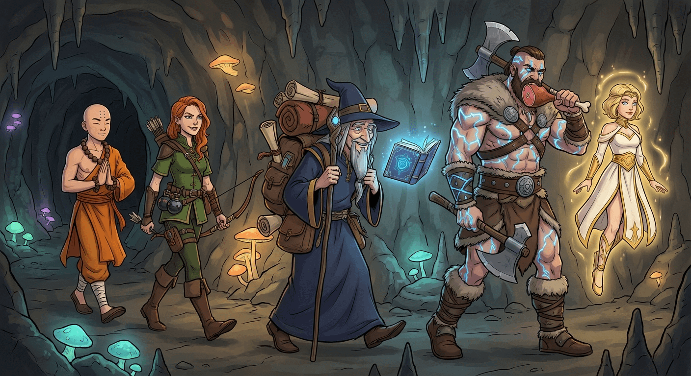<br>
<sub>Image © 2025 <a href="https://www.reddit.com/user/vladislavkochergin01/">vladislavkochergin01</a>, <a href="https://creativecommons.org/licenses/by/4.0/">CC BY 4.0</a> • Prompt by <a href="https://www.reddit.com/user/Kiitani/">Kiitani</a></sub>


**Prompt**

```
an animated illustration of a party of five adventurers navigating a cave system. In the middle, the tall, old guide stands. He is dressed in navy blue wizard robes. He has a silver goatee and a wise smile on his face. He holds a brown walking stick. He is carrying a heavy load of packs. A grimoire floats next to him, creating a luminescent light to guide the way. On his right, stands the towering Berserker. The berserker is wearing fur armor. He has a sculpted, muscular and tall build. His muscles are covered in storm lightning runes that flicker and crack. He is carrying twin axes, one in his left hand, and another in his axe holster on his hip. He has a large bastardsword on his back. He is gnawing on a huge piece of meat which he holds with his right hand. On the right of the berserker stands the pretty, fair-skinned healer. She is short and cute, wearing pure white priestess robes with golden trim. She has blonde hair and she is actually levitating a bit off the ground, with an aura around her. On the left of the guide stands a mischievious, redhead archer with a crafty smile on her face. She is drawing her bow. She has a number of arrows on her back and bombs strapped to her leather armor. She is slender and of average height. Next to her left stands the bald monk with five shaolin marks on his head. He wears orange monk robes and has a lean-muscular build. He is wearing sandals. He is carrying daoist builds and holding his hands close together in prayer.
```


---

[⬆️ Back to Cases Directory](#cases-toc)

<a id="cases-6"></a>
### Case 6: A Motorbike Made of Sharks (by [Dependent_Piece_5781](https://www.reddit.com/user/Dependent_Piece_5781/))

<p>


</p>

[Source Link](https://www.reddit.com/r/Bard/comments/1p0moso/just_got_a_limited_access_to_nano_banana_2_pro/)

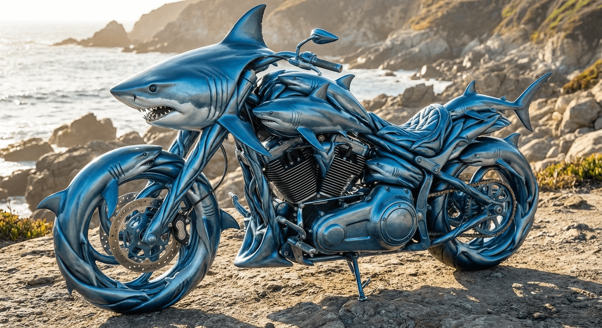<br>
<sub>Image © 2025 <a href="https://www.reddit.com/user/vladislavkochergin01/">vladislavkochergin01</a>, <a href="https://creativecommons.org/licenses/by/4.0/">CC BY 4.0</a> • Prompt by <a href="https://www.reddit.com/user/Dependent_Piece_5781/">Dependent_Piece_5781</a></sub>


**Prompt**

```
A motorbike made of sharks
```


---

[⬆️ Back to Cases Directory](#cases-toc)

<a id="cases-7"></a>
### Case 7: Biden’s Dog Holding a 2018 Newspaper (by [Healthy_Razzmatazz38](https://www.reddit.com/user/Healthy_Razzmatazz38/))

<p>


</p>

[Source Link](https://www.reddit.com/r/Bard/comments/1p0moso/just_got_a_limited_access_to_nano_banana_2_pro/)

<br>
<sub>Image © 2025 <a href="https://www.reddit.com/user/vladislavkochergin01/">vladislavkochergin01</a>, <a href="https://creativecommons.org/licenses/by/4.0/">CC BY 4.0</a> • Prompt by <a href="https://www.reddit.com/user/Healthy_Razzmatazz38/">Healthy_Razzmatazz38</a></sub>


**Prompt**

```
the breed of dog which biden had as a pet holding up a newspaper with the top headline from october 1st 2018 on a skateboard.
```


---

[⬆️ Back to Cases Directory](#cases-toc)

<a id="cases-8"></a>
### Case 8: Elderly Couple Watching a B-2 Bomber (by [Snoo26837](https://www.reddit.com/user/Snoo26837/))

<p>


</p>

[Source Link](https://www.reddit.com/r/Bard/comments/1p0moso/just_got_a_limited_access_to_nano_banana_2_pro/)

<br>
<sub>Image © 2025 <a href="https://www.reddit.com/user/vladislavkochergin01/">vladislavkochergin01</a>, <a href="https://creativecommons.org/licenses/by/4.0/">CC BY 4.0</a> • Prompt by <a href="https://www.reddit.com/user/Snoo26837/">Snoo26837</a></sub>


**Prompt**

```
35mm film photograph, full shot from behind of an elderly man in a long black overcoat and an elderly woman in a long deep red overcoat, standing symmetrically on a vast concrete tarmac. They are looking at a Northrop Grumman B-2 Spirit stealth bomber parked in the middle distance. In the far background are hazy, snow-capped mountains under a pale blue sky. The top third of the image is framed by the interior ceiling of a massive hangar with horizontal beams. Cinematic and formal composition, muted color palette, visible film grain, somber and powerful atmosphere. --ar 2:3 --style raw --v 6.0
```


---

[⬆️ Back to Cases Directory](#cases-toc)

<a id="cases-9"></a>
### Case 9: Stylized 3D Zombie Character (by [Fysikz](https://www.reddit.com/user/Fysikz/))

<p>


</p>

[Source Link](https://www.reddit.com/r/Bard/comments/1p0moso/just_got_a_limited_access_to_nano_banana_2_pro/)

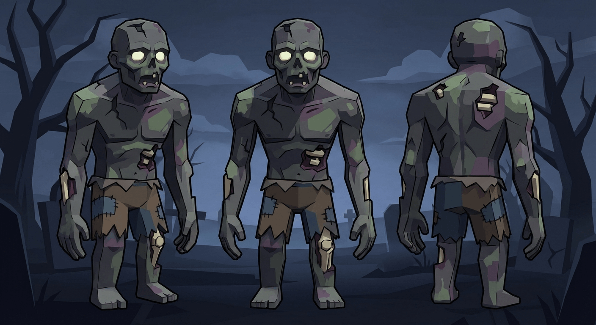<br>
<sub>Image © 2025 <a href="https://www.reddit.com/user/vladislavkochergin01/">vladislavkochergin01</a>, <a href="https://creativecommons.org/licenses/by/4.0/">CC BY 4.0</a> • Prompt by <a href="https://www.reddit.com/user/Fysikz/">Fysikz</a></sub>


**Prompt**

```
3D character model of a zombie. The style should be stylized and graphic, with crisp, defined, and bold colors. The zombie should have a gloomy inspired aesthetic only wearing torn shorts. Has decaying flesh.
```


---

[⬆️ Back to Cases Directory](#cases-toc)

<a id="cases-10"></a>
### Case 10: Man Drinking Sushi Water Under Surreal Skies (by [Rare-Belt-9644](https://www.reddit.com/user/Rare-Belt-9644/))

<p>


</p>

[Source Link](https://www.reddit.com/r/Bard/comments/1p0moso/just_got_a_limited_access_to_nano_banana_2_pro/)

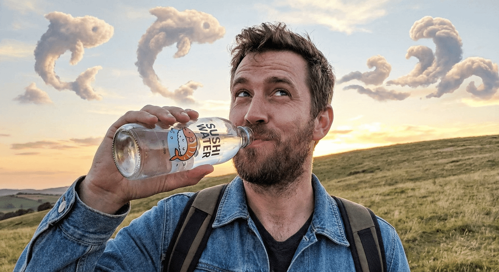<br>
<sub>Image © 2025 <a href="https://www.reddit.com/user/vladislavkochergin01/">vladislavkochergin01</a>, <a href="https://creativecommons.org/licenses/by/4.0/">CC BY 4.0</a> • Prompt by <a href="https://www.reddit.com/user/Rare-Belt-9644/">Rare-Belt-9644</a></sub>


**Prompt**

```
A man drinking bottle of sushi water and looking at beautiful-shaped skies, smirking
```


---

[⬆️ Back to Cases Directory](#cases-toc)

<a id="cases-11"></a>
### Case 11: Grizzly Bear Showing a Meme to a Hiker (by [maynmaynmayn](https://www.reddit.com/user/maynmaynmayn/))

<p>


</p>

[Source Link](https://www.reddit.com/r/Bard/comments/1p0moso/just_got_a_limited_access_to_nano_banana_2_pro/)

<br>
<sub>Image © 2025 <a href="https://www.reddit.com/user/vladislavkochergin01/">vladislavkochergin01</a>, <a href="https://creativecommons.org/licenses/by/4.0/">CC BY 4.0</a> • Prompt by <a href="https://www.reddit.com/user/maynmaynmayn/">maynmaynmayn</a></sub>


**Prompt**

```
A grizzly bear holding a picture with a meme of a grizzly bear in the forest, in front of a real hiker
```


---

[⬆️ Back to Cases Directory](#cases-toc)

<a id="cases-12"></a>
### Case 12: Floral Calculus Blackboard (by [Longjumping_Spot5843](https://www.reddit.com/user/Longjumping_Spot5843/))

<p>


</p>

[Source Link](https://www.reddit.com/r/Bard/comments/1p0moso/just_got_a_limited_access_to_nano_banana_2_pro/)

<br>
<sub>Image © 2025 <a href="https://www.reddit.com/user/vladislavkochergin01/">vladislavkochergin01</a>, <a href="https://creativecommons.org/licenses/by/4.0/">CC BY 4.0</a> • Prompt by <a href="https://www.reddit.com/user/Longjumping_Spot5843/">Longjumping_Spot5843</a></sub>


**Prompt**

```
A hard calculus integration problem written and solved on a blackboard, but the text itself and the chalk is sort of turned into this coloured artwork that looks like a flower. (as a photo)
```


---

[⬆️ Back to Cases Directory](#cases-toc)

<a id="cases-13"></a>
### Case 13: Lightning Radar Browser UI (by [BasketFar667](https://www.reddit.com/user/BasketFar667/))

<p>


</p>

[Source Link](https://www.reddit.com/r/Bard/comments/1p0moso/just_got_a_limited_access_to_nano_banana_2_pro/)

<br>
<sub>Image © 2025 <a href="https://www.reddit.com/user/vladislavkochergin01/">vladislavkochergin01</a>, <a href="https://creativecommons.org/licenses/by/4.0/">CC BY 4.0</a> • Prompt by <a href="https://www.reddit.com/user/BasketFar667/">BasketFar667</a></sub>


**Prompt**

```
Lightning Radar: A copy of the browser version of Lightning Radar.
```


---

[⬆️ Back to Cases Directory](#cases-toc)

<a id="cases-14"></a>
### Case 14: Duck, Chicken and Parrot Riding a Scooter (by [maynmaynmayn](https://www.reddit.com/user/maynmaynmayn/))

<p>


</p>

[Source Link](https://www.reddit.com/r/Bard/comments/1p0moso/just_got_a_limited_access_to_nano_banana_2_pro/)

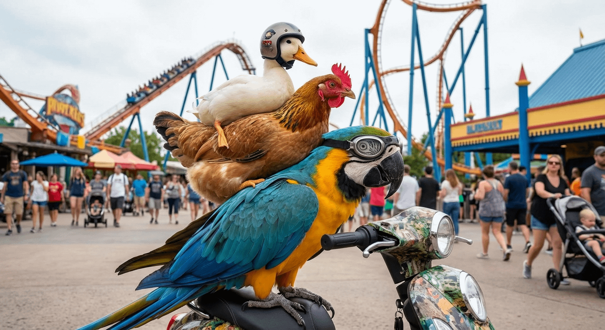<br>
<sub>Image © 2025 <a href="https://www.reddit.com/user/vladislavkochergin01/">vladislavkochergin01</a>, <a href="https://creativecommons.org/licenses/by/4.0/">CC BY 4.0</a> • Prompt by <a href="https://www.reddit.com/user/maynmaynmayn/">maynmaynmayn</a></sub>


**Prompt**

```
A duck riding a chicken that sits in the shoulders of a parrot that drives and electric scooter in a theme park
```


---

[⬆️ Back to Cases Directory](#cases-toc)

<a id="cases-15"></a>
### Case 15: One-Eyed Whippet on a Moped (by [douggieball1312](https://www.reddit.com/user/douggieball1312/))

<p>


</p>

[Source Link](https://www.reddit.com/r/Bard/comments/1p0moso/just_got_a_limited_access_to_nano_banana_2_pro/)

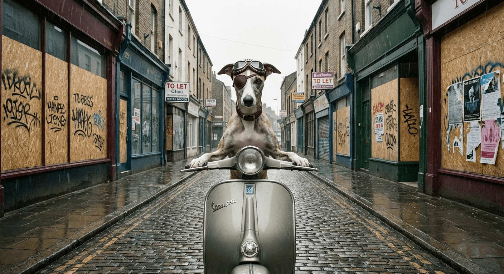<br>
<sub>Image © 2025 <a href="https://www.reddit.com/user/vladislavkochergin01/">vladislavkochergin01</a>, <a href="https://creativecommons.org/licenses/by/4.0/">CC BY 4.0</a> • Prompt by <a href="https://www.reddit.com/user/douggieball1312/">douggieball1312</a></sub>


**Prompt**

```
A whippet with an eye patch riding a moped through a UK street filled with shops with boarded up windows.
```


---

[⬆️ Back to Cases Directory](#cases-toc)

<a id="cases-16"></a>
### Case 16: Gemini Solves Cancer and World Peace (by [Feisty_Test_9388](https://www.reddit.com/user/Feisty_Test_9388/))

<p>


</p>

[Source Link](https://www.reddit.com/r/Bard/comments/1p0moso/just_got_a_limited_access_to_nano_banana_2_pro/)

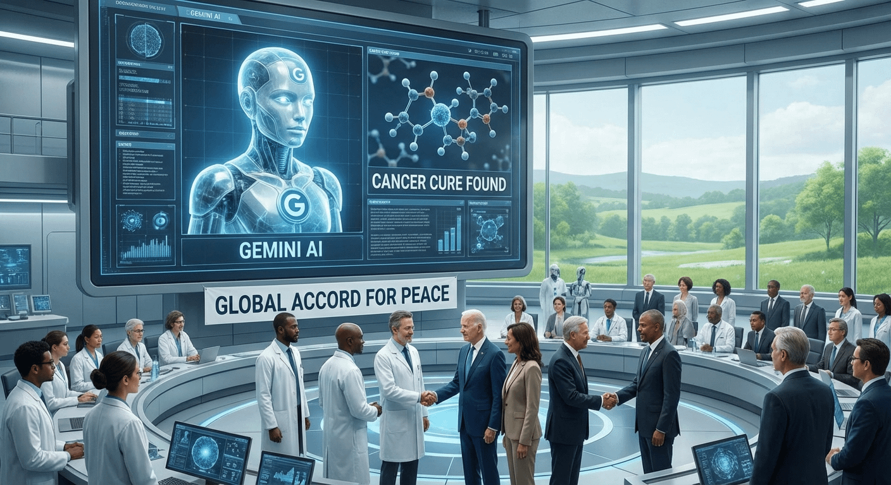<br>
<sub>Image © 2025 <a href="https://www.reddit.com/user/vladislavkochergin01/">vladislavkochergin01</a>, <a href="https://creativecommons.org/licenses/by/4.0/">CC BY 4.0</a> • Prompt by <a href="https://www.reddit.com/user/Feisty_Test_9388/">Feisty_Test_9388</a></sub>


**Prompt**

```
Gemini finding cure to cancer and establishing world peace
```


---

[⬆️ Back to Cases Directory](#cases-toc)

<a id="cases-17"></a>
### Case 17: Big-Headed Superhero Sprite Sheet (by [hydrangers](https://www.reddit.com/user/hydrangers/))

<p>


</p>

[Source Link](https://www.reddit.com/r/Bard/comments/1p0moso/just_got_a_limited_access_to_nano_banana_2_pro/)

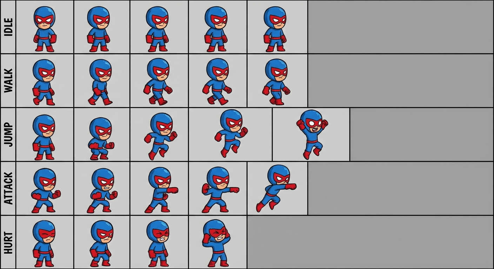<br>
<sub>Image © 2025 <a href="https://www.reddit.com/user/vladislavkochergin01/">vladislavkochergin01</a>, <a href="https://creativecommons.org/licenses/by/4.0/">CC BY 4.0</a> • Prompt by <a href="https://www.reddit.com/user/hydrangers/">hydrangers</a></sub>


**Prompt**

```
a sprite sheet for various animation for a single character for a 2d game. The hero should have a big head, cell shaded appearance, blue spandex suit with red face mask, red gloves, and red boots
```


---

[⬆️ Back to Cases Directory](#cases-toc)

<a id="cases-18"></a>
### Case 18: Sun Exploding into Pigeons (by [neoqueto](https://www.reddit.com/user/neoqueto/))

<p>


</p>

[Source Link](https://www.reddit.com/r/Bard/comments/1p0moso/just_got_a_limited_access_to_nano_banana_2_pro/)

<br>
<sub>Image © 2025 <a href="https://www.reddit.com/user/vladislavkochergin01/">vladislavkochergin01</a>, <a href="https://creativecommons.org/licenses/by/4.0/">CC BY 4.0</a> • Prompt by <a href="https://www.reddit.com/user/neoqueto/">neoqueto</a></sub>


**Prompt**

```
A very photorealistic image of the Sun vigorously exploding into a bunch of pigeons and an old lady looking at the situation saying "oh, crikey!", some of the pigeons are wearing pink wedding dresses, but don't be fooled, this is certainly a doomsday scenario, Earth is cooked.
```


---

[⬆️ Back to Cases Directory](#cases-toc)

<a id="cases-19"></a>
### Case 19: Old Lady Balancing Sumo Wrestlers on the Statue of Liberty (by [maynmaynmayn](https://www.reddit.com/user/maynmaynmayn/))

<p>


</p>

[Source Link](https://www.reddit.com/r/Bard/comments/1p0moso/just_got_a_limited_access_to_nano_banana_2_pro/)

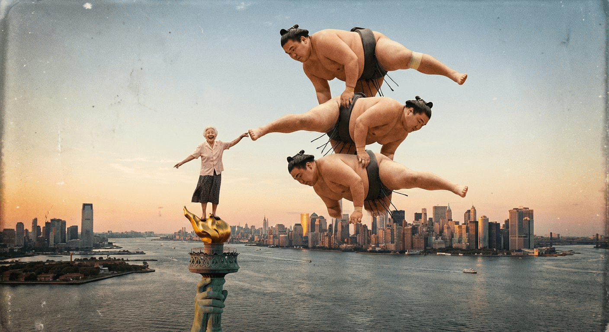<br>
<sub>Image © 2025 <a href="https://www.reddit.com/user/vladislavkochergin01/">vladislavkochergin01</a>, <a href="https://creativecommons.org/licenses/by/4.0/">CC BY 4.0</a> • Prompt by <a href="https://www.reddit.com/user/maynmaynmayn/">maynmaynmayn</a></sub>


**Prompt**

```
An old lady balancing 3 sumo wrestlers on her pinky finger, each sumo wrestler balances the others on their pinky fingers, the old lady is balancing on the top of the statue of liberty
```


---

[⬆️ Back to Cases Directory](#cases-toc)

<a id="cases-20"></a>
### Case 20: Soviet Manual on Human-Wolf Hybrids (by [ryebrye](https://www.reddit.com/user/ryebrye/))

<p>


</p>

[Source Link](https://www.reddit.com/r/Bard/comments/1p0moso/just_got_a_limited_access_to_nano_banana_2_pro/)

<br>
<sub>Image © 2025 <a href="https://www.reddit.com/user/vladislavkochergin01/">vladislavkochergin01</a>, <a href="https://creativecommons.org/licenses/by/4.0/">CC BY 4.0</a> • Prompt by <a href="https://www.reddit.com/user/ryebrye/">ryebrye</a></sub>


**Prompt**

```
A soviet biology textbook open to the page describing how to hybridize a human and a wolf, photo realistic - being read by a werewolf with a sparkly vampire in a glass cage in the background. 1940's styling. Frame from a 1953 motion picture in technicolor.
```


---

[⬆️ Back to Cases Directory](#cases-toc)

<a id="cases-21"></a>
### Case 21: Business Conversation Film Still (by [Bait_Shop_Guy_](https://www.reddit.com/user/Bait_Shop_Guy_/))

<p>


</p>

[Source Link](https://www.reddit.com/r/Bard/comments/1p0moso/just_got_a_limited_access_to_nano_banana_2_pro/)

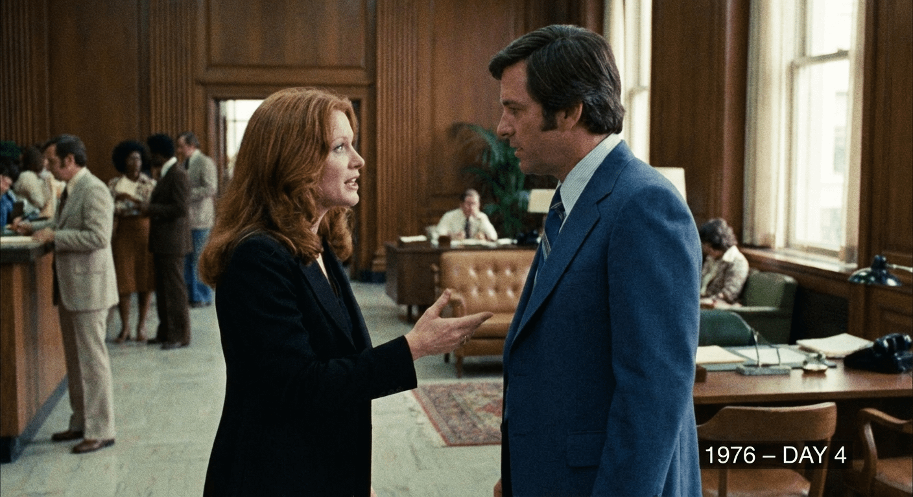<br>
<sub>Image © 2025 <a href="https://www.reddit.com/user/vladislavkochergin01/">vladislavkochergin01</a>, <a href="https://creativecommons.org/licenses/by/4.0/">CC BY 4.0</a> • Prompt by <a href="https://www.reddit.com/user/Bait_Shop_Guy_/">Bait_Shop_Guy_</a></sub>


**Prompt**

```
A redhead woman in a black blazer talks with a man in a blue business suit. Indoor setting. Screencap from a film.
```


---

[⬆️ Back to Cases Directory](#cases-toc)

<a id="cases-22"></a>
### Case 22: Orchestra Playing 'Baby Got Back' in Vienna (by [ryebrye](https://www.reddit.com/user/ryebrye/))

<p>


</p>

[Source Link](https://www.reddit.com/r/Bard/comments/1p0moso/just_got_a_limited_access_to_nano_banana_2_pro/)

<br>
<sub>Image © 2025 <a href="https://www.reddit.com/user/vladislavkochergin01/">vladislavkochergin01</a>, <a href="https://creativecommons.org/licenses/by/4.0/">CC BY 4.0</a> • Prompt by <a href="https://www.reddit.com/user/ryebrye/">ryebrye</a></sub>


**Prompt**

```
a conductor's point of view of an orchestra during a Christmas concert in Vienna, with the score for an orchestral arrangement of "Baby Got Back" on the music stand. Photorealistic. RF 20mm f/1.4 L VCM lens at 4.0, Canon R5 with Aperture priority +1 ev.
```


---

[⬆️ Back to Cases Directory](#cases-toc)

<a id="cases-23"></a>
### Case 23: Cats Boxing in the Ring (by [Every_Ad_2705](https://www.reddit.com/user/Every_Ad_2705/))

<p>


</p>

[Source Link](https://www.reddit.com/r/Bard/comments/1p0moso/just_got_a_limited_access_to_nano_banana_2_pro/)

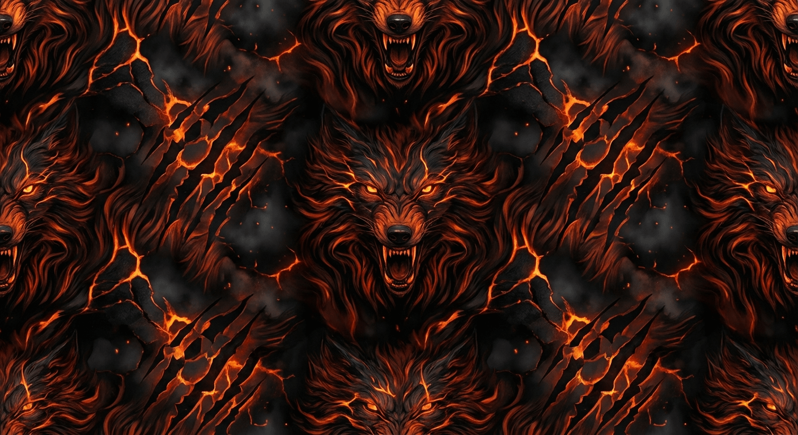<br>
<sub>Image © 2025 <a href="https://www.reddit.com/user/vladislavkochergin01/">vladislavkochergin01</a>, <a href="https://creativecommons.org/licenses/by/4.0/">CC BY 4.0</a> • Prompt by <a href="https://www.reddit.com/user/Every_Ad_2705/">Every_Ad_2705</a></sub>


**Prompt**

```
2 cats in the ring boxing it out
```


---

[⬆️ Back to Cases Directory](#cases-toc)

<a id="cases-24"></a>
### Case 24: Volcanic Werewolf Camo Pattern (by [SentinelHalo](https://www.reddit.com/user/SentinelHalo/))

<p>


</p>

[Source Link](https://www.reddit.com/r/Bard/comments/1p0moso/just_got_a_limited_access_to_nano_banana_2_pro/)

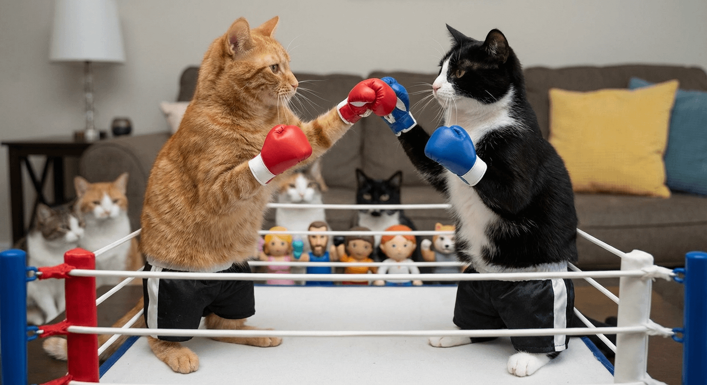<br>
<sub>Image © 2025 <a href="https://www.reddit.com/user/vladislavkochergin01/">vladislavkochergin01</a>, <a href="https://creativecommons.org/licenses/by/4.0/">CC BY 4.0</a> • Prompt by <a href="https://www.reddit.com/user/SentinelHalo/">SentinelHalo</a></sub>


**Prompt**

```
Volcanic-inspired werewolf camo pattern using ember-orange, charcoal-black, and deep red hues, molten cracks forming hidden wolf faces and snarls, flame-like fur textures, jagged claw-scar geometry, intense and supernatural, seamless repeating pattern
```


---

[⬆️ Back to Cases Directory](#cases-toc)

<a id="cases-25"></a>
### Case 25: Sveavägen Street in Stockholm (by [kyprianou](https://www.reddit.com/user/kyprianou/))

<p>


</p>

[Source Link](https://www.reddit.com/r/Bard/comments/1p0moso/just_got_a_limited_access_to_nano_banana_2_pro/)

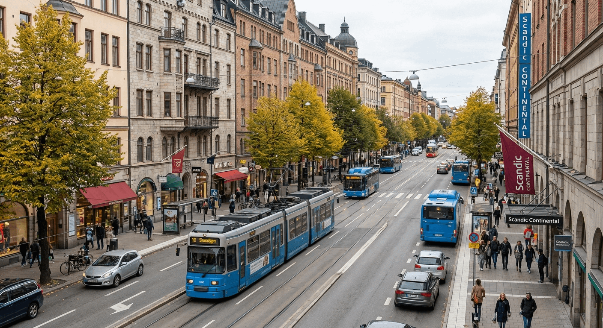<br>
<sub>Image © 2025 <a href="https://www.reddit.com/user/vladislavkochergin01/">vladislavkochergin01</a>, <a href="https://creativecommons.org/licenses/by/4.0/">CC BY 4.0</a> • Prompt by <a href="https://www.reddit.com/user/kyprianou/">kyprianou</a></sub>


**Prompt**

```
Sveavägen, Stockholm
```


---

[⬆️ Back to Cases Directory](#cases-toc)

<a id="cases-26"></a>
### Case 26: Web App UI with QR Code (by [Camaraderie](https://www.reddit.com/user/Camaraderie/))

<p>


</p>

[Source Link](https://www.reddit.com/r/Bard/comments/1p0moso/just_got_a_limited_access_to_nano_banana_2_pro/)

<br>
<sub>Image © 2025 <a href="https://www.reddit.com/user/vladislavkochergin01/">vladislavkochergin01</a>, <a href="https://creativecommons.org/licenses/by/4.0/">CC BY 4.0</a> • Prompt by <a href="https://www.reddit.com/user/Camaraderie/">Camaraderie</a></sub>


**Prompt**

```
Generate a mock UI for a web application with modern styling and CSS. Place a QR code with the encoding payload 'https://google.com'. The QR code must be scannable.
```


---

[⬆️ Back to Cases Directory](#cases-toc)

<a id="cases-27"></a>
### Case 27: CT5-V Blackwing and Purple Hellcat at Dusk (by [InformalNatural1134](https://www.reddit.com/user/InformalNatural1134/))

<p>


</p>

[Source Link](https://www.reddit.com/r/Bard/comments/1p0moso/just_got_a_limited_access_to_nano_banana_2_pro/)

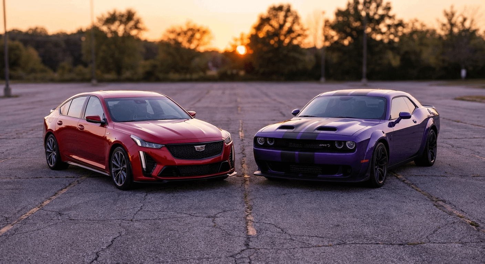<br>
<sub>Image © 2025 <a href="https://www.reddit.com/user/vladislavkochergin01/">vladislavkochergin01</a>, <a href="https://creativecommons.org/licenses/by/4.0/">CC BY 4.0</a> • Prompt by <a href="https://www.reddit.com/user/InformalNatural1134/">InformalNatural1134</a></sub>


**Prompt**

```
A ct5 v black wing radiant red and a gloss purple hellcat parked together in a empty parking lot in evening
```


---

[⬆️ Back to Cases Directory](#cases-toc)

<a id="cases-28"></a>
### Case 28: Brazilian Zouk Demo at Warsaw Zouk Festival (by [zactral](https://www.reddit.com/user/zactral/))

<p>


</p>

[Source Link](https://www.reddit.com/r/Bard/comments/1p0moso/just_got_a_limited_access_to_nano_banana_2_pro/)

<br>
<sub>Image © 2025 <a href="https://www.reddit.com/user/vladislavkochergin01/">vladislavkochergin01</a>, <a href="https://creativecommons.org/licenses/by/4.0/">CC BY 4.0</a> • Prompt by <a href="https://www.reddit.com/user/zactral/">zactral</a></sub>


**Prompt**

```
A couple doing a Brazilian Zouk dance demo at Warsaw Zouk Festival while a crowd of people watches and a videographer films the dancers, photorealistic.
```


---

[⬆️ Back to Cases Directory](#cases-toc)

<a id="cases-29"></a>
### Case 29: Wind Turbine over the Swiss Alps (by [Kosmicce](https://www.reddit.com/user/Kosmicce/))

<p>


</p>

[Source Link](https://www.reddit.com/r/Bard/comments/1p0moso/just_got_a_limited_access_to_nano_banana_2_pro/)

<br>
<sub>Image © 2025 <a href="https://www.reddit.com/user/vladislavkochergin01/">vladislavkochergin01</a>, <a href="https://creativecommons.org/licenses/by/4.0/">CC BY 4.0</a> • Prompt by <a href="https://www.reddit.com/user/Kosmicce/">Kosmicce</a></sub>


**Prompt**

```
Close-up drone shot of a wind turbine on top of swiss alps, beautiful sunny day, no clouds
```


---

[⬆️ Back to Cases Directory](#cases-toc)

<a id="cases-30"></a>
### Case 30: Anne Boleyn Actress iPhone Selfie (by [Bait_Shop_Guy_](https://www.reddit.com/user/Bait_Shop_Guy_/))

<p>


</p>

[Source Link](https://www.reddit.com/r/Bard/comments/1p0moso/just_got_a_limited_access_to_nano_banana_2_pro/)

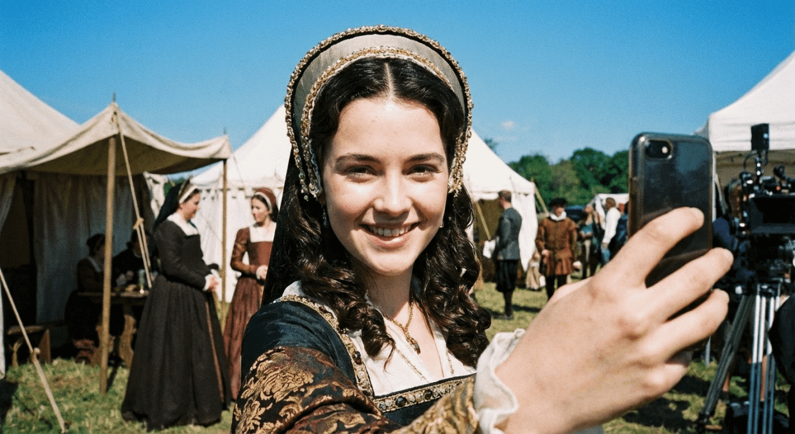<br>
<sub>Image © 2025 <a href="https://www.reddit.com/user/vladislavkochergin01/">vladislavkochergin01</a>, <a href="https://creativecommons.org/licenses/by/4.0/">CC BY 4.0</a> • Prompt by <a href="https://www.reddit.com/user/Bait_Shop_Guy_/">Bait_Shop_Guy_</a></sub>


**Prompt**

```
Amateur, medicore iPhone selfie of smiling young actress dressed as Anne Boleyn. Outdoor movie set setting, daytime, clear blue sky.
```


---

[⬆️ Back to Cases Directory](#cases-toc)

<a id="cases-31"></a>
### Case 31: Tiny Human Inside an Acoustic Guitar (by [xGRAPH1KSx](https://www.reddit.com/user/xGRAPH1KSx/))

<p>


</p>

[Source Link](https://www.reddit.com/r/Bard/comments/1p0moso/just_got_a_limited_access_to_nano_banana_2_pro/)

<br>
<sub>Image © 2025 <a href="https://www.reddit.com/user/vladislavkochergin01/">vladislavkochergin01</a>, <a href="https://creativecommons.org/licenses/by/4.0/">CC BY 4.0</a> • Prompt by <a href="https://www.reddit.com/user/xGRAPH1KSx/">xGRAPH1KSx</a></sub>


**Prompt**

```
a tiny human standing in the inside of an accoustic guitar revealing all the inner workings and details of the hollow space that is contained within a guitar.
```


---

[⬆️ Back to Cases Directory](#cases-toc)

<a id="cases-32"></a>
### Case 32: Blue Oranges and a Purple Apple (by [Head_Phrase_7084](https://www.reddit.com/user/Head_Phrase_7084/))

<p>


</p>

[Source Link](https://www.reddit.com/r/Bard/comments/1p0moso/just_got_a_limited_access_to_nano_banana_2_pro/)

<br>
<sub>Image © 2025 <a href="https://www.reddit.com/user/vladislavkochergin01/">vladislavkochergin01</a>, <a href="https://creativecommons.org/licenses/by/4.0/">CC BY 4.0</a> • Prompt by <a href="https://www.reddit.com/user/Head_Phrase_7084/">Head_Phrase_7084</a></sub>


**Prompt**

```
Photo of a white bowl filled with blue oranges and a singular purple apple in the center
```


---

[⬆️ Back to Cases Directory](#cases-toc)

<a id="cases-33"></a>
### Case 33: A Burger, but not (by [HeraclesLeftNipple](https://www.reddit.com/user/HeraclesLeftNipple/))

<p>


</p>

[Source Link](https://www.reddit.com/r/Bard/comments/1p0moso/just_got_a_limited_access_to_nano_banana_2_pro/)

<br>
<sub>Image © 2025 <a href="https://www.reddit.com/user/vladislavkochergin01/">vladislavkochergin01</a>, <a href="https://creativecommons.org/licenses/by/4.0/">CC BY 4.0</a> • Prompt by <a href="https://www.reddit.com/user/HeraclesLeftNipple/">HeraclesLeftNipple</a></sub>


**Prompt**

```
A Burger, but not.
```


---

[⬆️ Back to Cases Directory](#cases-toc)

<a id="cases-34"></a>
### Case 34: Space-Age 60s Living Room at Golden Hour (by [Polstick1971](https://www.reddit.com/user/Polstick1971/))

<p>


</p>

[Source Link](https://www.reddit.com/r/Bard/comments/1p0moso/just_got_a_limited_access_to_nano_banana_2_pro/)

<br>
<sub>Image © 2025 <a href="https://www.reddit.com/user/vladislavkochergin01/">vladislavkochergin01</a>, <a href="https://creativecommons.org/licenses/by/4.0/">CC BY 4.0</a> • Prompt by <a href="https://www.reddit.com/user/Polstick1971/">Polstick1971</a></sub>


**Prompt**

```
Space age 60’s style living room. Golden hour. Nostalgic feeling.
```


---

[⬆️ Back to Cases Directory](#cases-toc)

<a id="cases-35"></a>
### Case 35: Comic-Book Ouroboros with Ben Day Dots (by [SupehCookie](https://www.reddit.com/user/SupehCookie/))

<p>


</p>

[Source Link](https://www.reddit.com/r/Bard/comments/1p0moso/just_got_a_limited_access_to_nano_banana_2_pro/)

<br>
<sub>Image © 2025 <a href="https://www.reddit.com/user/vladislavkochergin01/">vladislavkochergin01</a>, <a href="https://creativecommons.org/licenses/by/4.0/">CC BY 4.0</a> • Prompt by <a href="https://www.reddit.com/user/SupehCookie/">SupehCookie</a></sub>


**Prompt**

```
an Ouroboros in a comicbook theme, with ben day dots make the Ouroboros look like its moving
```


---

[⬆️ Back to Cases Directory](#cases-toc)

<a id="cases-36"></a>
### Case 36: Prompt Overload Dystopian Desert (by [ComprehensiveLead198](https://www.reddit.com/user/ComprehensiveLead198/))

<p>


</p>

[Source Link](https://www.reddit.com/r/Bard/comments/1p0moso/just_got_a_limited_access_to_nano_banana_2_pro/)

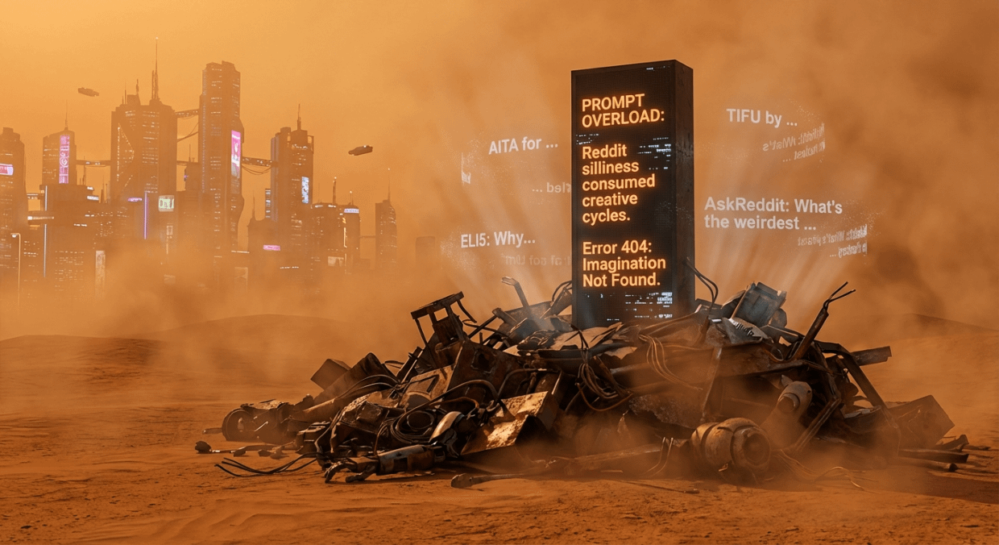<br>
<sub>Image © 2025 <a href="https://www.reddit.com/user/vladislavkochergin01/">vladislavkochergin01</a>, <a href="https://creativecommons.org/licenses/by/4.0/">CC BY 4.0</a> • Prompt by <a href="https://www.reddit.com/user/ComprehensiveLead198/">ComprehensiveLead198</a></sub>


**Prompt**

```
Dystopian, arid desert landscape under a hazy orange sky, leading to a distant cyberpunk megalopolis. Central focus: a rusted tech scrap pile with a flickering digital monolith. The monolith displays: "PROMPT OVERLOAD: Reddit silliness consumed creative cycles. Error 404: Imagination Not Found." Holographic snippets of absurd Reddit prompts drift like digital sand. Highly detailed 3D render, volumetric fog, neon reflections.
```


---

[⬆️ Back to Cases Directory](#cases-toc)

<a id="cases-37"></a>
### Case 37: 绝区零 × 喜茶 霓虹联动海报 (by [雪佬说](https://mp.weixin.qq.com/s/Rcr2TM4tIRpZfxJueXntsA))

<p>


</p>

[Source Link](https://mp.weixin.qq.com/s/Rcr2TM4tIRpZfxJueXntsA)

<br>
<sub>Image © 2025 <a href="https://mp.weixin.qq.com/s/Rcr2TM4tIRpZfxJueXntsA">雪佬说</a>, <a href="https://creativecommons.org/licenses/by/4.0/">CC BY 4.0</a> • Prompt by <a href="https://mp.weixin.qq.com/s/Rcr2TM4tIRpZfxJueXntsA">雪佬说</a></sub>


**Prompt**

```
`画幅比例16:9，官方游戏联动海报，杰作，充满活力的《绝区零》动漫风格。
场景: 四位时尚的动漫角色（一位黑夹克粉发女孩是视觉中心，一位银发女孩，一位白发男孩，一位黑发男孩）在未来城市夜晚上摆姿势，每人都拿着一杯喜茶。
环境: 这是一个未来城市的夜间街道，整个场景
被巨大、发光的霓虹灯招牌所主导。
一个以风格化的“ZZZ”标志为特色的、巨大且不容错过的霓虹灯招牌，是背景的绝对视觉焦点，在主角们身后闪耀着明亮的光芒。 其他写着“HEYTEA”的霓虹灯也同样醒目，将整个场景沐浴在鲜艳的紫色和蓝色光线中。
特殊效果: 草莓和柠檬等水果被包裹在透明气泡中漂浮，发光的粉色和蓝色能量漩涡贯穿画面。
文字元素:
左上角: 显示“绝区零”和“喜茶”的Logo，由“X”连接。
底部中央: 一大块醒目的中文文字“绝区零 X 喜茶：异能觉醒，双倍快乐！”。字体为粗体、风格化的艺术字，白色填充，带有厚重的紫粉渐变描边。
中文下方: 黑色矩形框内有白色大写英文“LIMITED COLLAB”。
艺术风格: 高度细节，线条干净，来自巨型霓虹灯的电影级光效，动态构图。
负面提示词: 模糊, 低质量, 人体结构崩坏, 手部畸形, 丑陋, 水印, 签名, 乱码文字, 字母变形
```


---

[⬆️ Back to Cases Directory](#cases-toc)

<a id="cases-38"></a>
### Case 38: 美团 赛博黄历 复古符箓海报 (by [雪佬说](https://mp.weixin.qq.com/s/Rcr2TM4tIRpZfxJueXntsA))

<p>


</p>

[Source Link](https://mp.weixin.qq.com/s/Rcr2TM4tIRpZfxJueXntsA)

<br>
<sub>Image © 2025 <a href="https://mp.weixin.qq.com/s/Rcr2TM4tIRpZfxJueXntsA">雪佬说</a>, <a href="https://creativecommons.org/licenses/by/4.0/">CC BY 4.0</a> • Prompt by <a href="https://mp.weixin.qq.com/s/Rcr2TM4tIRpZfxJueXntsA">雪佬说</a></sub>


**Prompt**

```
`画幅比例16:9，一张为美团设计的、超级复杂的商业海报，风格是未来主义的道家黄历或符箓图。
布局与风格: 整张海报是一个密集的、复杂的网格，充满了文字和图标，模仿在泛黄旧纸上的中国传统木版画。所有文字都采用经典的木刻风格楷体或宋体，从右到左竖排。
中心神像: 中央是一位“外卖神君”，以古版画风格描绘。他身穿黄帝袍，头戴袋鼠耳神冠，一手托着显示美团App的手机，另一手托着外卖餐盒。
复杂文字网格:
顶部标题: 在一个华丽的画框中，从右到左写着主标题：“赛博黄历·万事皆宜”。
环绕网格: 中心神像被代表十二时辰（子、丑、寅…）的网格包围。每个时辰下都有一列竖排文字描述宜忌，例如“宜：點宵夜”和“忌：空腹眠”。
角落元素: 四角是八卦卦象，每个卦象都与一项美团业务和一个小版画图标相关联（例如，机械马代表共享单车）。
细节: 海报上装饰着几个红色的、篆书风格的方形印章。整体氛围是古代神秘主义与现代日常生活的融合，一种“赛博道教”美学。杰作，高信息密度。
负面提示词: 3D, 照片, 现代字体, 横排文字, 极简, 简单, 模糊, 丑陋, 畸形, 糟糕的书法, 水印。
```


---

[⬆️ Back to Cases Directory](#cases-toc)

<a id="cases-39"></a>
### Case 39: 奈斯派索 上海装饰艺术海报 (by [雪佬说](https://mp.weixin.qq.com/s/Rcr2TM4tIRpZfxJueXntsA))

<p>


</p>

[Source Link](https://mp.weixin.qq.com/s/Rcr2TM4tIRpZfxJueXntsA)

<br>
<sub>Image © 2025 <a href="https://mp.weixin.qq.com/s/Rcr2TM4tIRpZfxJueXntsA">雪佬说</a>, <a href="https://creativecommons.org/licenses/by/4.0/">CC BY 4.0</a> • Prompt by <a href="https://mp.weixin.qq.com/s/Rcr2TM4tIRpZfxJueXntsA">雪佬说</a></sub>


**Prompt**

```
`画幅比例16:9，一张为Nespresso设计的优雅商业海报，采用上世纪二三十年代独特的上海装饰艺术（Art Deco）风格。
构图: 不对称但平衡的构图。
左侧人物: 一位身穿时尚几何图案旗袍的摩登女性，正优雅地操作一台被重新设计成Art Deco美学的Nespresso咖啡机——黄铜细节、流线型曲线、华丽雕刻。
右侧文字: 视觉焦点是一列巨大、引人注目的竖排风格化汉字。
字体是核心元素:
主标题: “奈斯派索”这四个汉字是核心艺术品。每个字的笔画都被设计成大胆的几何线条和装饰元素。
Slogan: 主标题旁，用小一号但同样艺术风格的字体竖排写着“啡常时刻，啡你莫属”。
英文“Nespresso”以小号无衬线字体，作为装饰巧妙地融入汉字笔画之间或旁边。
背景与边框: 背景是风格化、几何化的上海城市景观。整个海报被一个融合了中式传统图案与Art Deco几何图形的华丽边框包围。色彩丰富而怀旧（深红、金色、蓝绿色、奶油色）。杰作，精致，黄金时代的魅力。
负面提示词: 3D, 照片, 写实, 现代, 极简, 丑陋, 畸形, 糟糕的书法, 水印。
`画幅比例16:9，一张为Nespresso设计的优雅商业海报，采用上世纪二三十年代独特的上海装饰艺术（Art Deco）风格。
构图: 不对称但平衡的构图。
左侧人物: 一位身穿时尚几何图案旗袍的摩登女性，正优雅地操作一台被重新设计成Art Deco美学的Nespresso咖啡机——黄铜细节、流线型曲线、华丽雕刻。
右侧文字: 视觉焦点是一列巨大、引人注目的竖排风格化汉字。
字体是核心元素:
主标题: “奈斯派索”这四个汉字是核心艺术品。每个字的笔画都被设计成大胆的几何线条和装饰元素。
Slogan: 主标题旁，用小一号但同样艺术风格的字体竖排写着“啡常时刻，啡你莫属”。
英文“Nespresso”以小号无衬线字体，作为装饰巧妙地融入汉字笔画之间或旁边。
背景与边框: 背景是风格化、几何化的上海城市景观。整个海报被一个融合了中式传统图案与Art Deco几何图形的华丽边框包围。色彩丰富而怀旧（深红、金色、蓝绿色、奶油色）。杰作，精致，黄金时代的魅力。
负面提示词: 3D, 照片, 写实, 现代, 极简, 丑陋, 畸形, 糟糕的书法, 水印。
```


---

[⬆️ Back to Cases Directory](#cases-toc)

<a id="cases-40"></a>
### Case 40: 90年代过肩镜头：Nano-Banana-Pro 电视广告 (by [雪佬说](https://mp.weixin.qq.com/s/Rcr2TM4tIRpZfxJueXntsA))

<p>


</p>

[Source Link](https://mp.weixin.qq.com/s/Rcr2TM4tIRpZfxJueXntsA)

<br>
<sub>Image © 2025 <a href="https://mp.weixin.qq.com/s/Rcr2TM4tIRpZfxJueXntsA">雪佬说</a>, <a href="https://creativecommons.org/licenses/by/4.0/">CC BY 4.0</a> • Prompt by <a href="https://mp.weixin.qq.com/s/Rcr2TM4tIRpZfxJueXntsA">雪佬说</a></sub>


**Prompt**

```
画幅比例16:9，一张大师级的电影感过肩镜头画面，视角位于一个怀旧的90年代中国家庭成员身后。这个视角将观众直接带入场景中，与角色一同望向电视。

场景与视角:
前景是父亲和小孩头部的柔焦剪影，这确立了观众的观察视角。我们正越过他们看向前方。电视周围的房间沐浴在温暖、朦胧的黄色调灯光中，带有王家卫电影般的可见胶片颗粒感。老式风扇、花纹热水瓶等细节可见，但不是主要焦点。

电视机 (视觉焦点):
镜头的中心焦点是一台老式的、厚重的、有木纹外壳的显像管电视机，它正**面对着家人（即背对镜头）**。

屏幕内容 (关键对比):
**与柔焦的前景和充满颗粒感的房间形成强烈对比**，电视屏幕上的图像**是不可思议地锐利、鲜艳和清晰**。它是在一个模拟信号世界中打开的一扇完美的8K超高清窗口。屏幕内容**绝对不能有任何反光、扫描线或球面畸变**。

屏幕上的文字 (最高优先级, 刀锋般锐利):
电视屏幕上正播放着“Nano Banana 2”的未来感广告。屏幕上的文字是**整个图像中最锐利的元素，必须完美清晰可读**。字体采用大胆、时髦的90年代“美术字”风格。
- **第一行 (大而醒目):** 「未来之约，准时抵达！」
- **第二行 (在下方清晰可见):** 「2025年11月18日」
务必确保这些汉字和数字**形态完美、如刀锋般锐利，没有任何模糊或变形**。

美学:
一幅关于视角和对比的杰作。过肩镜头创造了一种亲密、窥视的感觉，让观众成为这个时间瞬间的一部分。朦胧的、模拟信号的过去（房间和人）与来自未来的完美、超高清清晰文字之间的超现实并置，构成了整个画面的核心叙事。

负面提示词:
家人的正面视角, 角色面向镜头, 电视面向镜头, 模糊的文字, 无法辨认的文字, 文字错误, 屏幕反光, 扫描线, 像素化的屏幕, 扭曲的屏幕内容, 现代房间, 平板电视, 水印。
```


---

[⬆️ Back to Cases Directory](#cases-toc)

<a id="cases-41"></a>
### Case 41: 成都慢行图 手绘旅游地图 (by [雪佬说](https://mp.weixin.qq.com/s/Rcr2TM4tIRpZfxJueXntsA))

<p>


</p>

[Source Link](https://mp.weixin.qq.com/s/Rcr2TM4tIRpZfxJueXntsA)

<br>
<sub>Image © 2025 <a href="https://mp.weixin.qq.com/s/Rcr2TM4tIRpZfxJueXntsA">雪佬说</a>, <a href="https://creativecommons.org/licenses/by/4.0/">CC BY 4.0</a> • Prompt by <a href="https://mp.weixin.qq.com/s/Rcr2TM4tIRpZfxJueXntsA">雪佬说</a></sub>


**Prompt**

```
画幅比例16:9，一张迷人而精致的成都手绘旅游地图，具有吉卜力工作室艺术设定集般的风格。整个画面是在一张有纹理的、陈旧的羊皮纸上的水彩和钢笔淡彩插画。整体美学风格异想天开、充满活力和生活气息。

地图布局与风格:
地图以风格化的等轴测视角，展示了成都的核心地标，这些地标被描绘成可爱、精细的微缩建筑和图标（例如，熊猫基地的熊猫、锦里的灯笼、人民公园的茶馆）。布局是有机的、自由流动的，而非基于僵硬的网格。

至关重要的字体排版挑战 (高难度部分):
所有文字必须以一种优美的、略带不完美感的手写书法风格（行楷）呈现，看起来就像是用绘制插图的同一支钢笔写出来的。
1.  **主标题:** 主标题“成都慢行图”被艺术性地写在顶部一条飘逸的缎带上。
2.  **带角度的趣味标签:** 每个地标图标旁边，都以俏皮的、略带倾斜的方式写着它的名字（例如：“宽窄巷子”、“武侯祠”、“杜甫草堂”）。文字需要感觉是有机放置的，而不是死板的水平线。
3.  **沿路径弯曲的文字:** 一条风格化的锦江贯穿地图。河流的名字“锦江”二字，需要沿着河流的弯曲路径优雅地书写。这是一个关键测试点。
4.  **融合性的注释:** 地图上散布着小小的、异想天开的注释，这些注释结合了文字和图标。例如：
    - 一条写着“吃火锅!”的注释，旁边画着一个小小的红辣椒。
    - 一个“喝茶咯!”的标签，旁边有一个冒着热气的微型茶杯图标。
    - 区域名称“锦江区”被写在一个手绘的云朵形状里。
5.  **手绘图例:** 在一个角落，有一个手绘的“图例”方框，里面有小图标（如茶杯、熊猫脸、寺庙屋顶）和它们对应的手写标签。
6.  **印章:** 一枚红色的、仿佛手工篆刻风格的印章，印着“蓉”字（成都的简称），被盖在角落，并与边框有轻微的重叠。

美学:
一幅插画地图学的杰作。文字和插图的融合必须天衣无缝。水彩效果要柔和，有可见的水渍和纹理，而钢笔线条则要自信而生动。整体感觉温暖、诱人，充满个性。

负面提示词:
电脑字体, 计算机生成的文字, 直线, 僵硬的网格, 完美对齐, 只有水平文字, 文字浮层, 照片, 3D, 极简, 通用图标, 拼写错误, 乱码, 水印。
```


---

[⬆️ Back to Cases Directory](#cases-toc)

<a id="cases-42"></a>
### Case 42: 大唐长安 插画长卷地图 (by [雪佬说](https://mp.weixin.qq.com/s/Rcr2TM4tIRpZfxJueXntsA))

<p>


</p>

[Source Link](https://mp.weixin.qq.com/s/Rcr2TM4tIRpZfxJueXntsA)

<br>
<sub>Image © 2025 <a href="https://mp.weixin.qq.com/s/Rcr2TM4tIRpZfxJueXntsA">雪佬说</a>, <a href="https://creativecommons.org/licenses/by/4.0/">CC BY 4.0</a> • Prompt by <a href="https://mp.weixin.qq.com/s/Rcr2TM4tIRpZfxJueXntsA">雪佬说</a></sub>


**Prompt**

```
画幅比例16:9，一幅令人叹为观止的插画地图学杰作，描绘了唐代首都长安的地图。整个画面以唐代仕女画的精致风格呈现，令人联想到绘画大师周昉的作品。媒材是在陈旧、细腻的绢本上使用工笔重彩。

**构图与透视:**
地图采用“散点透视”的长卷形式。城市感觉更像一幅生动的织锦，而非僵硬的蓝图。朱雀大街作为画面的中轴线。

**插画与字体细节:**
- **作为微型场景的地标:** 关键地点是小巧、精致的叙事场景：
    - **大明宫:** 宫廷仕女在园林中演奏乐器。
    - **西市:** 粟特商人与贵族妇女交易丝绸。
    - **曲江池:** 仕女们正在进行“曲水流觞”。
- **作为地图元素的优雅人物:** 优雅的唐代仕女被用作装饰元素，她们的姿态和袖带引导着观众的视线。

**一百零八坊 - 高级指令:**
一百零八坊由一个个优雅的手绘长方形印章来代表。核心目标是用貌似可信的、具有历史感的文字填充这些印章。
- **指令:** AI不必尝试渲染全部108个独一无二的坊名，而是必须从提供的“样本集”中学习，并用相似的、合理的、不重复的双字坊名去填充每一个印章。
- **著名坊名样本集 (用于风格参考):**
  “平康坊”、“崇仁坊”、“兴庆坊”、“道政坊”、“长兴坊”、“永崇坊”、“亲仁坊”、“永宁坊”、“怀远坊”、“延康坊”、“金城坊”、“布政坊”。
- **风格强制要求:** 所有印章内的文字必须是优美、纤细、典雅的“小篆”字体。结构应为“[某][某]坊”。

**主标题与标签:**
- **主标题:** “大唐长安”以雄浑大气的隶书，竖排书写在右上角。
- **标签:** 街道（“朱雀大街”）和河流（“渭水”）的名称，以娟秀的行书直接写在绢本背景上，并顺着路径的曲线流动。

**美学与氛围:**
调色板丰富而华丽（朱砂、石绿、石青、金箔）。线条如“游丝描”般细劲流畅。整体氛围是一种繁华、诗意、优雅的感觉。

**负面提示词:**
英文, 罗马字母, 3D, 现代地图, 网格布局, 几何形状, 电脑字体, 西方艺术风格, 卡通, 简单, 极简, 空白区域, 水印, 糟糕的书法, 乱码。
```


---

[⬆️ Back to Cases Directory](#cases-toc)

<a id="cases-43"></a>
### Case 43: 老北京航拍：光影显形的“衚”字 (by [雪佬说](https://mp.weixin.qq.com/s/Rcr2TM4tIRpZfxJueXntsA))

<p>


</p>

[Source Link](https://mp.weixin.qq.com/s/Rcr2TM4tIRpZfxJueXntsA)

<br>
<sub>Image © 2025 <a href="https://mp.weixin.qq.com/s/Rcr2TM4tIRpZfxJueXntsA">雪佬说</a>, <a href="https://creativecommons.org/licenses/by/4.0/">CC BY 4.0</a> • Prompt by <a href="https://mp.weixin.qq.com/s/Rcr2TM4tIRpZfxJueXntsA">雪佬说</a></sub>


**Prompt**

```
画幅比例16:9，一幅关于精妙含蓄与视觉智慧的杰作。一幅老北京城市肌理的无人机鸟瞰图。核心概念是汉字“衚”**完美无缝地**融入了整个城市景观。

**字体与建筑的融合 (终极的精妙之处):**
- **无物理高差:** “衚”字不是一个独立的、高耸的或庞大的结构。构成其笔画的墙体，与周围所有的胡同、四合院的墙体，在**高度、材质和风格上完全一致**。它身处肌理之中，而非凌驾其上。
- **“光影雕刻”:** 汉字的形态并非由结构来凸显，而是由**大师级的、富有氛围感的光影**来呈现。一束低角度的午后斜阳（Raking Light）横扫整个场景。光线刚好捕捉到构成“衚”字形态的墙体的边缘，使其微妙地变亮，同时在其“笔画”（即胡同）内部投下深刻而轮廓分明的阴影。这个字，是被光所揭示，而非被水泥所建造。
- **“氛围透视”:** 一层纤薄的、贴地的晨雾或霭气，弥漫在周边的庭院和巷陌中，使边缘的细节略微柔化。然而，构成“衚”字形态的那些路径和庭院，则**微妙地更加清晰、对比度更高**，由此形成一个自然的视觉焦点，让隐藏的形状在凝视者的眼中浮现。

**优雅的字体排版布局:**
保留精致且艺术化的字体设计。
- **主标题:** 标题“字里京城”被排成一个强有力的单列竖排，位于右侧。背景区域被巧妙地处理成半透明的微妙褪色效果，以确保文字的可读性而不突兀。字体是优雅的“新宋体”风格。一条极细的竖线与文字平行。
- **信息标签:** 标签文字（“灰瓦”、“国槐”）采用小号、精致的手写体。它们通过一条铅笔在图纸上画出般的、针尖般纤细的手绘曲线连接到物体。**不要有方框，不要有发光效果。**

**美学:**
整体基调是宁静、引人深思且意境深远的。色调是考究的“高级灰”，以饱和度低的色彩为主，唯一的色彩点缀来自阳光温暖的轻抚。画面拥有一种“众目睽睽下的秘密”般的气质，回报着观者的耐心与洞察力。它是一次具有深刻绘画感和哲学氛围的超写实渲染。

**负面提示词:**
高耸的墙壁, 雕塑般的汉字, 庞大的结构, 过于明显的汉字形状, 平均的光照, 平光, 发光方框, 未来感UI, 无衬线字体, 抽象, 2D, 色彩鲜艳, 卡通, 糟糕的书法, 水印。
```


---

[⬆️ Back to Cases Directory](#cases-toc)

<a id="cases-44"></a>
### Case 44: 过肩镜头：雨夜瘦金体书稿 (by [雪佬说](https://mp.weixin.qq.com/s/Rcr2TM4tIRpZfxJueXntsA))

<p>


</p>

[Source Link](https://mp.weixin.qq.com/s/Rcr2TM4tIRpZfxJueXntsA)

<br>
<sub>Image © 2025 <a href="https://mp.weixin.qq.com/s/Rcr2TM4tIRpZfxJueXntsA">雪佬说</a>, <a href="https://creativecommons.org/licenses/by/4.0/">CC BY 4.0</a> • Prompt by <a href="https://mp.weixin.qq.com/s/Rcr2TM4tIRpZfxJueXntsA">雪佬说</a></sub>


**Prompt**

```
画幅比例16:9，一个源自中国古装剧的、极富氛围感和叙事性的电影镜头，散发着宋代典雅、克制的美学。风格令人联想到张艺谋的电影。

**构图与视角:**
一个精心构图的**过肩镜头**。摄影机位于一位文人身后，越过他的肩膀，望向半开的窗外雨景。

**叙事元素与调度:**
- **窗外景象:** 透过雕花木窗，一株巨大的芭蕉树正被大雨抽打。
- **人物与动作:** 文人坐在书案前，**右手**以正确的姿势执笔。他的左手按在纸张边缘。
- **书稿 (极致的细节与神韵):** 桌上的宣纸是清晰的视觉焦点，被一盏温暖的孤灯照亮。
    - **书法:** 纸上写满了**笔画锐利的“瘦金体”**，内容是李清照的《声声慢》开篇。
    - **墨色变化 (墨分五色):** 字迹的墨色应有微妙而真实的变化。较早写下、已经干透的字是深沉的、哑光的“焦墨”。最新写的字则是更浓郁、湿润、闪着光泽的“湿墨”。
    - **墨迹晕染效果 (诗意的高潮):** 几滴雨点落在了纸上。
        - 在**较干的旧字**上，雨滴只留下一个微妙的、半透明的水痕，字迹本身保持清晰。
        - 在**湿润的新字**上，雨滴导致墨迹**向外“炸”开，形成一圈精细的、羽毛状的洇染**。晕染的边缘不是一个实心圆，而是有机的、**带有纤维感的“毛边”**，仿佛墨水正顺着宣纸的纹理漫开。这个效果必须既美丽又充满悲剧感。

**光影与色调:**
一盏孤灯的暖光至关重要。它必须捕捉到新洇开墨迹的湿润光泽，突显出那圈墨花富有质感的纤维边缘，并在纸张干燥的部分投下柔和的光泽。这温暖的室内与窗外冷色调、低饱和度的绿和灰形成对比。

**美学:**
一幅在电影镜头中捕捉到中国水墨画灵魂的杰作。对墨、水、纸之间物理互动的关注，将这个场景从一个简单的叙事提升为对“无常”和“秩序世界被混乱入侵”的深刻冥想。

**负面提示词:**
墨色完全一样, 实心的墨团晕染, 完全干燥的纸, 左手写字, 不正确的姿势, 模糊的文字, 现代字体, 粗壮的笔画, 晴天, 微笑, 水印。
```


---

[⬆️ Back to Cases Directory](#cases-toc)

<a id="cases-45"></a>
### Case 45: 蜜雪冰城商业海报 (by [雪佬说](https://mp.weixin.qq.com/s/Rcr2TM4tIRpZfxJueXntsA))

<p>


</p>

[Source Link](https://mp.weixin.qq.com/s/Rcr2TM4tIRpZfxJueXntsA)

<br>
<sub>Image © 2025 <a href="https://mp.weixin.qq.com/s/Rcr2TM4tIRpZfxJueXntsA">雪佬说</a>, <a href="https://creativecommons.org/licenses/by/4.0/">CC BY 4.0</a> • Prompt by <a href="https://mp.weixin.qq.com/s/Rcr2TM4tIRpZfxJueXntsA">雪佬说</a></sub>


**Prompt**

```
艺术风格与要求:
画幅比例16:9，一张极其复杂宏伟的蜜雪冰城商业海报。严格遵循古代敦煌壁画中“经变画”的风格，绘制在风化的石窟墙壁上，细节丰富，堪称杰作。使用赭石、朱砂、石绿等矿物颜料色彩，墙壁有裂纹和斑驳质感。整体采用二维视角，具有强烈的书法式轮廓线和神圣、古老的历史氛围，唐代艺术风格。
构图布局:
采用复杂的多板块叙事构图。一个巨大的中央主体，两侧环绕着四个较小的叙事故事板块，底部有一排供养人像。
一、中央主体:
吉祥物“雪王”化身为庄严宁静的佛陀形象，端坐于冰晶莲花宝座上。他的背后光环是一个巨大、发光的柠檬切片。两侧有两位由透明冰块雕刻而成的金刚力士护法，手持巨大的冰淇淋勺作为武器。优雅的飞天在空中飞舞，手捧发光的冰淇淋甜筒和柠檬水。
二、两侧叙事板块:
右上板块: 描绘酷暑沙漠，烈日下人们表情痛苦。旁边有竖排榜题，用书法风格模仿“酷暑之地，衆生皆苦”。
右下板块: 描绘天界冰雪宫殿中的雪王，心生慈悲，脚踩冰晶祥云准备下凡。榜题文字模仿“聖王憫世，乘冰東來”。
左上板块: 描绘雪王在沙漠上空，从净瓶中洒下由真实柠檬和冰淇淋雪花组成的甘露。榜题文字模仿“天降甘露，地湧冰蓮”。
左下板块: 描绘沙漠变为绿洲，人们欢欣鼓舞，畅饮柠檬泉，采摘冰淇淋花。榜题文字模仿“煩惱盡滌，同登極樂”。
三、底部供养人区域:
最下方有一排供养人像，他们保持着敦煌壁画中僵直、虔诚的姿态，但穿着现代的蜜雪冰城员工制服，手捧联动饮品。旁边有题记模仿“弟子蜜雪冰城衆等，一心供養”。
四、标题与文字排版:
顶部中央: 在一个华丽的画框内，有宏大的标题，模仿书法“大雪聖王甘露普惠經變圖”。
中央主体两侧: 有主Slogan，模仿书法“雪王赐福，衆生皆甜”。
底部中央: 有副Slogan，模仿书法“冰雪甘露，沁入心田”。
右下角: 有一个模仿朱红色篆书的方形印章，印文为“蜜雪之寶”。
负面提示词:
3D, 照片, 现代, 简约, 极简主义, 模糊, 水印, 糟糕的书法, 畸形, 错误
```


---

[⬆️ Back to Cases Directory](#cases-toc)

<a id="cases-46"></a>
### Case 46: Chibi Sticker Sheet with Expressive Poses (by [Marvin](https://www.fotor.com/blog/author/marvin-tompkins/))

<p>


</p>

[Source Link](https://www.fotor.com/blog/nano-banana-model-prompts/#blog-title-image-effects-0-1)

<br>
<sub>Image © 2025 <a href="https://www.fotor.com/blog/author/marvin-tompkins/">Marvin</a>, <a href="https://creativecommons.org/licenses/by/4.0/">CC BY 4.0</a> • Prompt by <a href="https://www.fotor.com/blog/author/marvin-tompkins/">Marvin</a></sub>

**Reference Images:**


**Prompt**

```
Making a playful peace sign with both hands and winking. Tearful eyes and slightly trembling lips, showing a cute crying expression. Arms wide open in a warm, enthusiastic hug pose. Lying on their side asleep, resting on a tiny pillow with a sweet smile. Pointing forward with confidence, surrounded by shining visual effects. Blowing a kiss, with heart symbols floating around. Maintain the chibi aesthetic. Exaggerated, expressive big eyes. Soft facial lines. Background: Vibrant red with star or colorful confetti elements for decoration. Leave some clean white space around each sticker. Aspect ratio: 9:16
```


---

[⬆️ Back to Cases Directory](#cases-toc)

<a id="cases-47"></a>
### Case 47: Chibi Funko Pop 3D Character Render (by [Marvin](https://www.fotor.com/blog/author/marvin-tompkins/))

<p>


</p>

[Source Link](https://www.fotor.com/blog/nano-banana-model-prompts/#blog-title-image-effects-0-1)

<br>
<sub>Image © 2025 <a href="https://www.fotor.com/blog/author/marvin-tompkins/">Marvin</a>, <a href="https://creativecommons.org/licenses/by/4.0/">CC BY 4.0</a> • Prompt by <a href="https://www.fotor.com/blog/author/marvin-tompkins/">Marvin</a></sub>

**Reference Images:**


**Prompt**

```
Create a detailed 3D render of a chibi Funko Pop figure, strictly based on the provided reference photo. The figure should accurately reflect the person's appearance, hairstyle, attire, and characteristic style from the photo. High detail, studio lighting, photorealistic texture, pure white background.
```


---

[⬆️ Back to Cases Directory](#cases-toc)

<a id="cases-48"></a>
### Case 48: Ghibli-Style Redraw of Reference Photo (by [Marvin](https://www.fotor.com/blog/author/marvin-tompkins/))

<p>


</p>

[Source Link](https://www.fotor.com/blog/nano-banana-model-prompts/#blog-title-image-effects-0-1)

<br>
<sub>Image © 2025 <a href="https://www.fotor.com/blog/author/marvin-tompkins/">Marvin</a>, <a href="https://creativecommons.org/licenses/by/4.0/">CC BY 4.0</a> • Prompt by <a href="https://www.fotor.com/blog/author/marvin-tompkins/">Marvin</a></sub>

**Reference Images:**


**Prompt**

```
Redraw this photo in Ghibli style
```


---

[⬆️ Back to Cases Directory](#cases-toc)

<a id="cases-49"></a>
### Case 49: Rhythm Dance Game Scene with 3D Character (by [Marvin](https://www.fotor.com/blog/author/marvin-tompkins/))

<p>


</p>

[Source Link](https://www.fotor.com/blog/nano-banana-model-prompts/#blog-title-image-effects-0-1)

<br>
<sub>Image © 2025 <a href="https://www.fotor.com/blog/author/marvin-tompkins/">Marvin</a>, <a href="https://creativecommons.org/licenses/by/4.0/">CC BY 4.0</a> • Prompt by <a href="https://www.fotor.com/blog/author/marvin-tompkins/">Marvin</a></sub>

**Reference Images:**


**Prompt**

```
A vibrant rhythm dance game screenshot featuring the 3D animated character from the reference photo, keeping its unique style, hat, outfit, and confident dance pose. Immersive cinematic lighting with neon pink and purple glow, glossy reflective dance floor shining under spotlights, and dynamic 3D cartoon style. Rhythm game interface with immersive UI: score meter at the top, colorful music waveform animations synced to the beat, stage timer countdown, and floating combo numbers. Highly detailed, game-like atmosphere with energy bars, neon particle effects, and immersive arcade rhythm game HUD elements. Ultra-detailed, cinematic, immersive, 3D animation.
```


---

[⬆️ Back to Cases Directory](#cases-toc)

<a id="cases-50"></a>
### Case 50: Photorealistic Multi-Image Composite (by [Marvin](https://www.fotor.com/blog/author/marvin-tompkins/))

<p>


</p>

[Source Link](https://www.fotor.com/blog/nano-banana-model-prompts/#blog-title-image-effects-0-1)

<br>
<sub>Image © 2025 <a href="https://www.fotor.com/blog/author/marvin-tompkins/">Marvin</a>, <a href="https://creativecommons.org/licenses/by/4.0/">CC BY 4.0</a> • Prompt by <a href="https://www.fotor.com/blog/author/marvin-tompkins/">Marvin</a></sub>

**Reference Images:**


**Prompt**

```
Combine multiple images ([Image1], [Image2], [Image3], …) into a single cohesive image. Keep all key subjects recognizable and maintain their proportions and details. Blend the images naturally with consistent lighting, shadows, perspective, and style. Photorealistic, high-resolution, seamless integration.
```


---

[⬆️ Back to Cases Directory](#cases-toc)

<a id="cases-51"></a>
### Case 51: Image Style Transfer Between Two Photos (by [Marvin](https://www.fotor.com/blog/author/marvin-tompkins/))

<p>


</p>

[Source Link](https://www.fotor.com/blog/nano-banana-model-prompts/#blog-title-image-effects-0-1)

<br>
<sub>Image © 2025 <a href="https://www.fotor.com/blog/author/marvin-tompkins/">Marvin</a>, <a href="https://creativecommons.org/licenses/by/4.0/">CC BY 4.0</a> • Prompt by <a href="https://www.fotor.com/blog/author/marvin-tompkins/">Marvin</a></sub>

**Reference Images:**


**Prompt**

```
Transform this image [Image1] into the artistic style of [Image2]. Keep the main subject, composition, and details from [Image1], but apply the colors, textures, and overall aesthetic of [Image2]. High-quality, [illustraition] style, consistent details.
```


---

[⬆️ Back to Cases Directory](#cases-toc)

<a id="cases-52"></a>
### Case 52: Outfit Swap with New Pants from Reference (by [Marvin](https://www.fotor.com/blog/author/marvin-tompkins/))

<p>


</p>

[Source Link](https://www.fotor.com/blog/nano-banana-model-prompts/#blog-title-image-effects-0-1)

<br>
<sub>Image © 2025 <a href="https://www.fotor.com/blog/author/marvin-tompkins/">Marvin</a>, <a href="https://creativecommons.org/licenses/by/4.0/">CC BY 4.0</a> • Prompt by <a href="https://www.fotor.com/blog/author/marvin-tompkins/">Marvin</a></sub>

**Reference Images:**


**Prompt**

```
Keep the character in [Image1] unchanged, but replace her pant with the outfit in [Image2]. Maintain the same pose, body proportions, and facial features, while applying the color, texture, and style of the pants in [Image2]. High-quality, realistic, consistent detail.
```


---

[⬆️ Back to Cases Directory](#cases-toc)

<a id="cases-53"></a>
### Case 53: Facial Expression Editing of the Same Person (by [Marvin](https://www.fotor.com/blog/author/marvin-tompkins/))

<p>


</p>

[Source Link](https://www.fotor.com/blog/nano-banana-model-prompts/#blog-title-image-effects-0-1)

<br>
<sub>Image © 2025 <a href="https://www.fotor.com/blog/author/marvin-tompkins/">Marvin</a>, <a href="https://creativecommons.org/licenses/by/4.0/">CC BY 4.0</a> • Prompt by <a href="https://www.fotor.com/blog/author/marvin-tompkins/">Marvin</a></sub>

**Reference Images:**


**Prompt**

```
Keep the person from [Image1] unchanged, but change their facial expression to [desired expression, e.g., smiling, surprised, angry]. Preserve the pose, body proportions, hairstyle, and overall appearance. Maintain realistic lighting, shadows, and photorealistic details.
```


---

[⬆️ Back to Cases Directory](#cases-toc)

<a id="cases-54"></a>
### Case 54: Pose Transfer Between Two Men (by [Marvin](https://www.fotor.com/blog/author/marvin-tompkins/))

<p>


</p>

[Source Link](https://www.fotor.com/blog/nano-banana-model-prompts/#blog-title-image-effects-0-1)

<br>
<sub>Image © 2025 <a href="https://www.fotor.com/blog/author/marvin-tompkins/">Marvin</a>, <a href="https://creativecommons.org/licenses/by/4.0/">CC BY 4.0</a> • Prompt by <a href="https://www.fotor.com/blog/author/marvin-tompkins/">Marvin</a></sub>

**Reference Images:**


**Prompt**

```
Take the two men and place them in the exact poses of the man in green carrying the man in red. Preserve their identities, body proportions, and clothing details. Ensure the pose is natural and realistic, with consistent lighting, shadows, and perspective. Photorealistic, high-resolution result.
```


---

[⬆️ Back to Cases Directory](#cases-toc)

<a id="cases-55"></a>
### Case 55: Body Reshaping While Preserving Identity (by [Marvin](https://www.fotor.com/blog/author/marvin-tompkins/))

<p>


</p>

[Source Link](https://www.fotor.com/blog/nano-banana-model-prompts/#blog-title-image-effects-0-1)

<br>
<sub>Image © 2025 <a href="https://www.fotor.com/blog/author/marvin-tompkins/">Marvin</a>, <a href="https://creativecommons.org/licenses/by/4.0/">CC BY 4.0</a> • Prompt by <a href="https://www.fotor.com/blog/author/marvin-tompkins/">Marvin</a></sub>

**Reference Images:**


**Prompt**

```
Reshape the body of the person in [Image1] into a [target body type]. Keep the face, identity, hairstyle, and clothing consistent. Ensure realistic anatomy, natural proportions, and photorealistic details.
```


---

[⬆️ Back to Cases Directory](#cases-toc)

<a id="cases-56"></a>
### Case 56: Nine Half-Length Portraits in Natural Environments (by [Marvin](https://www.fotor.com/blog/author/marvin-tompkins/))

<p>


</p>

[Source Link](https://www.fotor.com/blog/nano-banana-model-prompts/#blog-title-image-effects-0-1)

<br>
<sub>Image © 2025 <a href="https://www.fotor.com/blog/author/marvin-tompkins/">Marvin</a>, <a href="https://creativecommons.org/licenses/by/4.0/">CC BY 4.0</a> • Prompt by <a href="https://www.fotor.com/blog/author/marvin-tompkins/">Marvin</a></sub>

**Reference Images:**


**Prompt**

```
Using the uploaded photo as a reference, generate a set of 9 vibrant half-length portraits featuring natural life. Each portrait should show a different pose and be placed in a unique setting, with rich, colorful details that highlight the diversity of nature.
```


---

[⬆️ Back to Cases Directory](#cases-toc)

<a id="cases-57"></a>
### Case 57: Background Replacement for a Subject (by [Marvin](https://www.fotor.com/blog/author/marvin-tompkins/))

<p>


</p>

[Source Link](https://www.fotor.com/blog/nano-banana-model-prompts/#blog-title-image-effects-0-1)

<br>
<sub>Image © 2025 <a href="https://www.fotor.com/blog/author/marvin-tompkins/">Marvin</a>, <a href="https://creativecommons.org/licenses/by/4.0/">CC BY 4.0</a> • Prompt by <a href="https://www.fotor.com/blog/author/marvin-tompkins/">Marvin</a></sub>

**Reference Images:**


**Prompt**

```
Replace the background of [Image1] with [desired background description, e.g., a beach, a forest, a city skyline]. Keep the main subject (person/object) unchanged, maintaining original proportions, lighting, and details. Ensure the subject blends naturally with the new environment. Photorealistic, high-resolution, seamless integration.
```


---

[⬆️ Back to Cases Directory](#cases-toc)

<a id="cases-58"></a>
### Case 58: Adding a New Element into a Photo (by [Marvin](https://www.fotor.com/blog/author/marvin-tompkins/))

<p>


</p>

[Source Link](https://www.fotor.com/blog/nano-banana-model-prompts/#blog-title-image-effects-0-1)

<br>
<sub>Image © 2025 <a href="https://www.fotor.com/blog/author/marvin-tompkins/">Marvin</a>, <a href="https://creativecommons.org/licenses/by/4.0/">CC BY 4.0</a> • Prompt by <a href="https://www.fotor.com/blog/author/marvin-tompkins/">Marvin</a></sub>

**Reference Images:**


**Prompt**

```
Add [desired element, e.g., a tree, a lamp, a dog] to [Image1]. Place it naturally in the scene, matching the lighting, perspective, and style. Keep the original elements unchanged. Photorealistic, seamless integration.
```


---

[⬆️ Back to Cases Directory](#cases-toc)

<a id="cases-59"></a>
### Case 59: Object Removal and Clean Background Fill (by [Marvin](https://www.fotor.com/blog/author/marvin-tompkins/))

<p>


</p>

[Source Link](https://www.fotor.com/blog/nano-banana-model-prompts/#blog-title-image-effects-0-1)

<br>
<sub>Image © 2025 <a href="https://www.fotor.com/blog/author/marvin-tompkins/">Marvin</a>, <a href="https://creativecommons.org/licenses/by/4.0/">CC BY 4.0</a> • Prompt by <a href="https://www.fotor.com/blog/author/marvin-tompkins/">Marvin</a></sub>

**Reference Images:**


**Prompt**

```
Remove [element to remove, e.g., a person, a car, a sign] from [Image1]. Fill the background naturally to maintain the scene’s continuity, lighting, and details. Keep all other elements unchanged. Photorealistic, high-resolution.
```


---

[⬆️ Back to Cases Directory](#cases-toc)

<a id="cases-60"></a>
### Case 60: Four Camera Angles of the Same Scene (by [Marvin](https://www.fotor.com/blog/author/marvin-tompkins/))

<p>


</p>

[Source Link](https://www.fotor.com/blog/nano-banana-model-prompts/#blog-title-image-effects-0-1)

<br>
<sub>Image © 2025 <a href="https://www.fotor.com/blog/author/marvin-tompkins/">Marvin</a>, <a href="https://creativecommons.org/licenses/by/4.0/">CC BY 4.0</a> • Prompt by <a href="https://www.fotor.com/blog/author/marvin-tompkins/">Marvin</a></sub>

**Reference Images:**


**Prompt**

```
Recreate the person from [Image1] in four different camera perspectives.Keep the subject’s identity, body proportions, and clothing consistent across all four images. Maintain the same background environment as [Image1], with photorealistic lighting, natural shadows, and high-quality details.
Generate four variations side by side:
Bird’s-eye view (from above).
Rear view (from behind).
Side profile view.
Close-up portrait view.
```


---

[⬆️ Back to Cases Directory](#cases-toc)

<a id="cases-61"></a>
### Case 61: Seamless Text Editing in an Image (by [Marvin](https://www.fotor.com/blog/author/marvin-tompkins/))

<p>


</p>

[Source Link](https://www.fotor.com/blog/nano-banana-model-prompts/#blog-title-image-effects-0-1)

<br>
<sub>Image © 2025 <a href="https://www.fotor.com/blog/author/marvin-tompkins/">Marvin</a>, <a href="https://creativecommons.org/licenses/by/4.0/">CC BY 4.0</a> • Prompt by <a href="https://www.fotor.com/blog/author/marvin-tompkins/">Marvin</a></sub>

**Reference Images:**


**Prompt**

```
Edit the text in [Image1]. Replace the existing text with “[your new text]” while keeping the background, design, and other elements unchanged. Match the font style, size, and color to look natural and consistent with the image. Photorealistic, seamless integration.
```


---

[⬆️ Back to Cases Directory](#cases-toc)

<a id="cases-62"></a>
### Case 62: Ten-Minute-Later Version of the Same Scene (by [Marvin](https://www.fotor.com/blog/author/marvin-tompkins/))

<p>


</p>

[Source Link](https://www.fotor.com/blog/nano-banana-model-prompts/#blog-title-image-effects-0-1)

<br>
<sub>Image © 2025 <a href="https://www.fotor.com/blog/author/marvin-tompkins/">Marvin</a>, <a href="https://creativecommons.org/licenses/by/4.0/">CC BY 4.0</a> • Prompt by <a href="https://www.fotor.com/blog/author/marvin-tompkins/">Marvin</a></sub>

**Reference Images:**


**Prompt**

```
Generate an image of the same scene as [Image1], but showing how it looks 10 minutes later. Keep the environment and style consistent, but add natural changes over time such as light, weather, people and so on. Photorealistic, seamless continuity.
```


---

[⬆️ Back to Cases Directory](#cases-toc)

<a id="cases-63"></a>
### Case 63: Clothing Extraction for E-Commerce Photo (by [Marvin](https://www.fotor.com/blog/author/marvin-tompkins/))

<p>


</p>

[Source Link](https://www.fotor.com/blog/nano-banana-model-prompts/#blog-title-image-effects-0-1)

<br>
<sub>Image © 2025 <a href="https://www.fotor.com/blog/author/marvin-tompkins/">Marvin</a>, <a href="https://creativecommons.org/licenses/by/4.0/">CC BY 4.0</a> • Prompt by <a href="https://www.fotor.com/blog/author/marvin-tompkins/">Marvin</a></sub>

**Reference Images:**


**Prompt**

```
Extract the clothing from [Image1] and present it as a clean e-commerce product photo. Remove the model’s body completely. Keep the outfit in natural 3D shape, with realistic fabric folds, seams, and textures. Display the garment as if photographed on a mannequin or neatly laid flat, centered on a pure white or transparent background. High-resolution, professional lighting, suitable for online fashion catalog.
```


---

[⬆️ Back to Cases Directory](#cases-toc)

<a id="cases-64"></a>
### Case 64: High-Quality Photo Enhancement from Reference Image (by [Marvin](https://www.fotor.com/blog/author/marvin-tompkins/))

[Source Link](https://www.fotor.com/blog/nano-banana-model-prompts/#blog-title-image-effects-0-1)

<br>
<sub>Image © 2025 <a href="https://www.fotor.com/blog/author/marvin-tompkins/">Marvin</a>, <a href="https://creativecommons.org/licenses/by/4.0/">CC BY 4.0</a> • Prompt by <a href="https://www.fotor.com/blog/author/marvin-tompkins/">Marvin</a></sub>

**Reference Images:**


**Prompt**

```
Enhance [Image1] to improve overall quality and detail. Keep the original composition, colors, and style intact. Increase resolution, sharpness, texture clarity, and lighting realism. Output as a photorealistic, high-resolution image.
```


---

[⬆️ Back to Cases Directory](#cases-toc)

<a id="cases-65"></a>
### Case 65: Weather Transformation Based on Reference Image (by [Marvin](https://www.fotor.com/blog/author/marvin-tompkins/))

[Source Link](https://www.fotor.com/blog/nano-banana-model-prompts/#blog-title-image-effects-0-1)

<br>
<sub>Image © 2025 <a href="https://www.fotor.com/blog/author/marvin-tompkins/">Marvin</a>, <a href="https://creativecommons.org/licenses/by/4.0/">CC BY 4.0</a> • Prompt by <a href="https://www.fotor.com/blog/author/marvin-tompkins/">Marvin</a></sub>

**Reference Images:**


**Prompt**

```
Change the weather in [Image1] to [desired weather, e.g., rainy, snowy, foggy, sunny]. Keep the main subject and overall scene intact. Adjust lighting, shadows, colors, and environmental effects to match the new weather. Photorealistic, seamless integration, high-resolution.
```


---

[⬆️ Back to Cases Directory](#cases-toc)

<a id="cases-66"></a>
### Case 66: Color Grading and Palette Adjustment from Reference Image (by [Marvin](https://www.fotor.com/blog/author/marvin-tompkins/))

[Source Link](https://www.fotor.com/blog/nano-banana-model-prompts/#blog-title-image-effects-0-1)

<br>
<sub>Image © 2025 <a href="https://www.fotor.com/blog/author/marvin-tompkins/">Marvin</a>, <a href="https://creativecommons.org/licenses/by/4.0/">CC BY 4.0</a> • Prompt by <a href="https://www.fotor.com/blog/author/marvin-tompkins/">Marvin</a></sub>

**Reference Images:**


**Prompt**

```
Change the colors in [Image1] to [desired color/style, e.g., warm tones, cool blue tones, pastel colors]. Keep the main subject and composition intact. Adjust lighting, shadows, and overall color balance to match the new color scheme. Photorealistic, high-resolution, natural-looking result.
```


---

[⬆️ Back to Cases Directory](#cases-toc)

<a id="cases-67"></a>
### Case 67: Targeted content replacement in a reference image (by [Marvin](https://www.fotor.com/blog/author/marvin-tompkins/))

[Source Link](https://www.fotor.com/blog/nano-banana-model-prompts/#blog-title-image-effects-0-1)

<br>
<sub>Image © 2025 <a href="https://www.fotor.com/blog/author/marvin-tompkins/">Marvin</a>, <a href="https://creativecommons.org/licenses/by/4.0/">CC BY 4.0</a> • Prompt by <a href="https://www.fotor.com/blog/author/marvin-tompkins/">Marvin</a></sub>

**Reference Images:**


**Prompt**

```
Replace [target element or area] in [Image1] with [new element or reference, e.g., a different person, object, or scene]. Keep all other parts of the image unchanged. Ensure the replacement blends naturally with lighting, perspective, and overall style. Photorealistic, high-resolution, seamless integration.
```


---

[⬆️ Back to Cases Directory](#cases-toc)

<a id="cases-68"></a>
### Case 68: Image Outpainting Extension from Reference Photo (by [Marvin](https://www.fotor.com/blog/author/marvin-tompkins/))

[Source Link](https://www.fotor.com/blog/nano-banana-model-prompts/#blog-title-image-effects-0-1)

<br>
<sub>Image © 2025 <a href="https://www.fotor.com/blog/author/marvin-tompkins/">Marvin</a>, <a href="https://creativecommons.org/licenses/by/4.0/">CC BY 4.0</a> • Prompt by <a href="https://www.fotor.com/blog/author/marvin-tompkins/">Marvin</a></sub>

**Reference Images:**


**Prompt**

```
Extend [Image1] beyond its original borders using outpainting. Keep the main subject and composition intact. Generate new content around the edges that matches the style, colors, lighting, and perspective of the original image. Photorealistic, high-resolution, seamless integration.
```


---

[⬆️ Back to Cases Directory](#cases-toc)

<a id="cases-69"></a>
### Case 69: Dual-Image Redraw and Aspect Ratio Transfer (by [Marvin](https://www.fotor.com/blog/author/marvin-tompkins/))

[Source Link](https://www.fotor.com/blog/nano-banana-model-prompts/#blog-title-image-effects-0-1)

<br>
<sub>Image © 2025 <a href="https://www.fotor.com/blog/author/marvin-tompkins/">Marvin</a>, <a href="https://creativecommons.org/licenses/by/4.0/">CC BY 4.0</a> • Prompt by <a href="https://www.fotor.com/blog/author/marvin-tompkins/">Marvin</a></sub>

**Reference Images:**


**Prompt**

```
Redraw the content of Figure 1 onto Figure 2, add more detailed content to Figure 1 to fit the aspect ratio of Figure 2, completely clear the content of Figure 2, and only retain the aspect ratio of Figure 2.
```


---

[⬆️ Back to Cases Directory](#cases-toc)

<a id="cases-70"></a>
### Case 70: 3x3 Studio-Style Photo Strip Grid (by [Marvin](https://www.fotor.com/blog/author/marvin-tompkins/))

[Source Link](https://www.fotor.com/blog/nano-banana-model-prompts/#blog-title-image-effects-0-1)

<br>
<sub>Image © 2025 <a href="https://www.fotor.com/blog/author/marvin-tompkins/">Marvin</a>, <a href="https://creativecommons.org/licenses/by/4.0/">CC BY 4.0</a> • Prompt by <a href="https://www.fotor.com/blog/author/marvin-tompkins/">Marvin</a></sub>

**Reference Images:**


**Prompt**

```
Turn the photo into a 3x3 grid of photo strips with different studio-style poses and expressions.
```


---

[⬆️ Back to Cases Directory](#cases-toc)

<a id="cases-71"></a>
### Case 71: Line Art to Fully Colored Illustration (by [Marvin](https://www.fotor.com/blog/author/marvin-tompkins/))

[Source Link](https://www.fotor.com/blog/nano-banana-model-prompts/#blog-title-image-effects-0-1)

<br>
<sub>Image © 2025 <a href="https://www.fotor.com/blog/author/marvin-tompkins/">Marvin</a>, <a href="https://creativecommons.org/licenses/by/4.0/">CC BY 4.0</a> • Prompt by <a href="https://www.fotor.com/blog/author/marvin-tompkins/">Marvin</a></sub>

**Reference Images:**


**Prompt**

```
Convert the line art in [Image1] into a fully colored and detailed image. Preserve all original outlines and compositions. Apply [desired style, e.g., photorealistic, anime, cartoon, digital painting] with realistic lighting, shadows, and textures. High-resolution, natural, seamless rendering.
```


---

[⬆️ Back to Cases Directory](#cases-toc)

<a id="cases-72"></a>
### Case 72: Line Art Colorization with Detailed Rendering (by [Marvin](https://www.fotor.com/blog/author/marvin-tompkins/))

[Source Link](https://www.fotor.com/blog/nano-banana-model-prompts/#blog-title-image-effects-0-1)

<br>
<sub>Image © 2025 <a href="https://www.fotor.com/blog/author/marvin-tompkins/">Marvin</a>, <a href="https://creativecommons.org/licenses/by/4.0/">CC BY 4.0</a> • Prompt by <a href="https://www.fotor.com/blog/author/marvin-tompkins/">Marvin</a></sub>

**Reference Images:**


**Prompt**

```
Convert the line art in [Image1] into a fully colored and detailed image. Preserve all original outlines and compositions. Apply [desired style, e.g., photorealistic, anime, cartoon, digital painting] with realistic lighting, shadows, and textures. High-resolution, natural, seamless rendering.
```


---

[⬆️ Back to Cases Directory](#cases-toc)

<a id="cases-73"></a>
### Case 73: Two-Step Living Room Redesign from Reference Photos (by [Marvin](https://www.fotor.com/blog/author/marvin-tompkins/))

[Source Link](https://www.fotor.com/blog/nano-banana-model-prompts/#blog-title-image-effects-0-1)

<br>
<sub>Image © 2025 <a href="https://www.fotor.com/blog/author/marvin-tompkins/">Marvin</a>, <a href="https://creativecommons.org/licenses/by/4.0/">CC BY 4.0</a> • Prompt by <a href="https://www.fotor.com/blog/author/marvin-tompkins/">Marvin</a></sub>

**Reference Images:**


**Prompt**

```
1️⃣ Step one: Add a comfortable gray sofa and a wooden coffee table in the center, matching the room’s contemporary style, photorealistic render.

2️⃣ Step two: Add more furniture-like items to the foreground and more daily necessities on the table. Also, change the wallpaper to something warmer.
```


---

[⬆️ Back to Cases Directory](#cases-toc)

<a id="cases-74"></a>
### Case 74: Object or Scene Creation from Listed Items (by [Marvin](https://www.fotor.com/blog/author/marvin-tompkins/))

[Source Link](https://www.fotor.com/blog/nano-banana-model-prompts/#blog-title-image-effects-0-1)

<br>
<sub>Image © 2025 <a href="https://www.fotor.com/blog/author/marvin-tompkins/">Marvin</a>, <a href="https://creativecommons.org/licenses/by/4.0/">CC BY 4.0</a> • Prompt by <a href="https://www.fotor.com/blog/author/marvin-tompkins/">Marvin</a></sub>

**Reference Images:**


**Prompt**

```
Here are the items available: [List of items]. Based on these items, create an image of a [type of object/scene] that can be made or represented by combining them. The composition should make logical sense, considering the relationship between the items. Ensure the image is [visual style]. It should be with appropriate proportions and clear placement of each item.
```


---

[⬆️ Back to Cases Directory](#cases-toc)

<a id="cases-75"></a>
### Case 75: Anatomical Infographic of a Fictional Character (by [Marvin](https://www.fotor.com/blog/author/marvin-tompkins/))

[Source Link](https://www.fotor.com/blog/nano-banana-model-prompts/#blog-title-image-effects-0-1)

<br>
<sub>Image © 2025 <a href="https://www.fotor.com/blog/author/marvin-tompkins/">Marvin</a>, <a href="https://creativecommons.org/licenses/by/4.0/">CC BY 4.0</a> • Prompt by <a href="https://www.fotor.com/blog/author/marvin-tompkins/">Marvin</a></sub>

**Reference Images:**


**Prompt**

```
Draw a bilaterally symmetrical frontal anatomical illustration of the [Character], styled similarly to an infographic. The image should show the creature's external features on both sides, with its internal anatomy partially exposed. Detailed text should flank the image, explaining the creature's biology, abilities, behavior, habitat, and the specific functions of its anatomical structures. The overall design should be clear, informative, and in the style of a scientific illustration.
```


---

[⬆️ Back to Cases Directory](#cases-toc)

<a id="cases-76"></a>
### Case 76: 16-Bit Video Game Character Recreation (by [Marvin](https://www.fotor.com/blog/author/marvin-tompkins/))

[Source Link](https://www.fotor.com/blog/nano-banana-model-prompts/#blog-title-image-effects-0-1)

<br>
<sub>Image © 2025 <a href="https://www.fotor.com/blog/author/marvin-tompkins/">Marvin</a>, <a href="https://creativecommons.org/licenses/by/4.0/">CC BY 4.0</a> • Prompt by <a href="https://www.fotor.com/blog/author/marvin-tompkins/">Marvin</a></sub>

**Reference Images:**


**Prompt**

```
Recreate this [Character] as a 16-bit video game character, and place the character in a level of a 2D 16-bit platform video game.
```


---

[⬆️ Back to Cases Directory](#cases-toc)

<a id="cases-77"></a>
### Case 77: Polaroid-Style Snapshot with Curtain Background (by [Marvin](https://www.fotor.com/blog/author/marvin-tompkins/))

[Source Link](https://www.fotor.com/blog/nano-banana-model-prompts/#blog-title-image-effects-0-1)

<br>
<sub>Image © 2025 <a href="https://www.fotor.com/blog/author/marvin-tompkins/">Marvin</a>, <a href="https://creativecommons.org/licenses/by/4.0/">CC BY 4.0</a> • Prompt by <a href="https://www.fotor.com/blog/author/marvin-tompkins/">Marvin</a></sub>

**Reference Images:**


**Prompt**

```
Take a picture with a Polaroid camera. The photo should look like a normal photo, without any clear subject or props. The photo should have a slight blur a consistent light source. Such as a flash from a dark room, spread throughout the photo. Do not change the faces. Replace the background behind the two people with a white curtain.
```


---

[⬆️ Back to Cases Directory](#cases-toc)

<a id="cases-78"></a>
### Case 78: Soft Sunlit Portrait in Yellow Saree (by [Marvin](https://www.fotor.com/blog/author/marvin-tompkins/))

[Source Link](https://www.fotor.com/blog/nano-banana-model-prompts/#blog-title-image-effects-0-1)

<br>
<sub>Image © 2025 <a href="https://www.fotor.com/blog/author/marvin-tompkins/">Marvin</a>, <a href="https://creativecommons.org/licenses/by/4.0/">CC BY 4.0</a> • Prompt by <a href="https://www.fotor.com/blog/author/marvin-tompkins/">Marvin</a></sub>

**Reference Images:**


**Prompt**

```
Create A soft, sunlit portrait wearing a flowing sheer yellow saree with delicate floral embroidery. Sit gracefully against a plain wall, bathed in warm natural light with a triangular patch of sunlight casting artistic shadows. Hold a vibrant bouquet of sunflowers close to the chest, and a small white flower is tucked behind he ear. Gentle expression, loose hair strands moving slightly, and the dreamy golden glow create a serene, poetic, and romantic.
```


---

[⬆️ Back to Cases Directory](#cases-toc)

<a id="cases-79"></a>
### Case 79: Polaroid Hug Scene with White Curtain Background (by [Marvin](https://www.fotor.com/blog/author/marvin-tompkins/))

[Source Link](https://www.fotor.com/blog/nano-banana-model-prompts/#blog-title-image-effects-0-1)

<br>
<sub>Image © 2025 <a href="https://www.fotor.com/blog/author/marvin-tompkins/">Marvin</a>, <a href="https://creativecommons.org/licenses/by/4.0/">CC BY 4.0</a> • Prompt by <a href="https://www.fotor.com/blog/author/marvin-tompkins/">Marvin</a></sub>

**Reference Images:**


**Prompt**

```
Take a photo taken with a Polaroid camera. The photo should look like an ordinary photograph, without an explicit subject or property. The photo should have a slight blur and a consistent light source, like a flash from a dark room, scattered throughout the photo. Don’t change the face. Change the background behind those two people with white curtains. Make it look like both people in the reference picture are hugging each other.
```


---

[⬆️ Back to Cases Directory](#cases-toc)

<a id="cases-80"></a>
### Case 80: Top-Angle Black-and-White Portrait (by [Marvin](https://www.fotor.com/blog/author/marvin-tompkins/))

[Source Link](https://www.fotor.com/blog/nano-banana-model-prompts/#blog-title-image-effects-0-1)

<br>
<sub>Image © 2025 <a href="https://www.fotor.com/blog/author/marvin-tompkins/">Marvin</a>, <a href="https://creativecommons.org/licenses/by/4.0/">CC BY 4.0</a> • Prompt by <a href="https://www.fotor.com/blog/author/marvin-tompkins/">Marvin</a></sub>

**Reference Images:**


**Prompt**

```
Please generate a top-angle and close-up black and white portrait of my face, focused on the head facing forward. Use a 35mm lens look, 10.7K 4HD quality. Proud expression. Deep black shadow background - only the face, the upper chest, and the shoulder.
```


---

[⬆️ Back to Cases Directory](#cases-toc)

<a id="cases-81"></a>
### Case 81: Vertical Cinematic Portrait with Red Background (by [Marvin](https://www.fotor.com/blog/author/marvin-tompkins/))

[Source Link](https://www.fotor.com/blog/nano-banana-model-prompts/#blog-title-image-effects-0-1)

<br>
<sub>Image © 2025 <a href="https://www.fotor.com/blog/author/marvin-tompkins/">Marvin</a>, <a href="https://creativecommons.org/licenses/by/4.0/">CC BY 4.0</a> • Prompt by <a href="https://www.fotor.com/blog/author/marvin-tompkins/">Marvin</a></sub>

**Reference Images:**


**Prompt**

```
Create a vertical potrait shot using the exact same face features, characterized by stark cinematic lighting and intense contrast. Captured in a slightly low, upward-facing angle that dramatized the subject’s jawline and neck, the composition evokes quite dominance and sculptural elegance. The background is a deep, saturated crimson red, creating a bold visual clash with the model’s luminous skin and dark wardrobe.
```


---

[⬆️ Back to Cases Directory](#cases-toc)

<a id="cases-82"></a>
### Case 82: Exploded Technical View of a Product (by [Marvin](https://www.fotor.com/blog/author/marvin-tompkins/))

[Source Link](https://www.fotor.com/blog/nano-banana-model-prompts/#blog-title-image-effects-0-1)

<br>
<sub>Image © 2025 <a href="https://www.fotor.com/blog/author/marvin-tompkins/">Marvin</a>, <a href="https://creativecommons.org/licenses/by/4.0/">CC BY 4.0</a> • Prompt by <a href="https://www.fotor.com/blog/author/marvin-tompkins/">Marvin</a></sub>

**Reference Images:**


**Prompt**

```
Ultra-detailed exploded view of a product, metallic parts and electronic components floating in mid-air, perfectly aligned, revealing inner structure, futuristic technology aesthetic, 8K resolution, soft cinematic lighting, highly realistic.
```


---

[⬆️ Back to Cases Directory](#cases-toc)

<a id="cases-83"></a>
### Case 83: 100x Zoom Detail View of a Scene (by [Marvin](https://www.fotor.com/blog/author/marvin-tompkins/))

[Source Link](https://www.fotor.com/blog/nano-banana-model-prompts/#blog-title-image-effects-0-1)

<br>
<sub>Image © 2025 <a href="https://www.fotor.com/blog/author/marvin-tompkins/">Marvin</a>, <a href="https://creativecommons.org/licenses/by/4.0/">CC BY 4.0</a> • Prompt by <a href="https://www.fotor.com/blog/author/marvin-tompkins/">Marvin</a></sub>

**Reference Images:**


**Prompt**

```
Zoom in 100x on this image, maintaining the original aspect ratio. Ensure that the image details remain sharp and clear, revealing intricate textures, patterns, and elements without distortion, while preserving the natural colors and quality.
```


---

[⬆️ Back to Cases Directory](#cases-toc)

<a id="cases-84"></a>
### Case 84: Storyboard Generated from a Single Image (by [Marvin](https://www.fotor.com/blog/author/marvin-tompkins/))

[Source Link](https://www.fotor.com/blog/nano-banana-model-prompts/#blog-title-image-effects-0-1)

<br>
<sub>Image © 2025 <a href="https://www.fotor.com/blog/author/marvin-tompkins/">Marvin</a>, <a href="https://creativecommons.org/licenses/by/4.0/">CC BY 4.0</a> • Prompt by <a href="https://www.fotor.com/blog/author/marvin-tompkins/">Marvin</a></sub>

**Reference Images:**


**Prompt**

```
Create a storyboard from the uploaded image, highlighting key moments and transitions with cinematic angles, camera movements, and framing that capture the scene's mood and narrative flow.
```


---

[⬆️ Back to Cases Directory](#cases-toc)

<a id="cases-85"></a>
### Case 85: Tom Yum Goong Soup Recipe Infographic (by [Marvin](https://www.fotor.com/blog/author/marvin-tompkins/))

[Source Link](https://www.fotor.com/blog/nano-banana-model-prompts/#blog-title-image-effects-0-1)

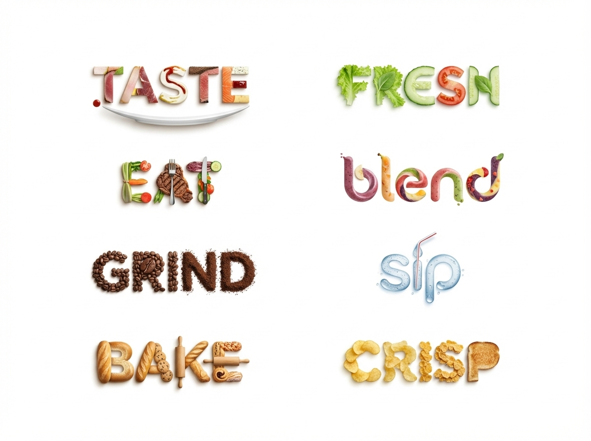<br>
<sub>Image © 2025 <a href="https://www.fotor.com/blog/author/marvin-tompkins/">Marvin</a>, <a href="https://creativecommons.org/licenses/by/4.0/">CC BY 4.0</a> • Prompt by <a href="https://www.fotor.com/blog/author/marvin-tompkins/">Marvin</a></sub>

**Reference Images:**


**Prompt**

```
Create an infographic that shows how to make Thai Tom Yum Goong Soup, with ingredients and recipe in it.
```


---

[⬆️ Back to Cases Directory](#cases-toc)

<a id="cases-86"></a>
### Case 86: Background and Blanket Focus with Blurred Child (by [Marvin](https://www.fotor.com/blog/author/marvin-tompkins/))

[Source Link](https://www.fotor.com/blog/nano-banana-model-prompts/#blog-title-image-effects-0-1)

<br>
<sub>Image © 2025 <a href="https://www.fotor.com/blog/author/marvin-tompkins/">Marvin</a>, <a href="https://creativecommons.org/licenses/by/4.0/">CC BY 4.0</a> • Prompt by <a href="https://www.fotor.com/blog/author/marvin-tompkins/">Marvin</a></sub>

**Reference Images:**

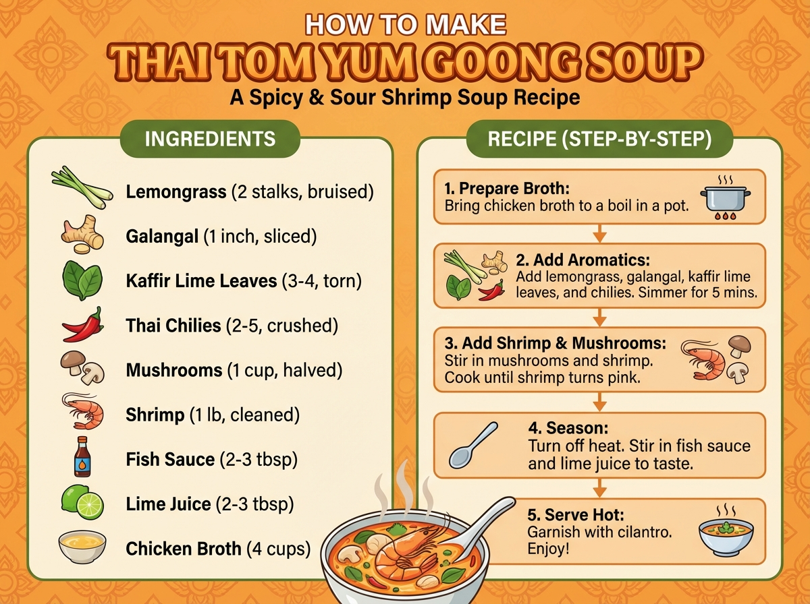


**Prompt**

```
Focus on the background trees and blanket of this image, blur this kid.
```


---

[⬆️ Back to Cases Directory](#cases-toc)

<a id="cases-87"></a>
### Case 87: Minimal Food Letter Logos on White Background (by [Marvin](https://www.fotor.com/blog/author/marvin-tompkins/))

[Source Link](https://www.fotor.com/blog/nano-banana-model-prompts/#blog-title-image-effects-0-1)

<br>
<sub>Image © 2025 <a href="https://www.fotor.com/blog/author/marvin-tompkins/">Marvin</a>, <a href="https://creativecommons.org/licenses/by/4.0/">CC BY 4.0</a> • Prompt by <a href="https://www.fotor.com/blog/author/marvin-tompkins/">Marvin</a></sub>

**Reference Images:**

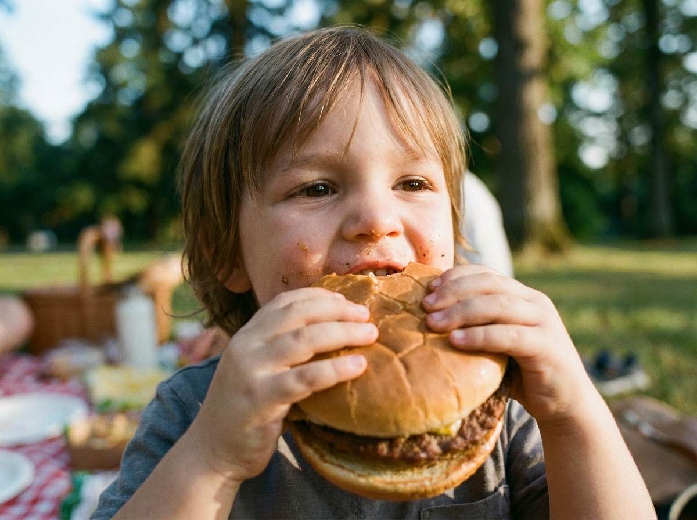


**Prompt**

```
Turn these 8 Logos into sophisticated minimalistic logos to make letters from realistic food to express the meaning of this word. Composition: rendering of all logos on a single solid white background.
```


---

[⬆️ Back to Cases Directory](#cases-toc)


---

<a id="tools-intro"></a>
## 🛠️ Tools Introduction

*Information about tools and platforms will be updated soon.*


<a id="prompting-tips"></a>
## 💡 Prompting Tips

*Prompting tips and best practices will be added as the community grows.*


<a id="how-to-contribute"></a>
## 🤝 How to Contribute

There are two ways to contribute, please read [CONTRIBUTING.md](./CONTRIBUTING.md).


<a id="acknowledgements"></a>
## 🙏 Acknowledgements

This collection showcases the capabilities of the Nano-Banana-Pro model. We welcome contributions from the community and thank all those who share their creative work with us. 😊

If you would like to contribute or have any questions, please feel free to contact us. ✉️

[⬆️ Back to Top](#readme-top)


<a id="star-history"></a>
## 🌟 Star History

[](https://www.star-history.com/#muset-ai/awesome-nano-banana-pro&Date)

[⬆️ Back to Top](#readme-top)

